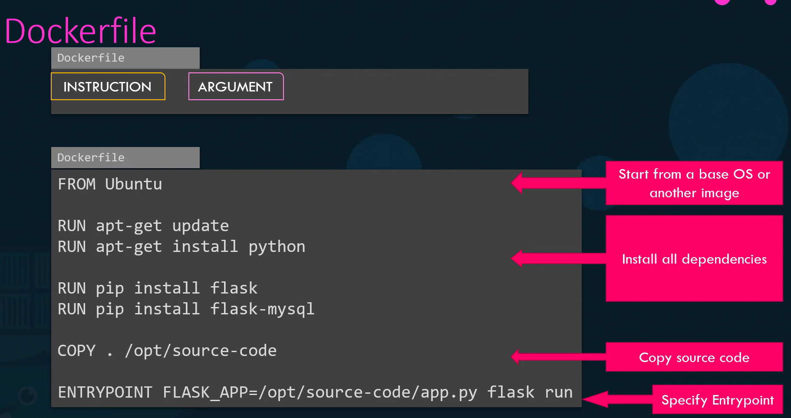

# Docker Image

## Dockerfile
### Create own image

```bash
vi Dockerfile
```

```bash
FROM ubuntu                 # use OS ubuntu
    
RUN apt-get update          # install dependencies using apt
RUN apt-get install python

RUN pip install flask       # install python dependencies using pip
RUN pip install flask-mysql

COPY . /opt/source-code     # copy code to /opt folder

WORKDIR /opt

EXPOSE 5050

ENTRYPOINT FLASK_APP=/opt/source-code/app.py flask run  #run the web server

```

```bash
docker build Dockerfile -t ribesh/my-custom-app
docker push ribesh/my-custom-app
```



Docker history command (get more details about the custom image)
```bash
docker history ribesh/my-custom-app
```


CMD vs ENTRYPOINT


CMD & ENTRYPOINT Combined


```bash
FROM ubuntu

ENTRYPOINT ["sleep"]

CMD ["5"]
```

```bash
docker run ubuntu-sleeper       # it will take the default value which is 5
```

```bash
docker run ubuntu-sleeper 10    # it will take 10 value
```

How to overide the Entrypoint command?
```bash
docker run --entrypoint sleep2.0 ubuntu-sleeper 10
```