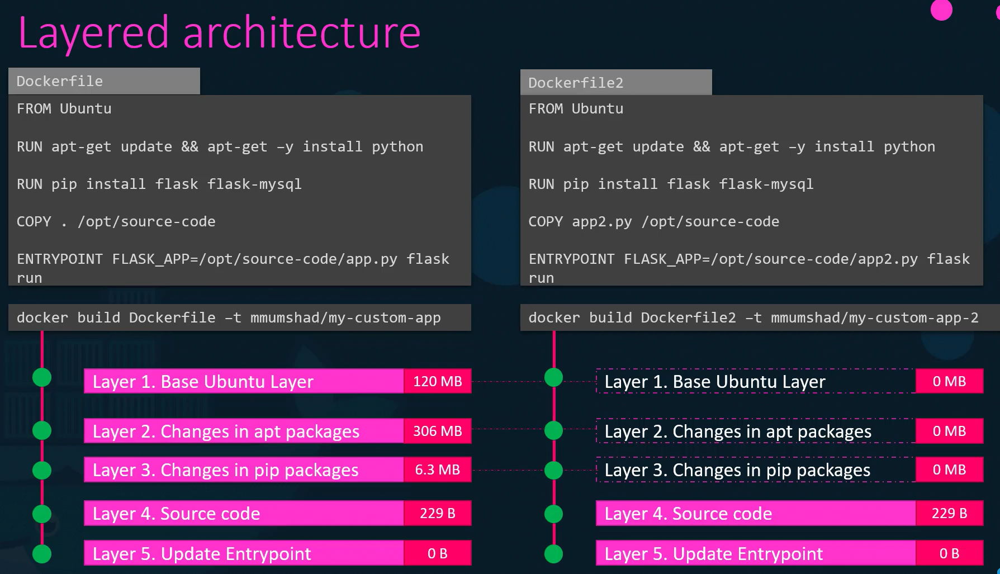
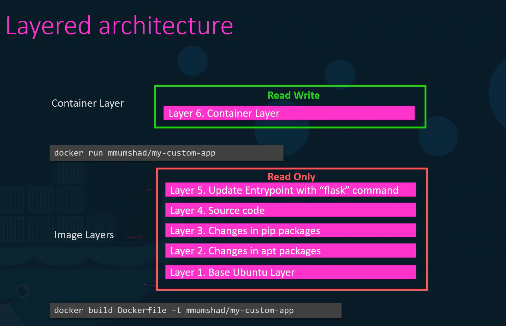
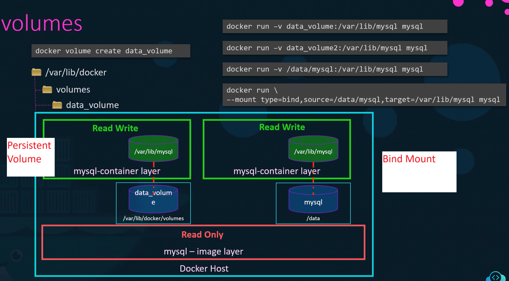

# Docker Storage






## Volumes



### Persistant Volume (When volume is in /var/lib/docker/volumes)

```bash
docker volume create data_volume
```

```bash
docker run -v data_volume:/var/lib/mysql mysql
```

### Bind Mounts

Old Way:
```bash
docker run -v /data/mysql:/var/lib/mysql mysql
```

New Way:
```bash
docker run --mount type=bind,source=/data/mysql,target=/var/lib/mysql mysql
```