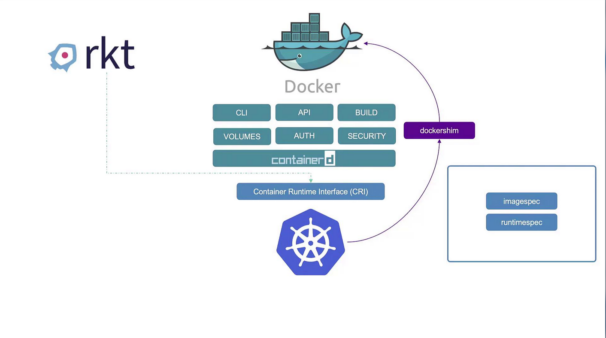

# Docker vs ContainerD

## The Evolution of Container Runtimes
-   At the dawn of the container era, Docker reigned supreme thanks to its intuitive interface.
-   Even though alternative tools like *Rocket* existed, **Kubernetes was initially designed to orchestrate Docker-based containers,** creating a strong coupling between Docker and Kubernetes.
    -   However, as Kubernetes expanded its ecosystem, other container runtimes sought integration.

-   Kubernetes addressed this need by introducing the **Container Runtime Interface (CRI).** 
    -   The CRI standardizes container runtimes by ensuring compliance with the **Open Container Initiative (OCI)** standards—the image specification (for building images) and the runtime specification (for container execution).
    -   This standardization paved the way for **runtimes like Rocket and others to be supported by Kubernetes.**

-   Since **Docker was developed before CRI was established,** it wasn’t built with CRI compatibility in mind. 

    -   To allow Docker to function with Kubernetes, a temporary solution known as the ***Docker Shim*** was implemented. 
    
    -   Over time, **native CRI-compatible runtimes such as ContainerD** emerged, shifting Docker’s primary role within the Kubernetes architecture.

-   ContainerD, a CRI-compatible runtime, integrates directly with Kubernetes—**eliminating the need for the Docker Shim.**
    -   **Originally bundled with Docker, ContainerD** has evolved into a standalone project under the Cloud Native Computing Foundation.
    
    -   This decoupling means you can install and use ContainerD without needing the entire Docker ecosystem if your goal is solely container runtime functionality.

The diagram below illustrates the relationship between Docker, Kubernetes, and alternative container runtimes (like rkt), highlighting components such as containerd, the Docker Shim, and the Container Runtime Interface (CRI).

Within Docker, several components work together to provide its functionality:

-   Docker CLI and API
-   Image build tools
-   Support for volumes, authentication, and security
-   The container runtime (runc) managed by containerd

## Summary

-   The CTR tool, bundled with ContainerD, is primarily used for debugging.
-   NerdCTL offers a Docker-like CLI for general-purpose container operations and advanced ContainerD features.
-   Crictl, maintained by the Kubernetes community, is designed for interacting with all CRI-compatible container runtimes and is mainly used for debugging and inspection.