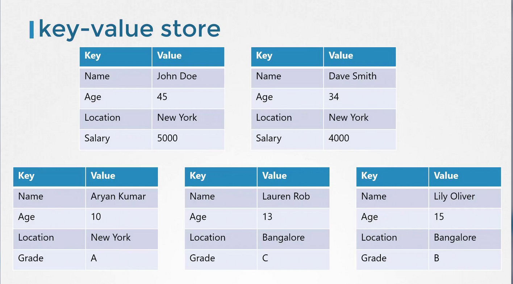

# ETCD for Beginners
-   It is a distributed, reliable key-value store that is both simple and fast.

## What Is a Key-Value Store?
Traditional relational databases, such as **SQL databases, store data in tables with rows and columns.** 

For example, a table that contains information about individuals might look like this:

-   Each row represents a single person.
-   Each column holds a specific detail about that person (e.g., name, age).

If you need to include additional information (like salary data for employed individuals or grades for students), you must expand the table. **This means adding columns that may not apply universally to every row.**

In contrast, a key-value store organizes data as independent documents or files. **Each document contains all relevant information for an individual**, allowing flexible and dynamic data structures:

-   Working individuals can have documents with salary details.
-   Students can have documents with grade details.




For complex data transactions, structured formats like JSON or YAML are used. Here are some examples of key-value pairs stored as JSON documents:

```bash
{
  "name": "John Doe",
  "age": 45,
  "location": "New York",
  "salary": 5000
}
```

```bash
{
  "name": "Dave Smith",
  "age": 34,
  "location": "New York",
  "salary": 4000,
  "organization": "ACME"
}
```


```bash
{
  "name": "Aryan Kumar",
  "age": 10,
  "location": "New York",
  "Grade": "A"
}
```

```bash
{
  "name": "Lily Oliver",
  "age": 15,
  "location": "Bangalore",
  "Grade": "B"
}
```

```bash
{
  "name": "Lauren Rob",
  "age": 13,
  "location": "Bangalore",
  "Grade": "C"
}
```

## Transitioning from API v2 to v3

One critical change between etcd versions is the API version used by etcdctl. 

Although etcdctl may be configured to use **API v2 by default**, **newer installations typically default to API v3.** 

You can verify the API version by running:
```bash
./etcdctl --version
```

Output:
```bash
etcdctl version: 3.3.11
API version: 2
```

### To switch etcdctl to use API v3, you have two options:
1.   Prepend the environment variable to the command:
        ```bash
        ETCDCTL_API=3 ./etcdctl version
        ```

        Output:
        ```bash
        etcdctl version: 3.3.11
        API version: 3
        ```

**OR**

2. export the environment variable for your session:

```bash
export ETCDCTL_API=3
./etcdctl version
```

### Note
-   In API v3, the command for setting a key changes from ```"set"``` to ```"put"```, while retrieving a key remains the same ```("get")```. 

-   Note that the version command is now a subcommand rather than an option.


After setting the environment variable, you can perform key-value operations with API v3 commands. For example:

```bash
export ETCDCTL_API=3
./etcdctl version
```

Then, set a key-value pair:
```bash
./etcdctl put key1 value1
```

Output: ```OK```

And retrieve the value:
```bash
./etcdctl get key1
```

Output:
```bash
key1
value1
```