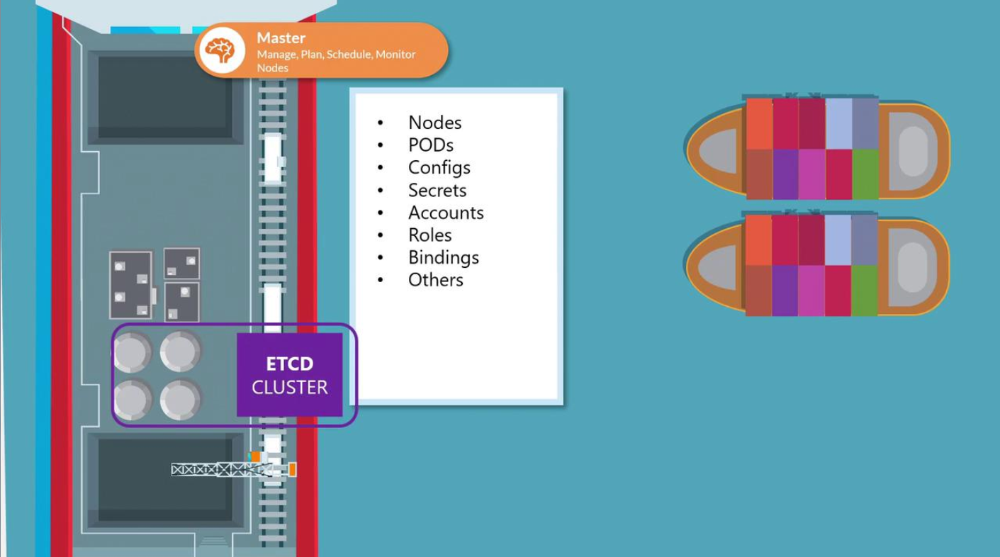

# ETCD in K8s

-   We explore the critical role of etcd in storing cluster state, detail different deployment approaches, and explain high availability considerations.
-   Whether you're setting up a Kubernetes cluster from scratch or using kubeadm, understanding etcd is essential.

- It is a distributed reliable key-value store that is Simple, Secure & Fast.
-   **Every object—nodes, pods, configurations, secrets, accounts, roles, and role bindings—is stored within etcd.**
    -   When you run a command like ```kubectl get```, the data is retrieved from this data store.

### ETCD Stores information about
-   Nodes
-   PODs
-   Configs
-   Secrets
-   Accounts
-   Roles
-   Bindings
-   Others



- Any changes you make to the cluster — whether adding nodes, deploying pods, or configuring ReplicaSets — are first recorded in etcd.
    - Only after etcd is updated are these changes considered to be complete.

### Key Information

The etcd server typically listens on port ```2379``` for client requests. Ensuring that the advertised client URL (via the ```--advertise-client-urls``` option) is correctly configured is crucial for proper communication between the Kubernetes API Server and etcd.


- Every info you see, when you run ```kubectl get``` commad is from etcd server


### Deploying etcd with kubeadm
For many test environments and streamlined deployments, kubeadm automatically configures etcd. When you use kubeadm, the etcd server runs as a pod within the **kube-system namespace**, abstracting away the manual setup details.

To view all the pods running in the kube-system namespace, including etcd, run:
```bash
kubectl get pods -n kube-system
```
Output:
```bash
NAMESPACE     NAME                                 READY   STATUS      RESTARTS   AGE
kube-system   coredns-78fcdf6894-prwl              1/1     Running     0          1h
kube-system   coredns-78fcdf6894-vqd9w             1/1     Running     0          1h
kube-system   etcd-master                          1/1     Running     0          1h
kube-system   kube-apiserver-master                1/1     Running     0          1h
kube-system   kube-controller-manager-master       1/1     Running     0          1h
kube-system   kube-proxy-f6k26                     1/1     Running     0          1h
kube-system   kube-proxy-hnzw                      1/1     Running     0          1h
kube-system   kube-scheduler-master                1/1     Running     0          1h
kube-system   weave-net-924k8                      2/2     Running     1          1h
kube-system   weave-net-hzfcz                      2/2     Running     1          1h
```

To examine the keys stored in etcd (organized under the registry directory), use the following command:
```bash
kubectl exec etcd-master -n kybe-system etcdctl get / --prefix -keys-only
```

Output:
```bash
/registry/apiregistration.k8s.io/apiservices/v1
/registry/apiregistration.k8s.io/apiservices/v1.apps
/registry/apiregistration.k8s.io/apiservices/v1.authentication.k8s.io
/registry/apiregistration.k8s.io/apiservices/v1.authorization.k8s.io
/registry/apiregistration.k8s.io/apiservices/v1.autoscaling
/registry/apiregistration.k8s.io/apiservices/v1.batch
/registry/apiregistration.k8s.io/apiservices/v1.networking.k8s.io
/registry/apiregistration.k8s.io/apiservices/v1.rbac.authorization.k8s.io
/registry/apiregistration.k8s.io/apiservices/v1beta1.admissionregistration.k8s.io
```