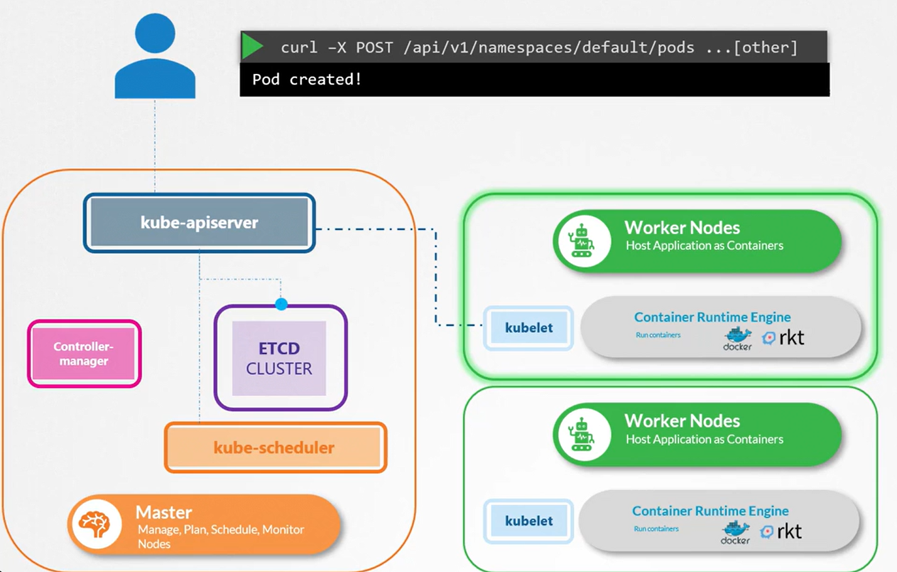
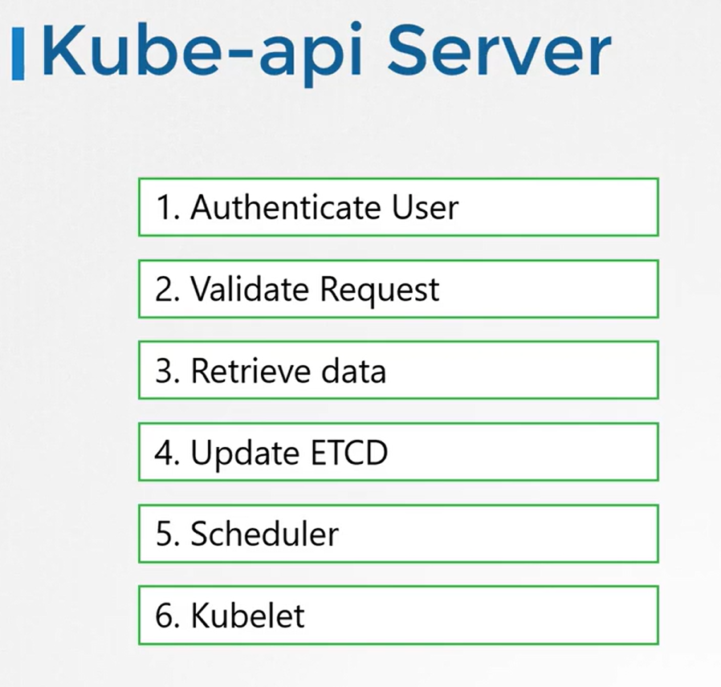
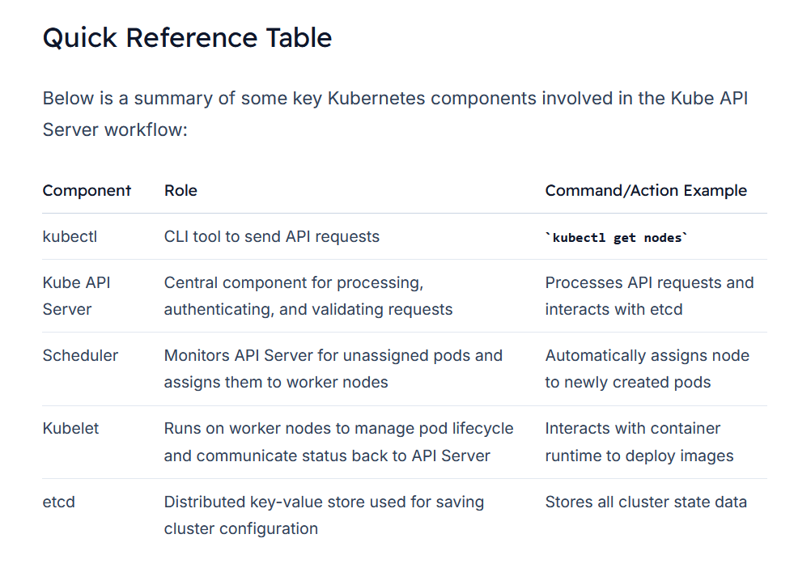

# Kube API
Kube API Server acts as the **central management component** in a Kubernetes cluster by 
1.  Handling requests from **kubectl**, 
2.  Validating and authenticating them, 
3.  Interfacing with the **etcd datastore**, and 
4.  Coordinating with other system components.


When you execute a command like:
```bash
kubectl get nodes
```

*The utility sends a request to the API Server.* The server processes this request by **authenticating the user, validating the request, fetching data from the *etcd cluster***, and replying with the desired information. 

For example, the output of the command might be:
```bash
NAME      STATUS   ROLES    AGE   VERSION
master    Ready    master   20m   v1.11.3
node01    Ready    <none>   20m   v1.11.3
```

## API Server Request Lifecycle
When a direct API POST request is made to **create a pod**, the API Server:
1.  Authenticates and validates the request.
2.  Constructs a pod object (initially without a node assignment) and updates the etcd store.
3.  Notifies the requester that the pod has been created.

For instance, using a curl command:
```bash
curl -X POST /api/v1/namespaces/default/pods ...[other]
Pod created!
```



### Working Principle
-   The **scheduler** *continuously monitors the API Server for pods that need node assignments.*
    -   Once a new pod is detected, *the scheduler selects an appropriate node and informs the API Server.*

-   The API Server then updates the etcd datastore with the new assignment and passes this information to the Kubelet on the worker node.
    -   The Kubelet deploys the pod via the container runtime and later updates the pod status back to the API Server for synchronization with etcd.

#### Key Insight

At the heart of these operations is the Kube API Server, ensuring secure and validated communication between the cluster components.




View the api-server options
```bash
kubectl get pods -n kube-system
```

Output:
```bash
NAMESPACE      NAME                                        READY   STATUS    RESTARTS   AGE
kube-system    coredns-78fcdf6894-hwrq9                    1/1     Running   0          16m
kube-system    coredns-78fcdf6894-rzhjr                    1/1     Running   0          16m
kube-system    etcd-master                                 1/1     Running   0          15m
kube-system    kube-apiserver-master                       1/1     Running   0          15m
kube-system    kube-controller-manager-master              1/1     Running   0          15m
kube-system    kube-proxy-lzt6f                            1/1     Running   0          16m
kube-system    kube-proxy-zm5qd                            1/1     Running   0          15m
kube-system    kube-scheduler-master                       1/1     Running   0          15m
kube-system    weave-net-29z42                             2/2     Running   1          16m
kube-system    weave-net-snm1l                             2/2     Running   1          16m
```

For non-kube-admin setups, you can examine the container command options directly within the pod manifest ```/etc/kubernetes/manifests```.

```bash
spec:
  containers:
  - command:
    - kube-apiserver
    - --authorization-mode=Node,RBAC
    - --advertise-address=172.17.0.32
    - --allow-privileged=true
    - --client-ca-file=/etc/kubernetes/pki/ca.crt
    - --disable-admission-plugins=PersistentVolumeLabel
    - --enable-admission-plugins=NodeRestriction
    - --enable-bootstrap-token-auth=true
    - --etcd-cafile=/etc/kubernetes/pki/etcd/ca.crt
    - --etcd-certfile=/etc/kubernetes/pki/apiserver-etcd-client.crt
    - --etcd-keyfile=/etc/kubernetes/pki/apiserver-etcd-client.key
    - --etcd-servers=https://127.0.0.1:2379
    - --insecure-port=0
    - --kubelet-client-certificate=/etc/kubernetes/pki/apiserver-kubelet-client.crt
    - --kubelet-client-key=/etc/kubernetes/pki/apiserver-kubelet-client.key
    - --kubelet-preferred-address-types=InternalIP,ExternalIP,Hostname
    - --proxy-client-cert-file=/etc/kubernetes/pki/front-proxy-client.crt
    - --proxy-client-key-file=/etc/kubernetes/pki/front-proxy-client.key
    - --requestheader-allowed-names=front-proxy-client
    - --requestheader-client-ca-file=/etc/kubernetes/pki/front-proxy-ca.crt
    - --requestheader-extra-headers-prefix=X-Remote-Extra-
    - --requestheader-group-headers=X-Remote-Group
    - --requestheader-username-headers=X-Remote-User
```




Check the process
```bash
ps -aux | grep kube-apiserver
```