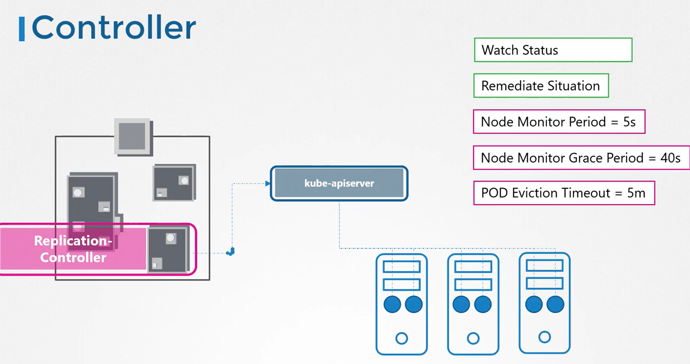

# Kube Controller Manager
It is a vital component in Kubernetes responsible for managing a variety of controllers within your cluster.

## Overview
-   In Kubernetes, **a controller acts like a department** in an organization—**each controller is tasked with handling a specific responsibility.**
    -   For instance, *one controller might monitor the health of nodes*, while another ensures that the desired *number of pods is always running*.
    -   These controllers constantly observe system changes to drive the cluster toward its intended state.


### How Controllers Are Packaged
-   All individual controllers are **bundled into a single process** known as the Kubernetes Controller Manager. 
-   When you **deploy the Controller Manager, every associated controller is started together.** 
    -   This unified deployment simplifies management and configuration.

#### View the process for kube-controller-manager
```bash
ps -aux | grep kube-controller-manager
```

### 1. Node Controller
-   The Node Controller, for example, ***checks node** statuses every five seconds through the Kube API Server.*
    -    If a node stops sending heartbeats, it is not immediately marked as unreachable; instead, there is a grace period of 40 seconds followed by an additional five minutes for potential recovery before its pods are rescheduled onto a healthy node.

#### Example: Checking Node Statuses
```bash
kubectl get nodes
NAME         STATUS   ROLES    AGE   VERSION
worker-1     Ready    <none>   8d    v1.13.0
worker-2     Ready    <none>   8d    v1.13.0
```
In the case where a node fails to recover, the output might look like this:
```bash
kubectl get nodes
NAME         STATUS     ROLES    AGE   VERSION
worker-1     Ready      <none>   8d    v1.13.0
worker-2     NotReady   <none>   8d    v1.13.0
```


### 2. Replication Controller
-    Replication Controller ensures that the **specified number of pods is maintained by creating new pods when needed.** 
        -  This mechanism reinforces the resilience and reliability of your Kubernetes cluster.



All core Kubernetes constructs—such as Deployments, Services, Namespaces, and Persistent Volumes—rely on these controllers. 

**Essentially, controllers serve as the "brains" behind many operations in a Kubernetes cluster.**

### 3. Deployment Controller

### 4. Namespace Controller

### 5. Endpoint Controller

### 6. Job-Controller

### 7. PV Protection Controller

### 8. PV-Binder-Controller

### 9. Stateful-Set

### 10. Service Account Controller

### 11. ReplicaSet

### 12. CronJob


### Viewing the Controller Manager in Action
-   Depending on your cluster setup, t**he Controller Manager may run as a pod** in the *kube-system namespace* (if set up using kubeadm) or as a **system service**.
    -    In kubeadm-based clusters, you can inspect the pod definition located in the ```/etc/kubernetes/manifests``` directory.

#### Service Configuration Example (Non-Kubeadm Environments)
```bash
[Service]
ExecStart=/usr/local/bin/kube-controller-manager \
  --address=0.0.0.0 \
  --cluster-cidr=10.200.0.0/16 \
  --cluster-name=kubernetes \
  --cluster-signing-cert-file=/var/lib/kubernetes/ca.pem \
  --cluster-signing-key-file=/var/lib/kubernetes/ca-key.pem \
  --kubeconfig=/var/lib/kubernetes/kube-controller-manager.kubeconfig \
  --leader-elect=true \
  --root-ca-file=/var/lib/kubernetes/ca.pem \
  --service-account-private-key-file=/var/lib/kubernetes/service-account-key.pem \
  --service-cluster-ip-range=10.32.0.0/24 \
  --use-service-account-credentials=true \
  --v=2
Restart=on-failure
RestartSec=5
```