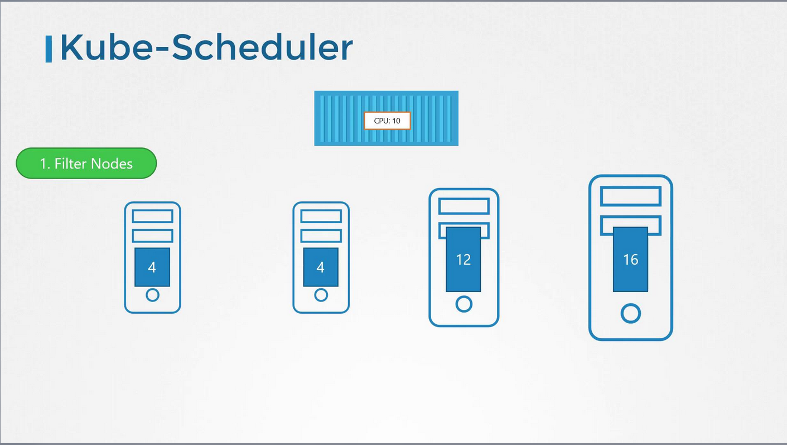
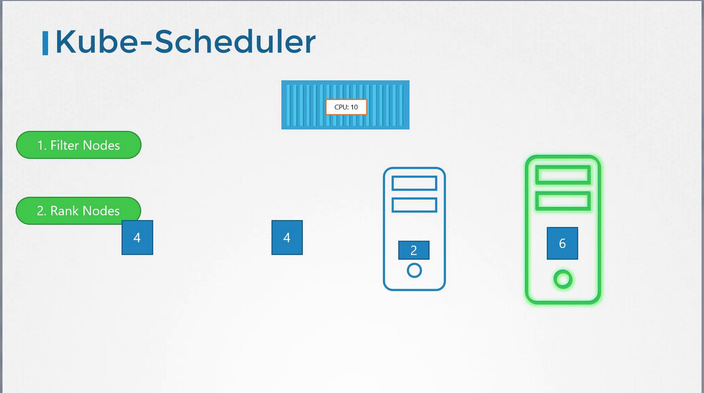

# Kube-Scheduler
- Only decides which container goes where based on certain criteria
-   It is important to note that while the **scheduler makes the placement decision,** the *actual creation of the pod on the selected node is carried out by the **Kubelet.***

## Scheduler Process Overview
-   The primary responsibility of the **Kubernetes scheduler is to assign pods to nodes based on a series of criteria.**
    -    This ensures that the selected node has sufficient resources and meets any specific requirements.
    -   For instance, different nodes may be designated for certain applications or come with varied resource capacities.
-   When multiple pods and nodes are involved, the scheduler assesses each pod against the available nodes through a two-phase process: 
1.  Filtering and 
2.  Ranking


### 1. Filtering Phase
-   In the filtering phase, **the scheduler eliminates nodes that do not meet the pod's resource requirements**. 
    -   For example, nodes that lack sufficient CPU or memory are immediately excluded.



-   As depicted above, the diagram demonstrates the elimination of nodes with insufficient resources, leaving only the candidate nodes that can accommodate the pod's needs.

### 2. Ranking Phase
-   After filtering, the scheduler enters the **ranking phase.** 
    -   Here, it uses a priority function to score and compare the remaining nodes on a scale from 0 to 10, ultimately selecting the best match.
    -   For instance, if placing a pod on one node would leave six free CPUs (four more than an alternative node), that node is assigned a higher score and is chosen.



-   This high-level overview outlines how Kubernetes efficiently filters and ranks nodes for optimal pod placement.

-   The scheduler’s design is highly customizable, allowing you to develop your own scheduler if the need arises.
    -   For more advanced scheduling configurations—such as resource limits, taints and tolerations, node selectors, and affinity rules  —refer to the Kubernetes Documentation.

View Kube-scheduler Process
```bash
ps -aux | grep kube-scheduler
```