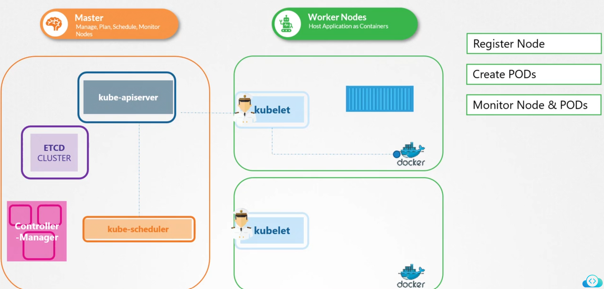

# Kubelet
-   The Kubelet is often described as the ```"captain of the ship."```
-   It oversees node activities by managing container operations such as **starting and stopping containers** based on instructions from the **master scheduler.**

    -   Additionally, the Kubelet **registers the node with the Kubernetes cluster** and **continuously monitors the state of pods and their containers.**

    -   It regularly **reports the status of the node** and its workloads to the **Kubernetes API server**.

-   When the **Kubelet receives instructions to run a container or pod, it communicates with the container runtime** (e.g., Docker) to download the required image and initiate the container.

    -   It then maintains the health of these containers and ensures they operate as expected.



### Key Takeaway

The Kubelet is essential for node management in Kubernetes, acting as the **intermediary between the cluster's control plane and the container runtime.**


#### Verify the Kubelet Process
```bash
ps -aux | grep kubelet
```