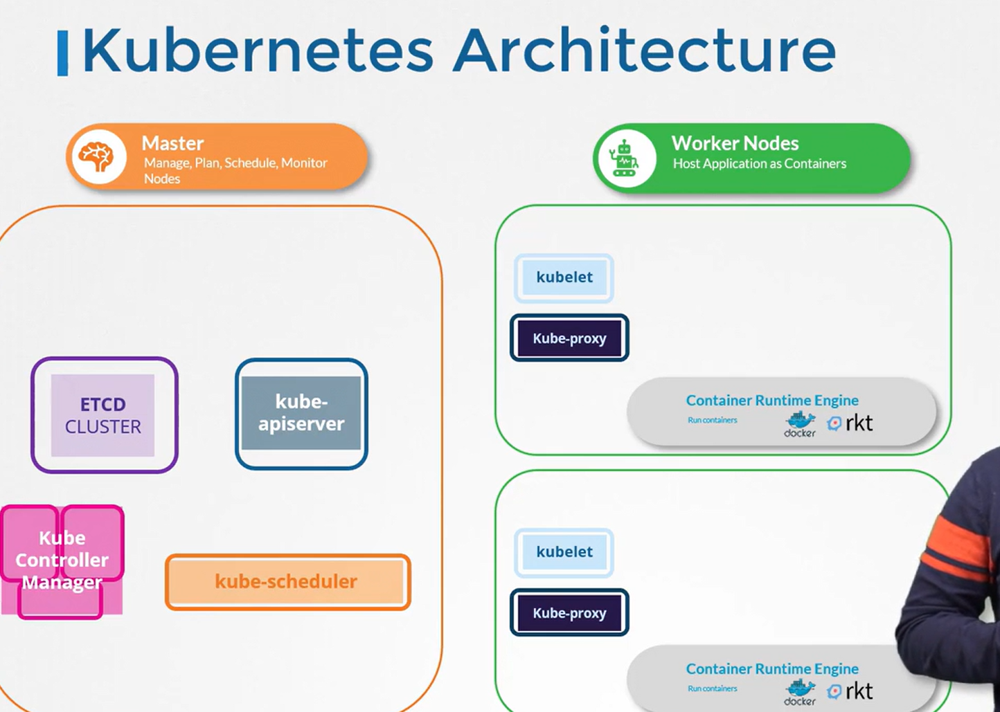

# Architecture

## Summaray of K8 Architecture

1. Master Node
    -    etcd
    -   kube scheduler
    -   controller
    -   kube api server

2.  Worker Node
    -   kubelet
    -   kube proxy

### Master Node Components

- It contains several control plane components that manage the entire K8 cluster

- It keepds track of all nodes, decides where application should run, and continuously monitor the cluster.

- It maintains details information about each container and its corresponding node in highly available key-value store called **etcd**.

- **Kubernetes scheduler** determines which worker node should host it

- The scheduler takes into account current load, resourse requirements. It is vital for efficient cluster operation.

- **Kubernetes replication controller** ensure that the desired number of containers are running and managing node operations

### Summary of Master Node Components:

1. ETCD Cluster
    -   Stores Cluster-wide configuration and state data

2. Kube Scheduler
    -   Determines the best node for new container deployments

3. Controllers
    -   Manage node lifecycle, container replication and system stability.

4. Kube API Server
    -   Acts as the central hub for cluster communication and management.

### Summary of Worker Node Components

1.  Kubelet
    -   managed container lifecycle on an indicidual node
    -   receives instruction from Kube API server to create, update, or delete containers & regularly reports the node's status

2.  Kube Proxy
    -   configures networking rules on worker nodes, thus enabling smooth inter-container communication across nodes
    -  it allows a web server on one node to interact with a database on another