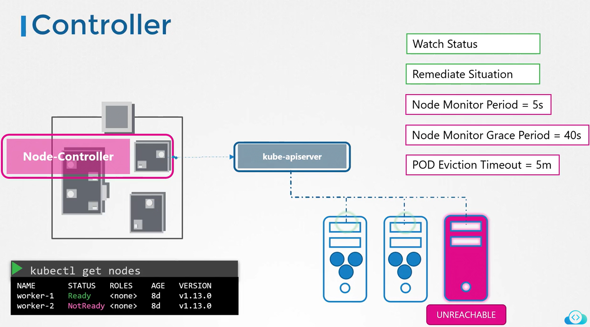

# Controller

```bash
ps -aux | grep kube-controller-manager
```

## 1. Node Controller



## 2. Replication Controller


## 3. Deployment Controller

## 4. Namespace Controller

## 5. Endpoint Controller

## 6. Job-Controller

## 7. PV Protection Controller

## 8. PV-Binder-Controller

## 9. Stateful-Set

## 10. Service Account Controller

## 11. ReplicaSet

## 12. CronJob