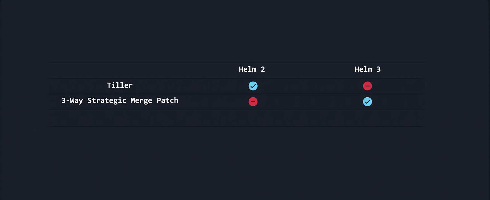
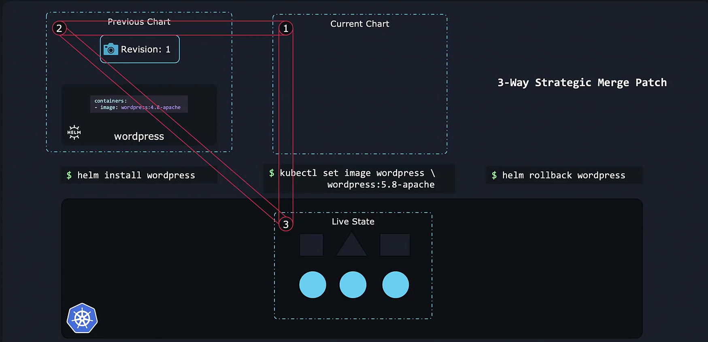
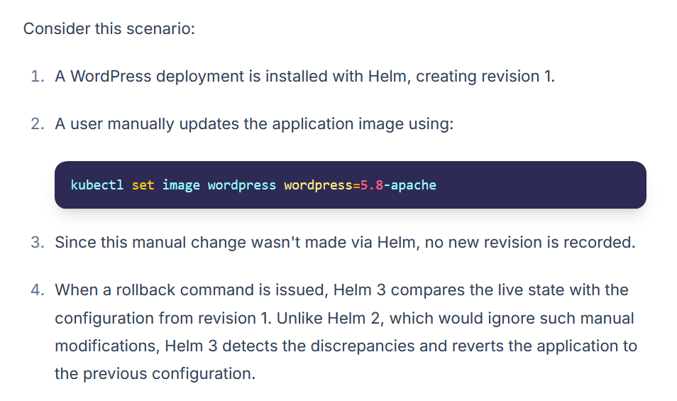

# HELM 2 vs HELM 3




## Three-Way Strategic Merge Patch in Helm 3



One of the most significant improvements in Helm 3 is the integration of a **three-way strategic merge patch mechanism.** 

-   Think of this as a snapshot feature for your deployments. 

-   When you install a chart—say, a full-blown WordPress website—Helm creates revision 1. 

    -   Upgrading the release with a new chart version creates an additional revision.

### For example, consider the following sequence:
```bash
$ helm install wordpress
$ helm upgrade wordpress
```

### Suppose the initial installation specifies the container image as:
```bash
containers:
  - image: wordpress:4.8-apache
```

### After upgrading, the container image might be updated to:
```bash
containers:
  - image: wordpress:5.8-apache
```

**Each significant action (installation, upgrade, or rollback) creates a new revision.** 

-   This revision acts as a snapshot of your deployment’s state. 
-   If a rollback is needed, Helm compares the live configuration with the targeted revision and reverts the changes:

```bash
$ helm rollback wordpress
```
### *Important*
During the **rollback process**, Helm 3 performs a **three-way comparison** between the **live state, the current chart, and the previous revision.** 

-   **This ensures that any manual changes** —like those made with ```kubectl set image``` —are detected and addressed accordingly.


