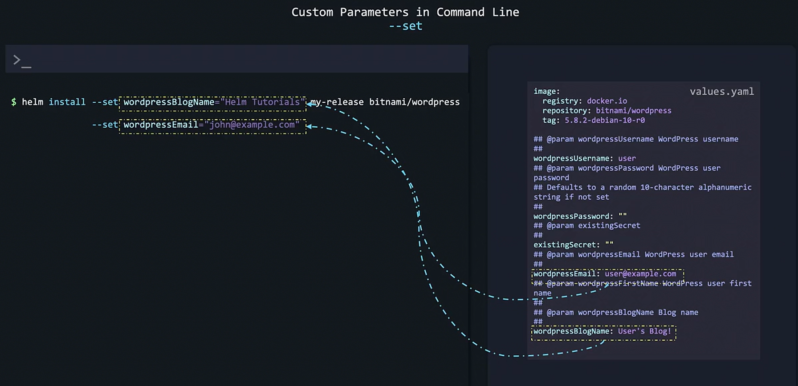
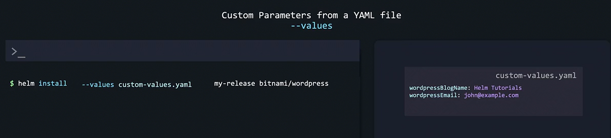
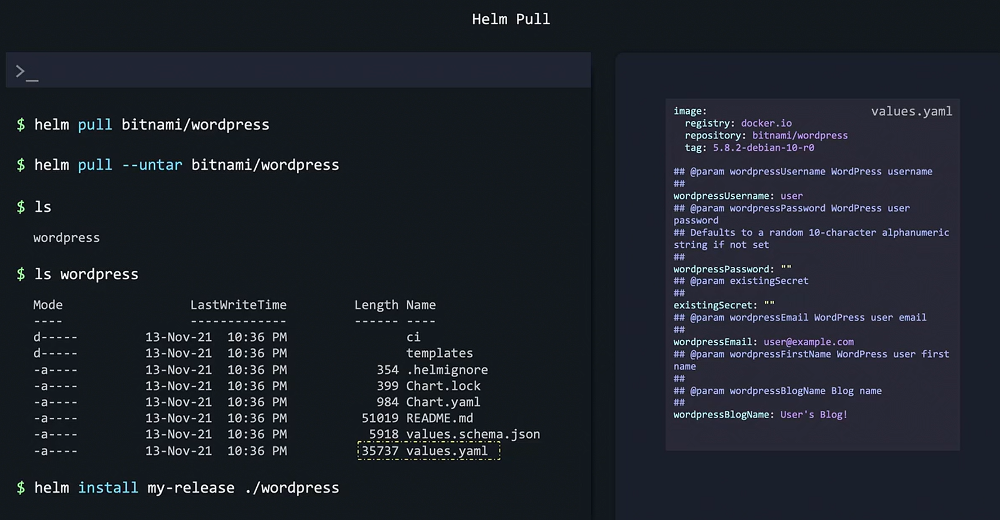

# Customizing Chart Parameters
-   By default, when installing **WordPress using the Bitnami Helm chart**, the deployment leverages the **default settings provided in its values.yaml file**.

For example,
```bash
helm install my-release bitnami/wordpress
```

-   will deploy WordPress with the **blog name set to "User's Blog!"** since that is the value defined in the values.yaml file.


## Using the Command Line to Override Defaults
-   Sometimes you may want to **change specific default settings like the blog name or email address.**


### Option 1  [Using ```--set``` option in CLI]
-   **Rather than modifying the values.yaml** file directly, you can use the ```--set``` option on the command line to override these values.

```bash
helm install --set wordpressBlogName="Helm Tut" my-release bitnami/wordpress
```




### Option 2 [Using a Custom Values File]
-   For scenarios where multiple settings need to be overridden, it may be more efficient to create your own custom values file.

1.  Create a file named ```custom-values.yaml``` with your desired configuration:
    ```bash
    wordpressBlogName: Helm Tutorials
    wordpressEmail: john@example.com
    ```
2. Install the chart with your custom values file using the following command:

    ```bash
    helm install --values custom-values.yaml my-release bitnami/wordpress
    ```



## Modifying the Built-in values.yaml Directly

-   For a more **permanent configuration change**, you might **choose to modify the chart's built-in ```values.yaml``` file.**

1.  By downloading the chart archive:
```bash
helm pull bitnami/wordpress
```

2.  Extract the files using one of two methods
    
    **A.**  Unarchive the file manually
    
    **OR**

    **B.**  Use the ```--untar``` option:
        
        ```bash
        helm pull --untar bitnami/wordpress
        ```
After extracting, you will find a **directory (named wordpress)** containing all chart files, **including values.yaml.**    

Sample:
```bash
#values.yaml

image:
  registry: docker.io
  repository: bitnami/wordpress
  tag: 5.8.2-debian-10-r0
##
## @param wordpressUsername WordPress username
##
wordpressUsername: user
## @param wordpressPassword WordPress user password
## Defaults to a random 10-character alphanumeric string if not set
wordpressPassword: ""
## @param existingSecret
##
existingSecret: ""
## @param wordpressEmail WordPress user email
##
wordpressEmail: user@example.com
## @param wordpressFirstName WordPress user first name
##
## @param wordpressBlogName Blog name
##
wordpressBlogName: User's Blog!
```

3.  Modify the file using any text editor to adjust the desired values.
    
    When ready, install the modified chart locally by specifying the chart directory:
    
    ```bash
    helm install my-release ./wordpress
    ```
