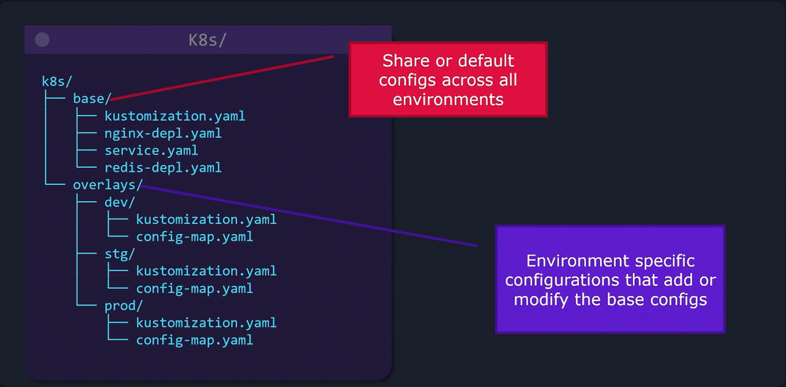
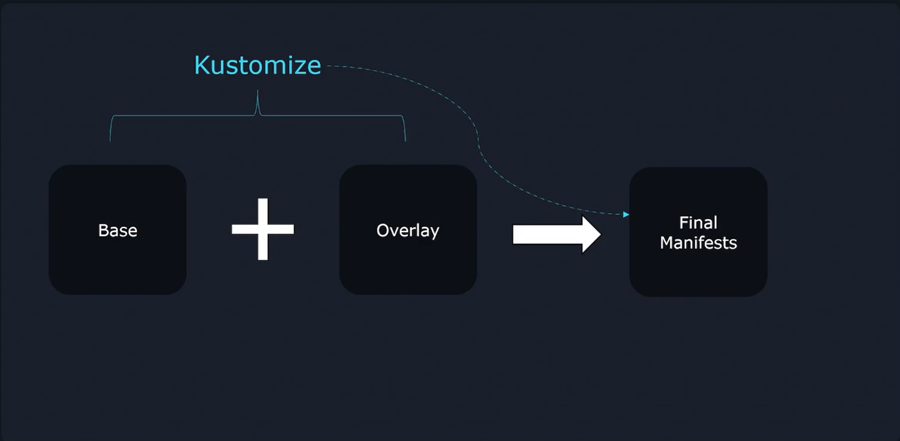
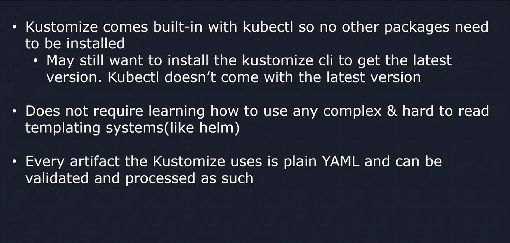

# Kustomize Problem Statement & Idealogy


## Traditional Approach
Consider a simple example of a single NGINX deployment defined in a YAML file. This deployment creates one NGINX pod:

```bash
apiVersion: apps/v1
kind: Deployment
metadata:
  name: nginx-deployment
spec:
  replicas: 1
  selector:
    matchLabels:
      component: nginx
  template:
    metadata:
      labels:
        component: nginx
    spec:
      containers:
        - name: nginx
          image: nginx
```

**Imagine you have multiple environments like development, staging, and production.**

-   You might require the **same deployment to behave differently in each environment.**

-   For example, on a ***local development* machine you need only one replica**, ***staging* might require two or three, and *production* could need five or more.**

Solution: 

A common solution is to duplicate the YAML file into individual directories for each environment and then modify environment-specific parameters (such as replica counts).

```bash
# dev/nginx.yml
apiVersion: apps/v1
kind: Deployment
metadata:
  name: nginx-deployment
spec:
  replicas: 1
  selector:
    matchLabels:
      component: nginx
  template:
    metadata:
      labels:
        component: nginx
    spec:
      containers:
        - name: nginx
          image: nginx
```

```bash
# stg/nginx.yml
apiVersion: apps/v1
kind: Deployment
metadata:
  name: nginx-deployment
spec:
  replicas: 2
  selector:
    matchLabels:
      component: nginx
  template:
    metadata:
      labels:
        component: nginx
    spec:
      containers:
        - name: nginx
          image: nginx
```

```bash
# prod/nginx.yml
apiVersion: apps/v1
kind: Deployment
metadata:
  name: nginx-deployment
spec:
  replicas: 5
  selector:
    matchLabels:
      component: nginx
  template:
    metadata:
      labels:
        component: nginx
    spec:
      containers:
        - name: nginx
          image: nginx
```

To apply these configuration.
```bash
kubectl apply -f dev/

kubectl apply -f /stg/

kubectl apply -f /prod/
```

### Note:
-   While this approach can work for a handful of resources, **it becomes both tedious and error-prone as more resources are added.**

-   Every new resource (like a service defined in **service.yaml**) **must be copied across every environment directory.**

## Enter Kustomize
Kustomize provides an elegant solution by introduction two key components:

1.  Base Configuration
2.  Overlays

### 1. Base Configuration
-   It contains **resource common to all environment**.
-   It represents **default values that every environment** uses unless explicitly overridden.

```bash
apiVersion: apps/v1
kind: Deployment
metadata:
  name: nginx-deployment
spec:
  replicas: 1
  selector:
    matchLabels:
      component: nginx
  template:
    metadata:
      labels:
        component: nginx
    spec:
      containers:
        - name: nginx
          image: nginx
```

### 2. Overlays
-   It allows **customization of the Base Configurations** for each environment.
-   Each overlay—whether for development, staging, or production—**defines changes specific to that environment.**
-   In a development overlay, the default configuration might remain unchanged, while staging and production overlays could modify the replica count to suit their requirements.


## Recommende Folder Structure


-   In this structure, the **base** directory holds the *common configuration*
-   While the **overlays** directory contains *subdirectories for each environment with their respective configuration adjustments*

## How Kustomize Works

-   It takes the **Base Configuration** and the **Overlays** to produce a final, environment-specific Kubernetes manifest. 

-   One major benefit is that **Kustomize is built into kubectl**, eliminating the need for additional installation.

-   *Unlike templating systems such as Helm*, **Kustomize operates directly on standard YAML** files—no templating language to learn.



## Simplicity and Scalability
