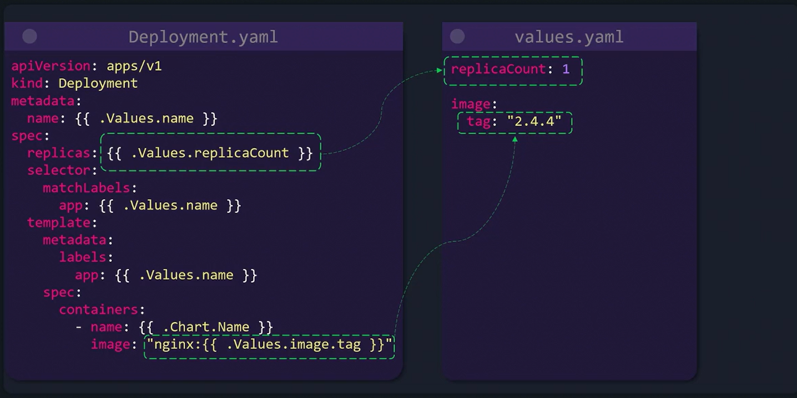
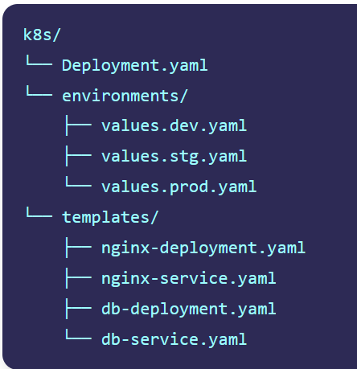
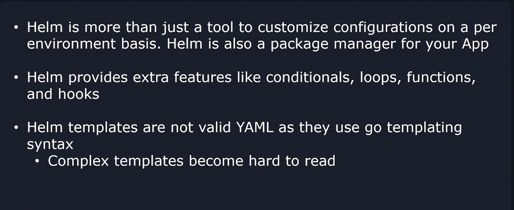

# Kustomize Vs Helm
-   Helm leverages Go templating syntax to dynamically assign values to properties within your Kubernetes manifests. 



When you deploy your application, Helm seamlessly injects the defined values into your templates.

## Helm Project Structure

-   A well-organized Helm project typically separates configuration files based on the target environment. 

-   Below is an example directory structure that demonstrates how to arrange your Helm charts and values files:

    

    -   The **templates directory** contains Kubernetes manifest files that include Go templating syntax.
    -   The **environments directory** includes various ```values.yaml``` files tailored for development, staging, and production.

When deploying your application, you select the appropriate values file based on the target environment, and Helm injects these values into the templates accordingly.

## Additional Helm Features
Helm is **more than just a templating tool** —it is a powerful package manager for Kubernetes applications, **offering capabilities similar to those found in Linux package managers like yum or apt.**
    
-   Key advanced features include:
    -   Conditionals and loops within templates
    -   Built-in functions to manipulate and format data
    -   Lifecycle hooks to manage application deployment events

### IMPORANT NOTE

-   Helm charts are rendered using **Go templating syntax,** meaning they are **not valid YAML until processed.** 
-   This can make the charts more challenging to read compared to plain Kubernetes YAML files.


In contrast, **Kustomize uses straightforward YAML overlays, making it simpler and often more readable.**
-   However, the simplicity of Kustomize comes with less flexibility than Helm's advanced feature set.

