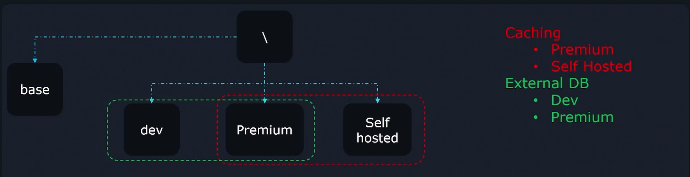
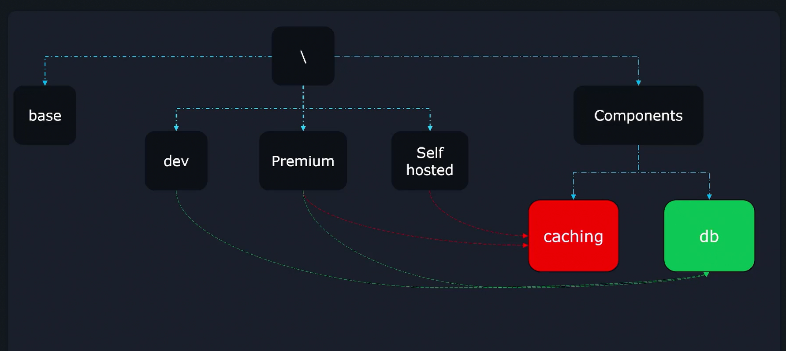
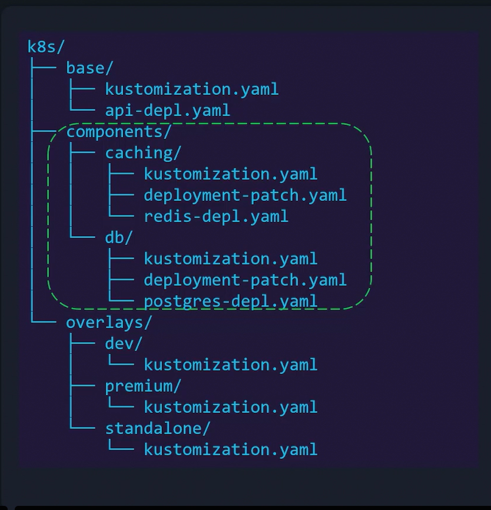
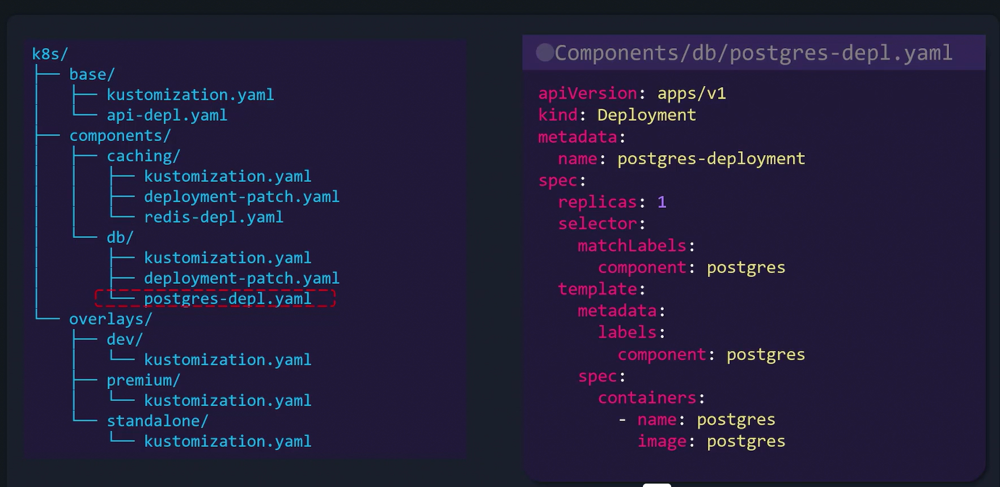
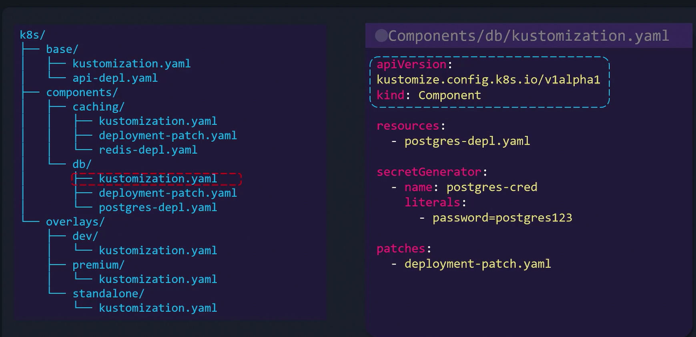
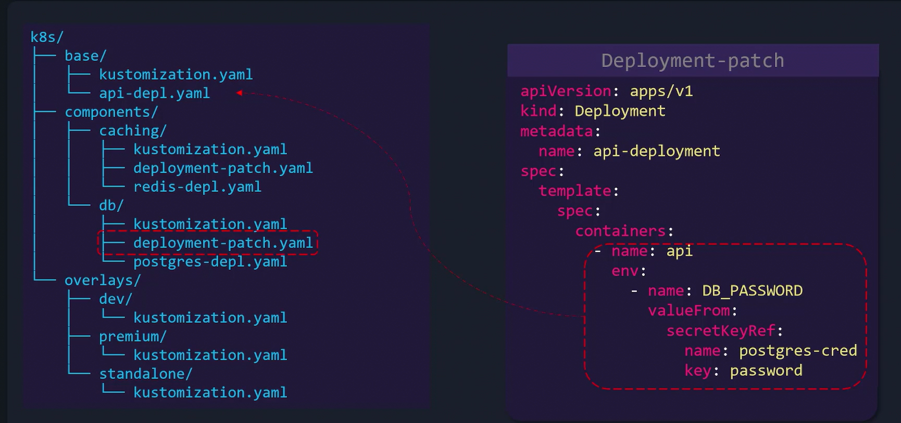
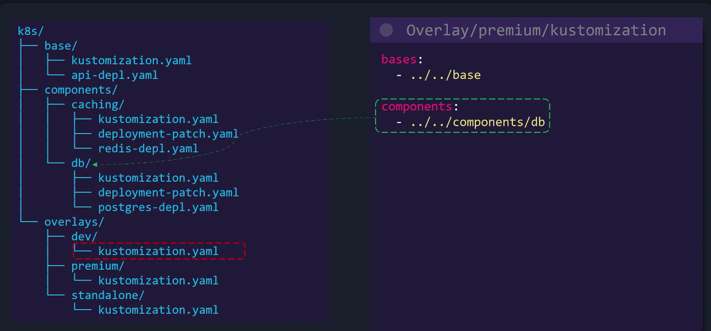

# Components
-   Components allow you to define a **reusable block of configuration logic that can be included in multiple overlays.**

-   This approach is particularly beneficial when an application supports **optional features that should only be enabled in certain overlays instead of globally.**

-   By **centralizing feature-specific configurations**—such as Kubernetes resources, patches, config maps, and secrets—you **reduce duplication and prevent configuration drift.**

## When to use components
-   Imagine a scenario where you have a set of configurations to enable a specific feature.

    -   If this feature were meant for **all overlays**, including the configuration in the **Base** might be appropriate.

    -   However, when the feature should only be a**ctivated in a subset of overlays**, *manually duplicating the configuration leads to scalability issues and potential errors.*

-    Components solve this problem efficiently by **maintaining a centralized configuration that you can import wherever necessary.**


### Vistual Example


Consider an application that can be deployed in three variations: 
1.  Development, 
2.  Premium, and 
3.  Self-hosted. 

The Base configuration holds common settings, while each variation is represented by its own overlay folder. 

Suppose the application has two optional features:

1.  Caching: *Only the premium and self-hosted versions require caching,* which involves deploying a Redis instance along with its configurations and secrets.

2.  External Database: A PostgreSQL database is enabled only for the development and premium versions.

Including the caching configuration directly in the Base would apply it to all overlays unintentionally, and duplicating the configuration across multiple overlays is error-prone. 

**Components allow you to write the configuration once and reuse it across the specific overlays where it's needed.**


### Organizing Components



In this setup:

-   **Base** contains shared configurations.
-   **Overlays** (dev, premium, standalone) inherit from the Base.
-   **Components** store isolated configurations for individual features, such as caching and external database (db). Each component directory includes all the necessary Kubernetes resources to enable the feature.

### Implementing a Kustomize Component

Let's walk through an example by implementing the database component. In the db folder, you will find the following files:

-   **postgres-depl.yaml:** Defines the deployment resource for a PostgreSQL database.
-   **deployment-patch.yaml:** Contains a strategic merge patch to update the base deployment with database-specific configurations.
-   **kustomization.yaml:** Declares the component by importing resources, generating secrets, and applying patches.


#### Postgres Deployment Configuration


```bash
apiVersion: apps/v1
kind: Deployment
metadata:
  name: postgres-deployment
spec:
  replicas: 1
  selector:
    matchLabels:
      component: postgres
  template:
    metadata:
      labels:
        component: postgres
    spec:
      containers:
        - name: postgres
          image: postgres
```
#### Component kustomization.yaml

```bash
apiVersion: kustomize.config.k8s.io/v1alpha1
kind: Component
resources:
  - postgres-depl.yaml
secretGenerator:
  - name: postgres-cred
    literals:
      - password=postgres123
patches:
  - deployment-patch.yaml
```

#### Deployment Patch

```bash
apiVersion: apps/v1
kind: Deployment
metadata:
  name: api-deployment
spec:
  template:
    spec:
      containers:
      - name: api
        env:
        - name: DB_PASSWORD
          valueFrom:
            secretKeyRef:
              name: postgres-cred
              key: password

```


#### Overlay Configuration


```bash
bases:
  - ../../base
components:
  - ../../components/db
```