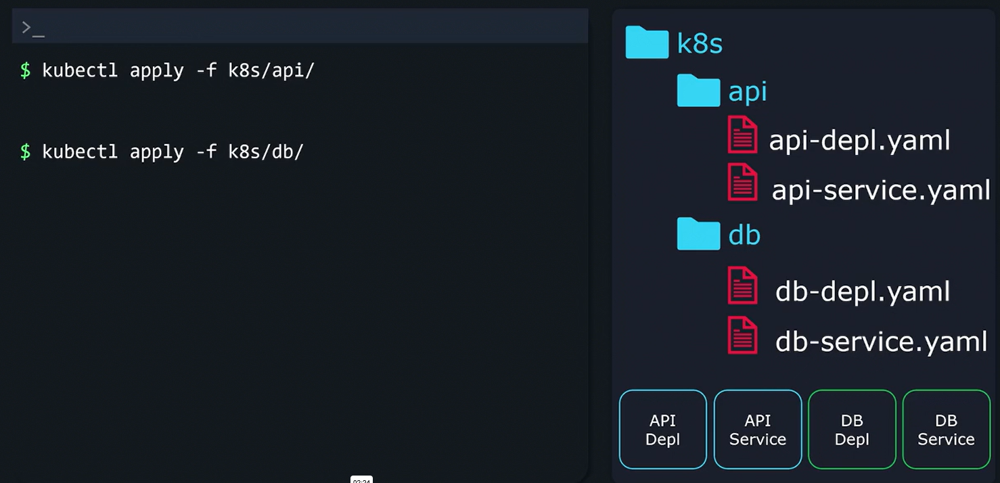
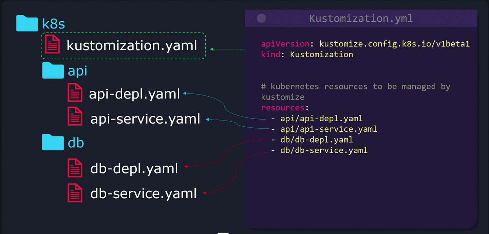
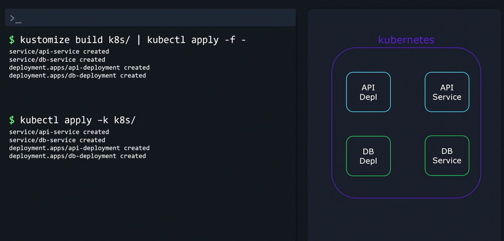
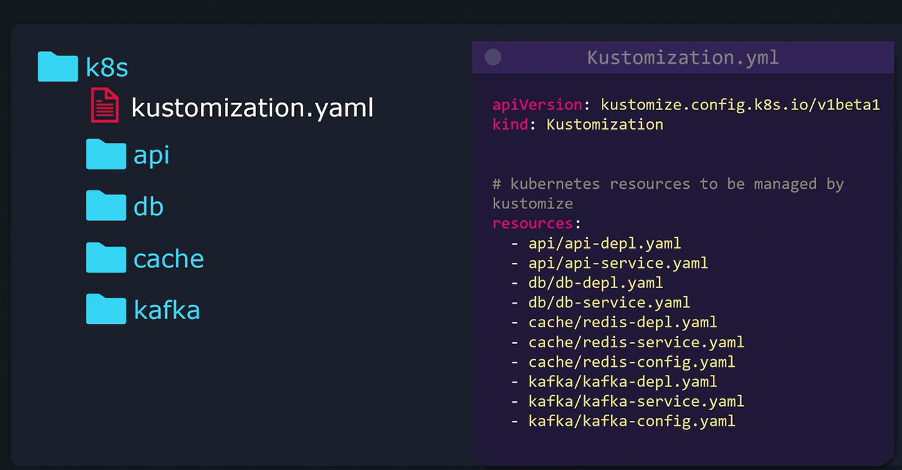
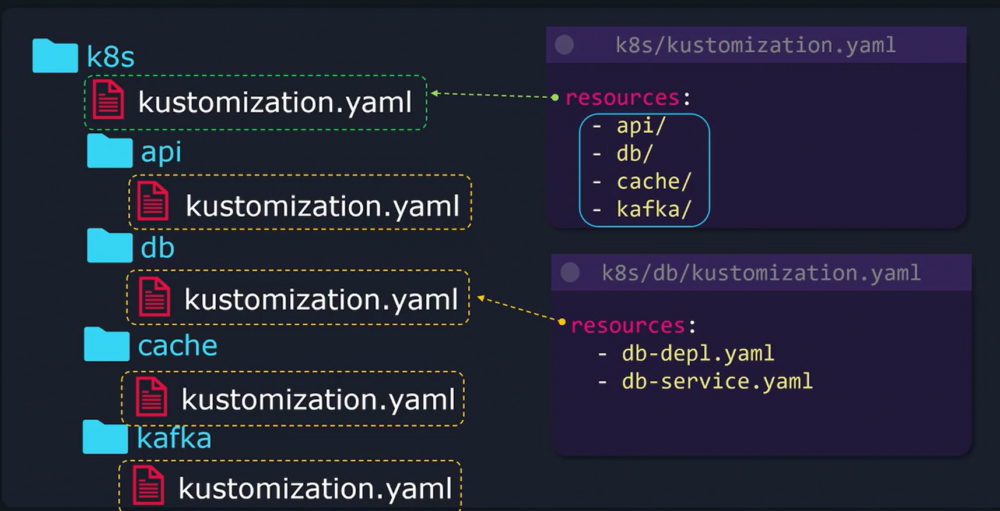

# Managing Directories

Consider a scenario where you have a directory named "k8s" containing four YAML files:

1.  API Deployment
2.  API Service
3.  Database Deployment
4.  Database Service



```bash
kubectl apply -f k8s/api/
kubectl apply -f k8s/db/
```

This is where Kustomize proves its worth. 

-   You can create a root kustomization.yaml file in your "k8s" directory that lists every resource by its relative path:



```bash
apiVersion: kustomize.config.k8s.io/v1beta1
kind: Kustomization


# Kubernetes resources to be managed by Kustomize
resources:
  - api/api-depl.yaml
  - api/api-service.yaml
  - db/db-depl.yaml
  - db/db-service.yaml
```
### Deploy all resources with a single command:
```bash
kustomize build k8s/ | kubectl apply -f -
```
#### OR
```bash
kubectl apply -k k8s/
```



Imagine expanding your project to include additional components, such as a cache and Kafka.




### Better approach for Many Directories


####  Command
```bash
kustomize build k8s/ | kubectl apply -f -
```

#### OR

```bash
kubectl apply -k k8s/
```