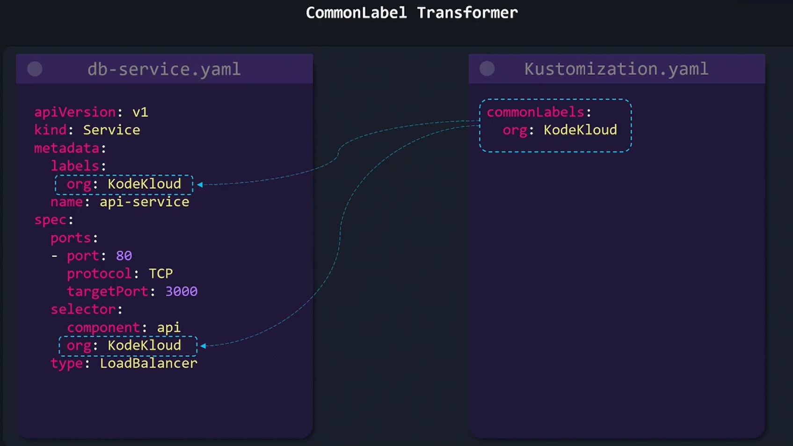
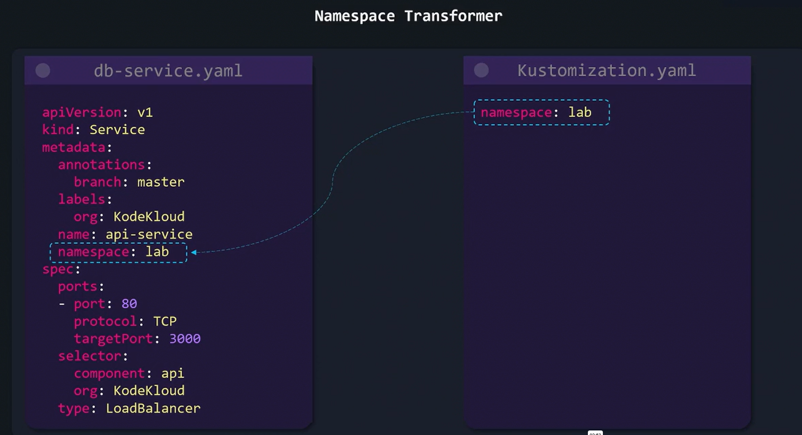
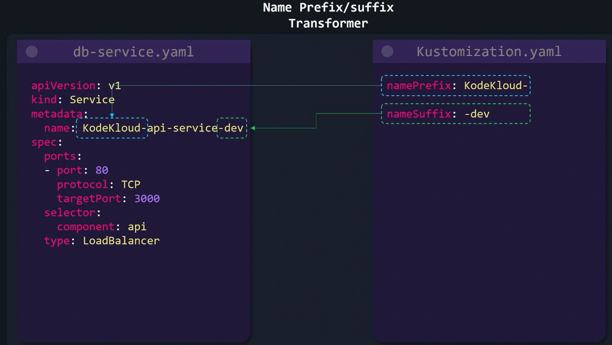
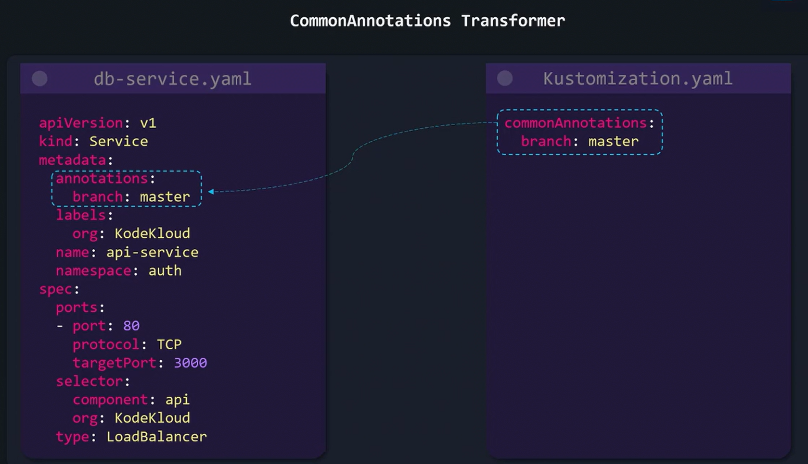

# Transformers
Kustomize allows you to **apply common configuration changes across multiple YAML files**—whether by adding labels, modifying resource names, setting namespaces, or applying annotations—**without editing each file manually.**

## The Issue
Imagine working with multiple Kubernetes resource files, such as a Deployment and a Service.

Consider the following initial configuration files:
```bash
# db-depl.yaml

apiVersion: apps/v1
kind: Deployment
metadata:
  name: api-deployment
spec:
  replicas: 1
  selector:
    matchLabels:
      component: api
  template:
    metadata:
      labels:
        component: api
    spec:
      containers:
        - name: nginx
          image: nginx
```

```bash
# db-service.yaml

apiVersion: v1
kind: Service
metadata:
  name: db-service
spec:
  selector:
    component: db-depl
  ports:
    - protocol: "TCP"
      port: 27017
      targetPort: 27017
  type: LoadBalancer
```

Suppose you want to **apply a common configuration change** — like adding a label (for example, org: KodeKloud) or appending a suffix (such as -dev) to resource names—across all these files. 

**Manually updating each file in a production environment with numerous YAML files can be time-consuming and error-prone.** 

This is where Kustomize's transformers become extremely useful.

## Transformations with Kustomize

### 1.  CommonLabel Transformer
-   Instead of manually updating each resource, you can add a common label to all Kubernetes resources via your kustomization file. 

-   For example, if you want to add the 
```label org: KodeKloud```

```bash
# Kustomization.yaml

commonLabels:
  org: KodeKloud
```



### 2.  Namespace Transformer
-   The namespace transformer enables you to **group all your Kubernetes resources** under a designated namespace.

```bash
# Kustomization.yaml

namespace: lab
```



### 3.  Name Prefix/Suffix Transformer
-   If you need to append a suffix (like -dev) to the names of all your resources, you can adjust your resource file names manually or delegate the change to Kustomize.

```bash
# Kustomization.yaml

namePrefix: KodeKloud-
nameSuffix: -dev
```



### 4.  CommonAnnotations Transformer
-   When you need to apply common annotations across all your Kubernetes resources, Kustomize makes it easy. 
```bash
# Kustomization.yaml

commonAnnotations:
  branch: master
```
