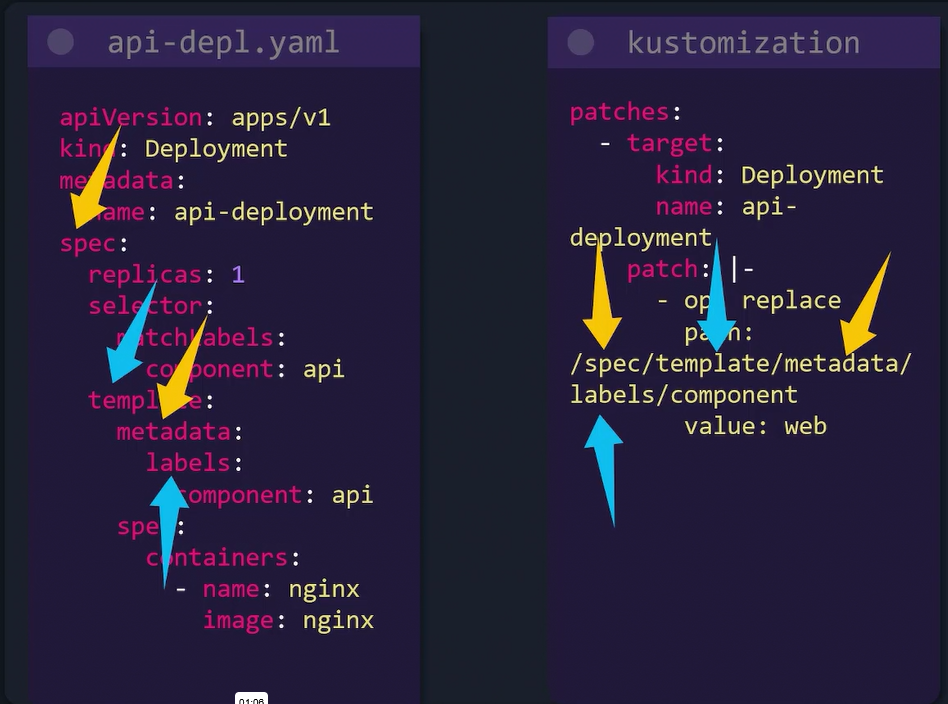
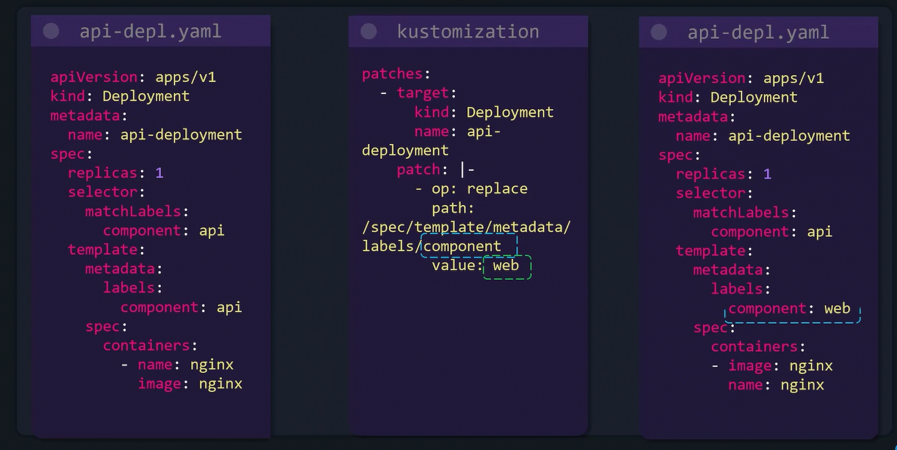
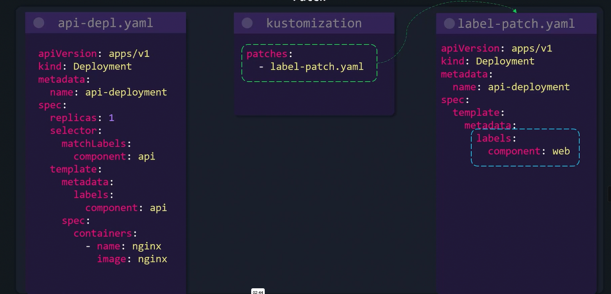
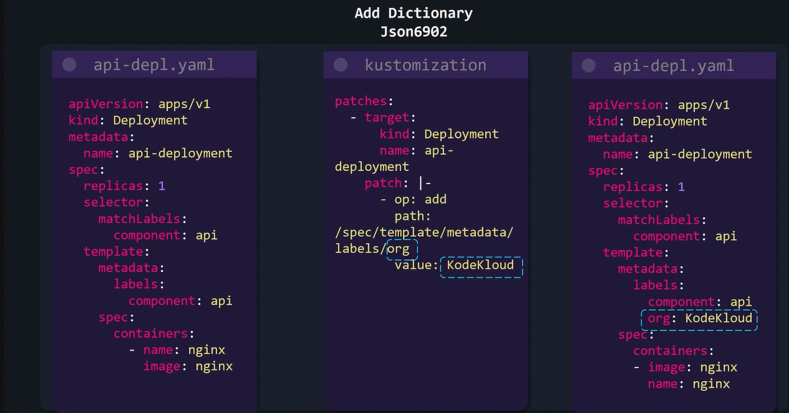
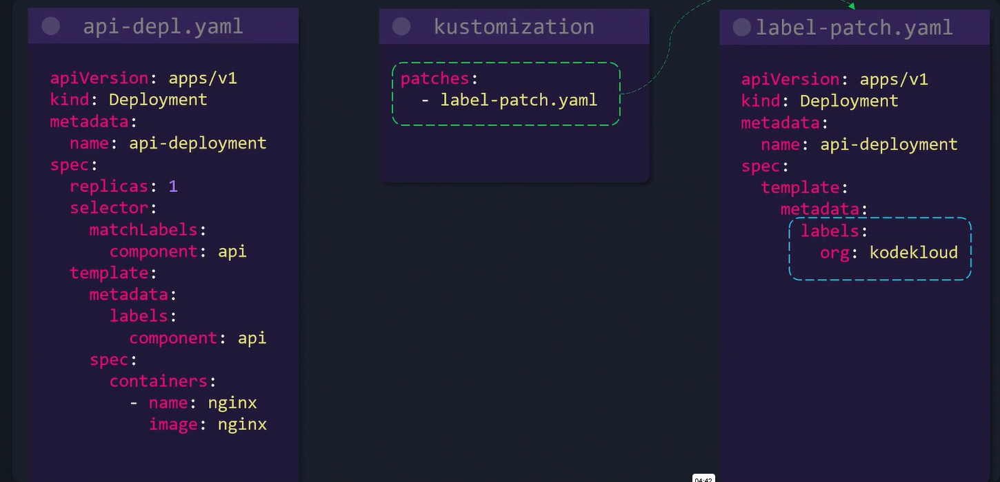
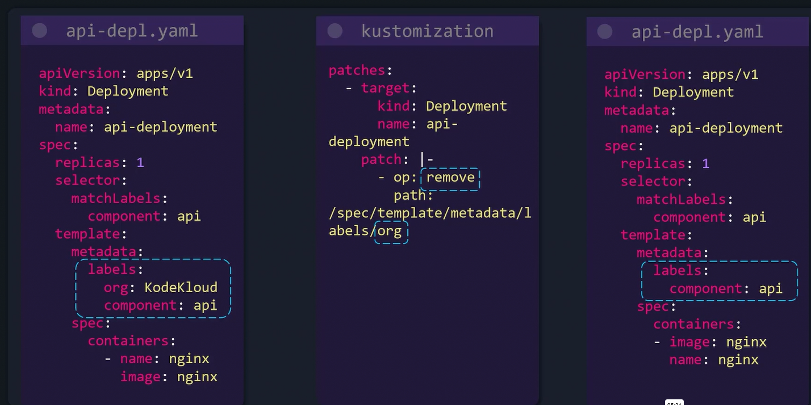
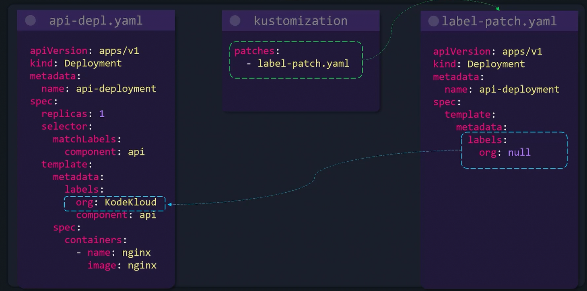

# Patches Dictionary

## A.   Replace Operation

### 1. Using JSON Approach

### 2. Using Strategic Merge Approach

## B. ADD Operation

### 1. Using JSON Approach

### 2. Using Strategic Merge Approach

## C. Remove Operation

### 1. Using JSON Approach

### 2. Using Strategic Merge Approach

