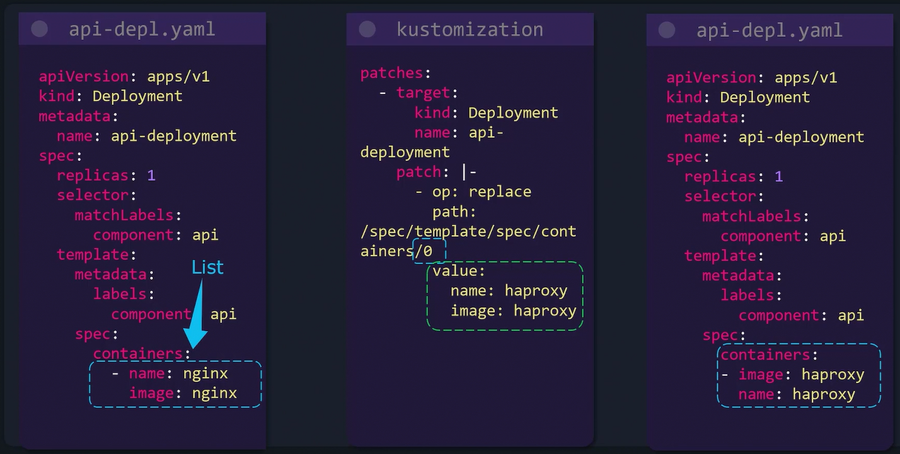
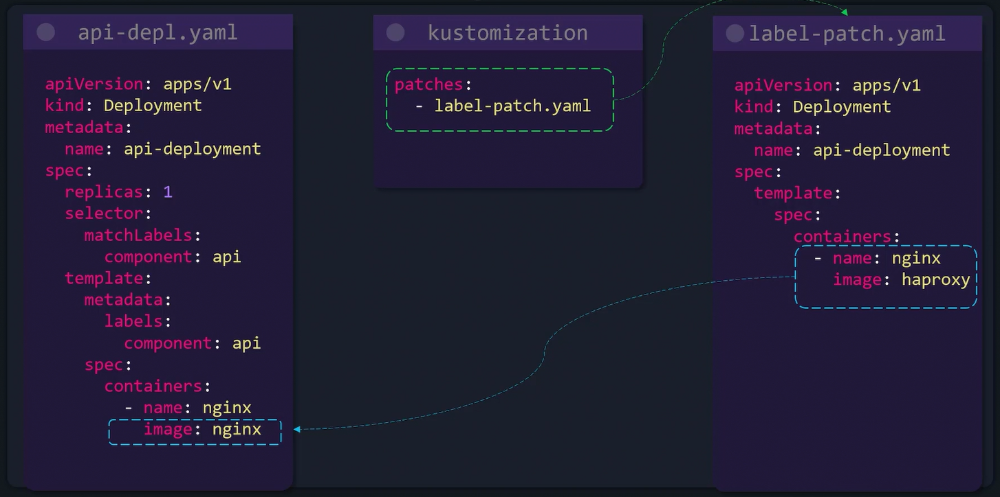
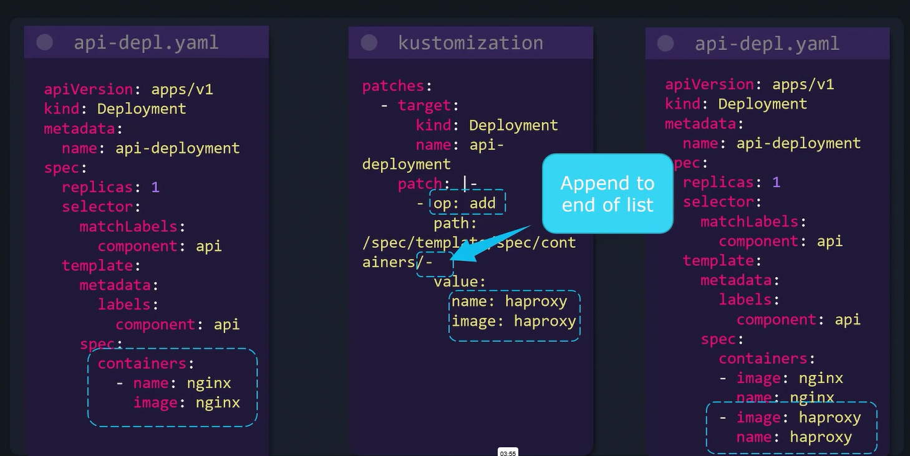
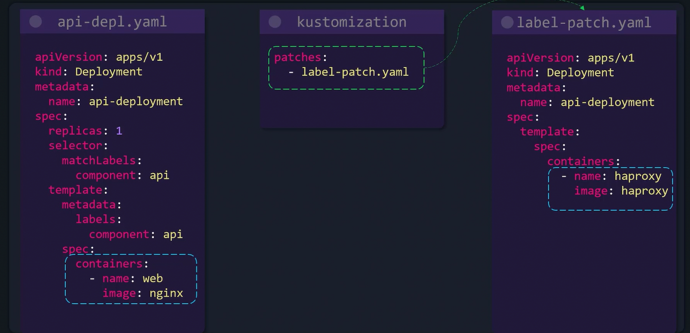
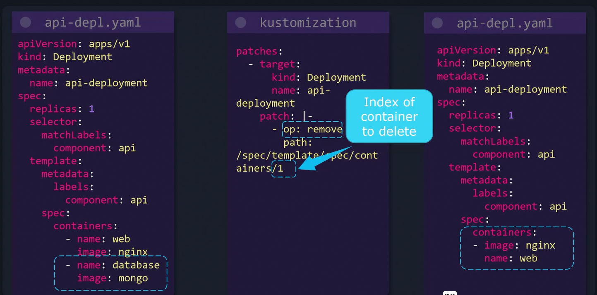
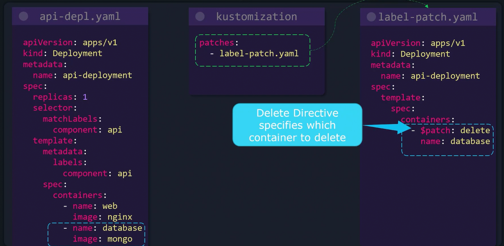

# Patches List

## A.   REPLACE Operation

### 1. Using JSON Approach

### 2. Using Strategic Merge Approach

## B. ADD Operation

### 1. Using JSON Approach

The patch path ends with a dash (-) to signal that the new container should be appended to the end of the list. 

Although indexing (e.g., 0 for the beginning) is possible, appending is achieved easily using the dash notation.

### 2. Using Strategic Merge Approach

## C. REMOVE Operation

### 1. Using JSON Approach

### 2. Using Strategic Merge Approach

