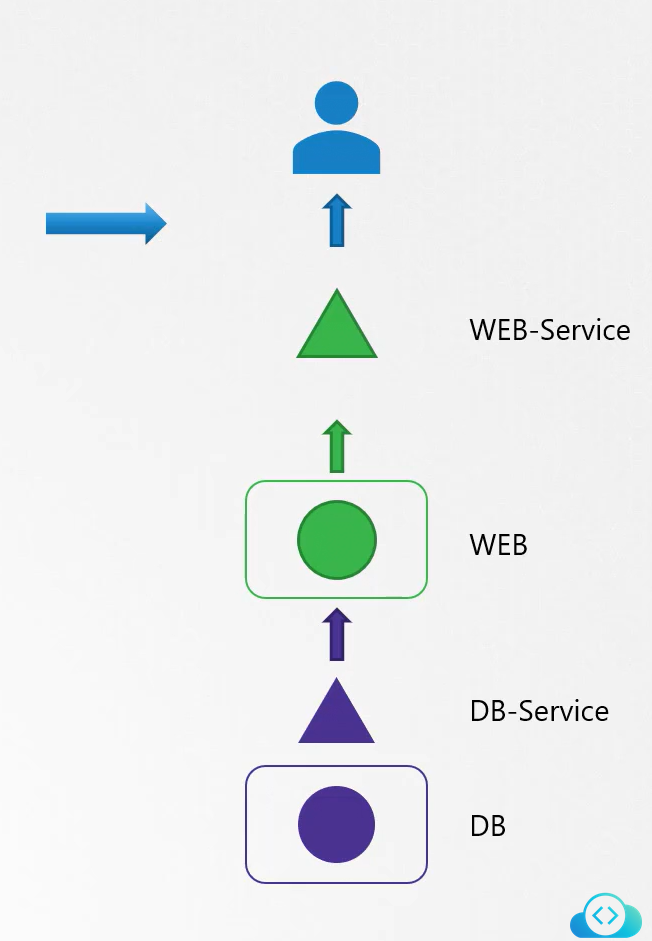
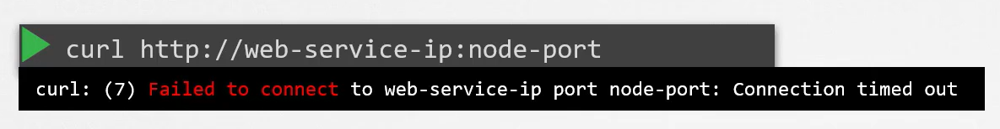
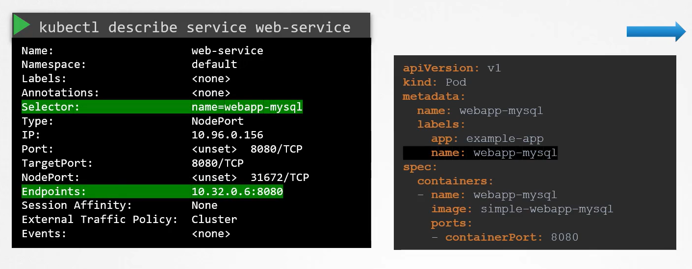
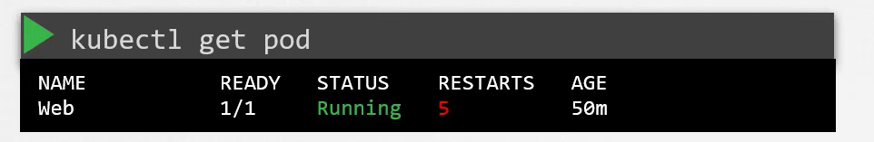
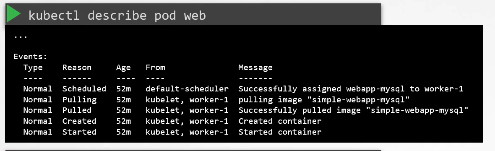
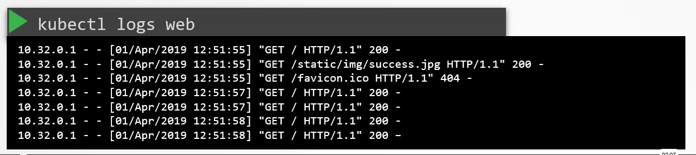
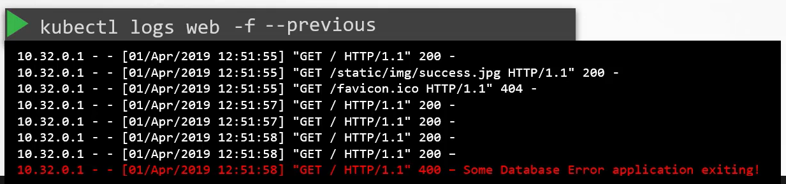

# Troubleshooting
We will review systematic troubleshooting techniques and provide practical scenarios to help you diagnose and resolve issues in a two-tier application architecture.


## Overview
-   Consider a two-tier application consisting of a **web server and a database server.**

    -   The database pod hosts a **database application** and serves data to the **web servers via a database service.**

    -   Meanwhile, the web server, running on a **separate pod, **delivers content to the users through a **web service.**



## Troubleshooting the Web Application
### 1. Curl
-   When users report issues accessing your application, start by testing the application’s front end.



```bash
curl http://web-service-ip:node-port
curl: (7) Failed to connect to web-service-ip port node-port: Connection timed out
```


### 2. Validate Service Endpoints
-   Ensure that the **web service has correctly discovered endpoints** for the web pod.

A common issue is a mismatch between the **selectors** defined on the **service and those on the pod.**


```bash
kubectl describe service web-service
```

### 3. Verify POD Configurations
-   Review the web application's pod definition to ensure it is correctly configured and running:



```bash
kubectl get pods
```

### 4. Check Events of POD
-   For a more detailed inspection, including event logs:


```bash
kubectl describe pod web
```

### 5. Review Application Logs


Logs of previous Pod


```bash
kubectl logs web
kubectl logs -f 
kubectl logs -f --previous
```

##  Troubleshooting the Database Service
Apply a similar approach to verify the status of the database (DB) service. Examine the following:

 1. Inspect the **DB service** details.
 2. Confirm that **endpoints** are configured correctly.
 3. Check the **DB pod's status.**
 4. Review the **database logs** for errors that might signal issues within the database.


 ### Double-Check Your Selectors

Ensure that both the **web** and **DB services** have matching selectors for their respective pods. Mismatches in labels can lead to missing endpoints and connectivity issues.