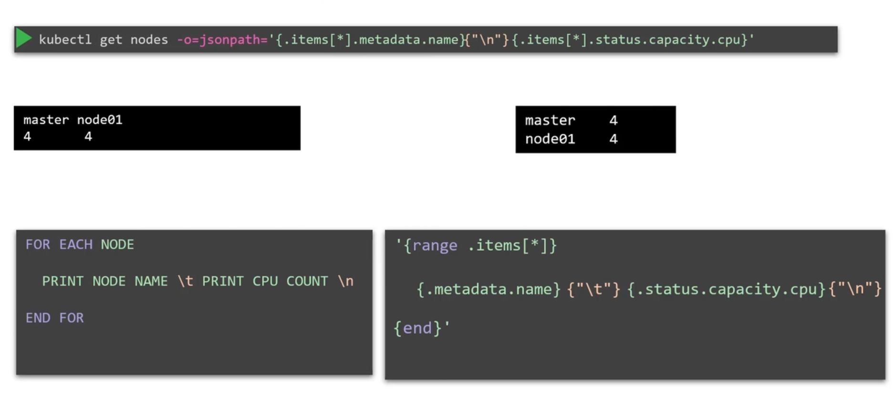

# Advanced Commands


## Why Use JSONPath?
In production environments with hundreds of nodes and thousands of objects—such as deployments, pods, ReplicaSets, services, and secrets— **the standard kubectl output might not provide the precise data you need.**

While kubectl gives a quick summary, **JSONPath queries let you filter and format large** datasets with precision.


### How Kubectl Works
-   Kubectl is the command-line interface for Kubernetes that communicates with the API server. 

-   **Every command retrieves data in JSON format and converts it into a human-readable format.**

For example,
```bash
kubectl get nodes
```

Output
```bash
NAME      STATUS   ROLES    AGE   VERSION
master    Ready    master   40m   v1.11.3
node01    Ready    <none>   40m   v1.11.3
```

Behind the scenes, the JSON output might resemble:
```bash
{
  "apiVersion": "v1",
  "items": [
    {
      "apiVersion": "v1",
      "kind": "Node",
      "metadata": {
        "annotations": {
          "node.alpha.kubernetes.io/ttl": "0"
        },
        "creationTimestamp": "2019-06-21T09:01:56Z",
        "labels": {
          "beta.kubernetes.io/arch": "amd64",
          "beta.kubernetes.io/os": "linux",
          "kubernetes.io/hostname": "master",
          "node-role.kubernetes.io/master": ""
        }
      }
    }
  ]
}
```

-   Kubectl trims excessive details to keep the output clear

-   If you need the full details—like resource capacity, taints, conditions, hardware architecture, etc.—use ```kubectl describe``` or query the JSON directly.


## Building a JSONPath Query
-   Imagine needing a report that displays specific fields, **such as node names and CPU counts.** 

    -   **No default command provides this directly**—that’s where JSONPath shines. 
    
Follow these steps to build a JSONPath query with kubectl:


1. Retrieve Raw Data
    ```bash
    kubectl get nodes
    ```

2. View Full JSON Output
Add the -o json option to see the complete data:
    ```bash
    kubectl get nodes -o json
    kubectl get pods -o json
    ```
For instance, a sample JSON output for pods might look like:

```bash
{
  "apiVersion": "v1",
  "kind": "List",
  "items": [
    {
      "apiVersion": "v1",
      "kind": "Pod",
      "metadata": {
        "name": "nginx-5557945897-gznjp"
      },
      "spec": {
        "containers": [
          {
            "image": "nginx:alpine",
            "name": "nginx"
          }
        ],
        "nodeName": "node01"
      }
    }
  ]
}
```

3. Analyze the JSON Structure

For example, to extract the image from the first container in the first pod, the JSONPath query is:

```bash
Query: .items[0].spec.containers[0].image
```

4. Query with Kubectl

```bash
kubectl get pods -o=jsonpath='{.items[0].spec.containers[0].image}'
```

### JSONPath Hint

If you're new to JSONPath, try using online evaluators like ```jsonpath.com``` to experiment with and refine your queries.


Using JSONPath, you can extract various fields. For example:

```bash
{.items[*].metadata.name} #returns all node names.
{.items[*].status.nodeInfo.architecture} #provides hardware architectures.
{.items[*].status.capacity.cpu} #shows CPU counts per node.
```

Example commands:

### 1
```bash
kubectl get nodes -o=jsonpath='{.items[*].metadata.name}'
```

Output:
```bash
master node01
```

### 2
```bash
kubectl get nodes -o=jsonpath='{.items[*].status.nodeInfo.architecture}'
```

Output
```bash
amd64 amd64
```

### 3
```bash
kubectl get nodes -o=jsonpath='{.items[*].status.capacity.cpu}'
```

Output:
```bash
4 4
```

### 4
```bash
kubectl get nodes -o=jsonpath='{.items[*].metadata.name}{"\n"}{.items[*].status.capacity.cpu}'
```

Output:
```bash
master node01
4 4
```


### Advanced Formatting with Loops





### Advanced Formatting with Custom Columns


```bash
kubectl get nodes -o=custom-columns=NODE:.metadata.name,CPU:.status.capacity.cpu
```

### Advanced Formatting with Sort

