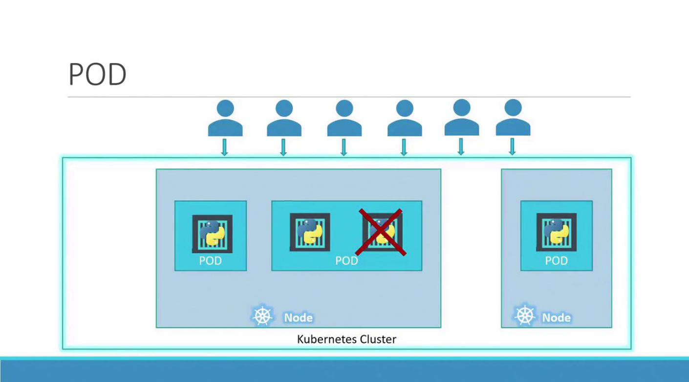
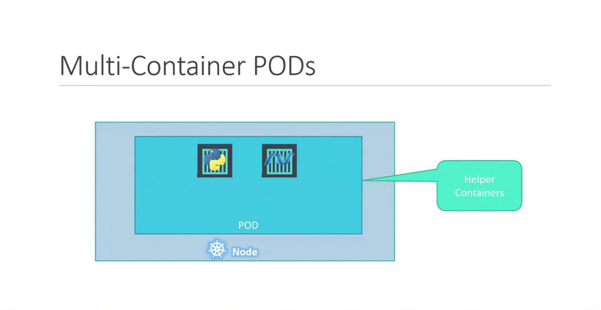

# Pods
-   With Kubernetes, **the goal is to run containers on worker nodes**, but rather than deploying containers directly, **Kubernetes encapsulates them within an object called a pod.**

    - A pod represents a single instance of an application and is the **smallest deployable unit in Kubernetes.**

-   In the simplest scenario, a single-node Kubernetes cluster may run **one instance of your application inside a Docker container encapsulated by a pod.**

-   When user load increases, **instead of adding more containers to the same pod, additional pods are created**.
    -   For instance, running two instances in separate pods allows the load to be shared across the node or even across multiple nodes if the demand escalates and additional cluster capacity is required.



### Scaling Pods

Remember, scaling an application in Kubernetes involves **increasing or decreasing the number of pods**, not the number of containers within a single pod.

-   Typically, **each pod hosts a single container** running your main application. 
    -   However, a **pod can also contain multiple containers**, which are usually *complementary rather than redundant*.
        -   For example, you might include a helper container alongside your main application container to support tasks like data processing or file uploads. Both containers in the pod share the same network namespace (allowing direct communication via localhost), storage volumes, and lifecycle events, ensuring they start and stop together.



To better understand the concept, consider a basic Docker example. Suppose you initially deploy your application with a simple command:

```bash
docker run python-app
```

When the load increases, you may launch additional instances manually:
```bash
docker run python-app
docker run python-app
docker run python-app
docker run python-app
```

Now, if your application needs a helper container that communicates with each instance, managing links, custom networks, and shared volumes manually becomes complex. You’d have to run commands like:

```bash
docker run helper --link app1
docker run helper --link app2
docker run helper --link app3
docker run helper --link app4
```

With Kubernetes pods, these challenges are resolved automatically. 
-   When a pod is defined with multiple containers, they share storage, the network namespace, and lifecycle events—ensuring seamless coordination and simplifying management.

## Deploying Pods

### Run an image
```bash
kubectl run <pod_name> --image=<image_location>
```
```bash
kubectl run nginx --image=nginx
```

### List pods
```bash
kubectl get pods
kubectl get po
kubectl get pods -o wide    # Get more info
```

### Get more details of pod
```bash
kubectl describe pod nginx
```

### Delete Pod
```bash
kubectl delete pod nginx
```

### Edit a POD
```bash
kubectl edit pod nginx
```

### Remember, you CANNOT edit specifications of an existing POD other than the below.

    spec.containers[*].image
    spec.initContainers[*].image
    spec.activeDeadlineSeconds
    spec.tolerations

