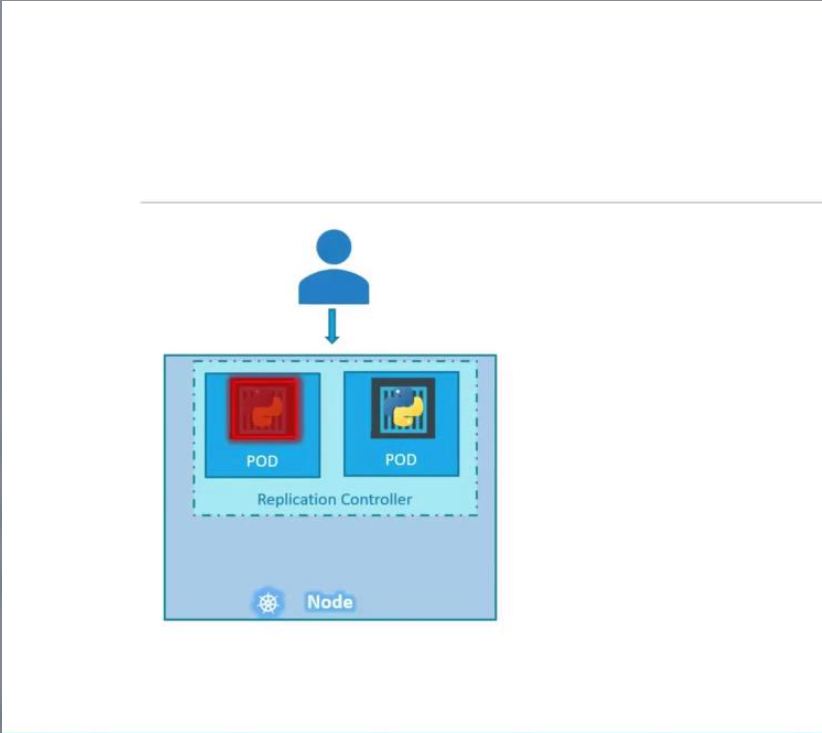
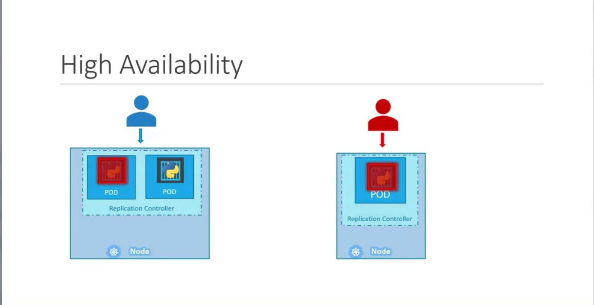
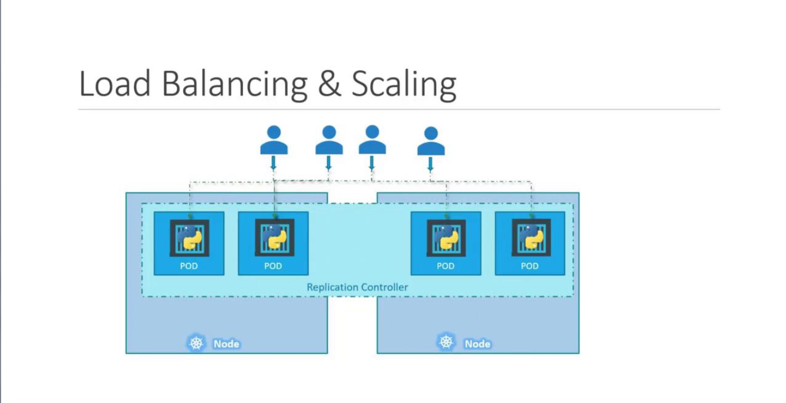
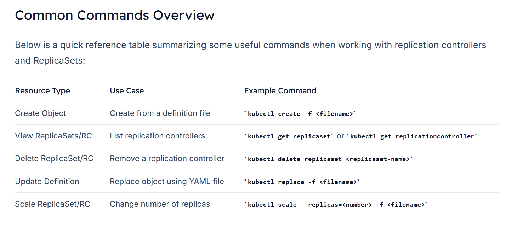

# ReplicaSets

-   Imagine a scenario where a single pod runs your application. If that pod crashes or fails, users lose access.
    -   To prevent this risk, running multiple pod instances is key.

-   A replication controller ensures high availability by creating and maintaining the desired number of pod replicas.
    -   **Even if you intend to run a single pod, a replication controller adds redundancy by automatically creating a replacement if the pod fails.**




If one pod serving your application crashes, the replication controller immediately deploys a new one to keep the service available.



-   Beyond availability, replication controllers also help **distribute load.** 
    -   When user demand increases, additional pods can better balance that load. 
    -   If resources on a particular node become scarce, **new pods can be scheduled across other nodes in your cluster.**




###  Note

-   While both **replication controllers** and **replica sets** serve similar purposes, the **replication controller is the older technology** being gradually replaced by the replica set. 
-   In this lesson, we will focus on replica sets for our demos and implementations.

## Creating a Replication Controller
To create a replication controller, start by writing a configuration file (e.g., ```rc-definition.yaml```). Like any Kubernetes manifest, the file contains four main sections: **apiVersion**, **kind**, **metadata**, and **spec**.

1.  **apiVersion**: For a replication controller, use ```v1```.
2.  **kind**: Set this to ```ReplicationController```.
3.  **metadata**: Provide a name (e.g., ```myapp-rc```) and include labels such as app and type.
4.  **spec**: This section is crucial. It not only defines the desired ```number of replicas``` with the replicas key but also includes a ```template``` section which serves as the blueprint for creating the pods. Ensure that all pod-related entries in the template are indented correctly and aligned with replicas as siblings.

```bash
vi rc-definition.yml
```

```bash
apiVersion: v1
kind: ReplicationController
metadata:
  name: myapp-rc
  labels:
    app: myapp
    type: front-end
spec:
  replicas: 3
  template:
    metadata:
      name: myapp-pod
      labels:
        app: myapp
        type: front-end
    spec:
      containers:
      - name: nginx-container
        image: nginx
```

```bash
kubectl create -f rc-definition.yml
```

### View Replication Controller
```bash
kubectl get replicationcontroller

kubectl get rc
```

## Introducing ReplicaSet
-   A ReplicaSet is a modern alternative to the replication controller, using an updated API version and some improvements. Here are the key differences:
    1.  **API Version**: Use ```apps/v1``` for a ReplicaSet.
    2.  **Selector**: In addition to ```metadata``` and ```spec```, a ReplicaSet requires a ```selector``` **to explicitly determine which pods to manage.** This is defined using ```matchLabels```, which can also capture pods created before the ReplicaSet if they match the criteria.

```bash
apiVersion: apps/v1
kind: ReplicaSet
metadata:
  name: myapp-replicaset
  labels:
    app: myapp
    type: front-end
spec:
  replicas: 3
  selector:
    matchLabels:
      type: front-end
  template:
    metadata:
      name: myapp-pod
      labels:
        app: myapp
        type: front-end
    spec:
      containers:
      - name: nginx-container
        image: nginx
```

### Create the ReplicaSet with:
```bash
kubectl create -f replicaset-definition.yml
```

### Verify ReplicaSet
```bash
kubectl get replicaset

kubectl get rs
```


## Labels and Selectors
-   Labels in Kubernetes are critical because they enable controllers, such as ReplicaSets, **to identify and manage the appropriate pods within a large cluster.**
    -   For example, if you deploy multiple instances of a front-end web application, assign a label (e.g., ```tier: front-end```) to each pod. Then, use a selector to target those pods:

        ```bash
        ## ReplicaSet.yaml
        
        selector:
            matchLabels:
            tier: front-end
        ```

    -   The pod definition should similarly include the label:
        ```bash
        ## Pod-definition.yaml

        metadata:
        name: myapp-pod
        labels:
            tier: front-end

        ```


### Is the Template Section Required?
-   Even if three pods with matching labels already exist in your cluster, the template section in the ReplicaSet specification remains essential. 
-   **It serves as the blueprint for creating new pods if any fail,** ensuring the desired state is consistently maintained.


### Scaling the ReplicaSet
Scaling a ReplicaSet involves adjusting the number of pod replicas. There are two methods to achieve this:

#### 1.     Update the Definition File
-   Modify the ```replicas``` value in your YAML file (e.g., change from 3 to 6) and update the ReplicaSet with:

    ```bash
    kubectl replace -f replicaset-definition.yml
    ```

#### 2.     Use the kubectl scale Command
```bash
kubectl scale --replicas=6 -f replicaset-definition.yml
```

#### Important

-   Keep in mind that if you scale using the ```kubectl scale``` command, **the YAML file still reflects the original number of replicas**. 
-   To maintain consistency, it may be necessary to update the YAML file after scaling.


