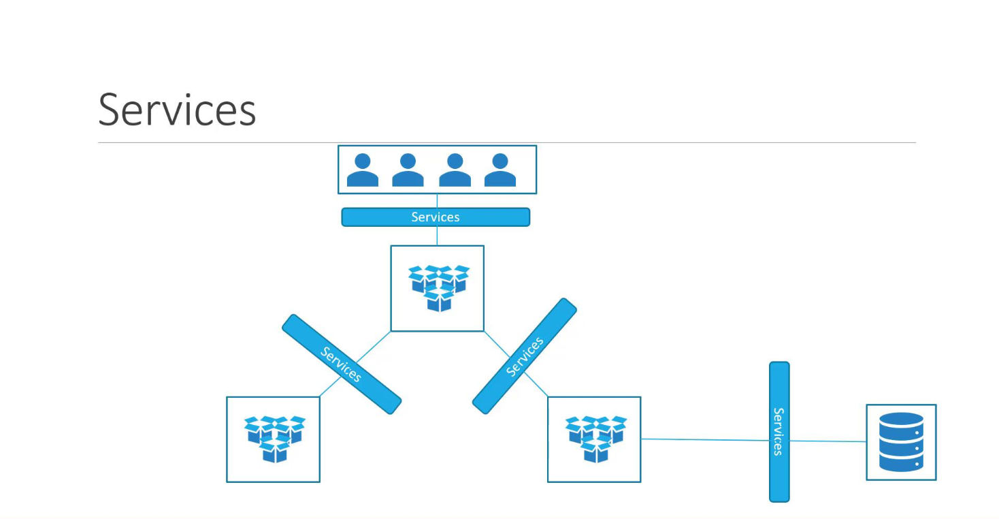
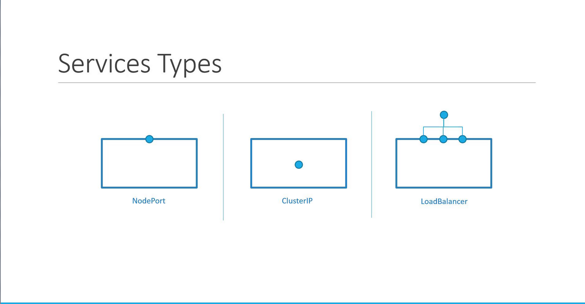

# Services

-   We’ll explore how Kubernetes services **enable seamless communication between various application components**—both within the cluster and from the outside world.

-   Kubernetes services **allow different sets of Pods to interact with each other.**
    -   Whether connecting the front end to back-end processes or integrating external data sources, services help to decouple microservices while maintaining reliable communication.
        -   For instance, you can **expose your front-end to end users** and **enable back-end components to interact efficiently**.





## Use Cases
### Use Case1: From Internal Networking to External Access

-   So far, we’ve seen **how Pods communicate internally using the Kubernetes network.** 

-   Consider a scenario where you deploy a Pod running a web application and **want an external user to access it.** Here’s a quick overview of the setup:
    -   **Kubernetes Node IP**: 192.168.1.2
    -   **Laptop IP (same network):** 192.168.1.10
    -   **Internal Pod Network:** 10.244.0.0
    -   **Pod IP:** 10.244.0.2

-   Since the Pod is on an isolated internal network, direct access to ```10.244.0.2``` from your laptop isn’t possible. One workaround is to **SSH into the Kubernetes node** (192.168.1.2) and use curl to reach the Pod:
    ```bash
    curl http://10.244.0.2
    Hello World!
    ```
    -   While this method works from the node, the **goal is to have external access directly from your laptop using the node’s IP.** 

-   This is where a Kubernetes service, specifically a **NodePort** service, becomes essential.
    -   **A NodePort service maps requests arriving at a designated node port (like 30008) to the Pod’s target port.**

        ```bash
        curl http://192.168.1.2:30008
        Hello World!
        ```

    -   This configuration externally exposes the web server running inside the Pod.

## Types of Kubernetes Services
Kubernetes supports several service types, each serving a unique purpose:

1.  **NodePort:** Maps a port on the **node to a port on a Pod**.
2.  **ClusterIP:** Creates a **virtual IP for internal communication** between services (e.g., connecting front-end to back-end servers).
3.  **LoadBalancer:** Provisions an external load balancer (supported in cloud environments) to distribute traffic across multiple Pods.





