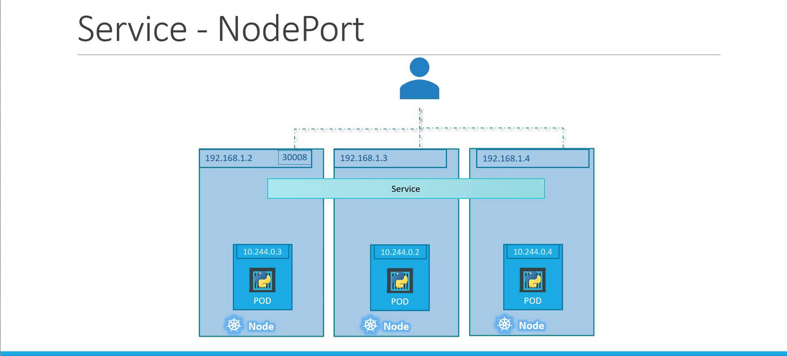

# Services NodePort
## NodePort Service Breakdown

-   With a NodePort service, there are three key ports to consider:

    -   **Target Port**: **The port on the Pod** where the application listens (e.g., 80).
    -   **Port:** **The virtual port on the service** within the cluster.
    -   **NodePort:** The **external port** on the Kubernetes node (by default in the range 30000–32767).

## Creating a NodePort Service
The process of creating a NodePort service begins with defining the service in a **YAML file**.

```bash
apiVersion: v1
kind: Service
metadata:
  name: myapp-service
spec:
  type: NodePort
  ports:
    - targetPort: 80
      port: 80
      nodePort: 30008
```

In this YAML:
-   **targetPort** specifies the Pod’s application port.
-   **port** is the port on the service that acts as a virtual server - port within the cluster.
-   **nodePort** maps the external request to the specific port on the node (ensure it’s between 30000 and 32767).

### Note
-   If you omit targetPort, it defaults to the same value as port. 
-    Similarly, if nodePort isn’t provided, Kubernetes automatically assigns one.


**However, the YAML definition does not link the service to any Pods.**
-   To connect the service to specific Pods, **a selector is used**, just as in ReplicaSets or Deployments. 

    ```bash
    # Pod.yaml

    apiVersion: v1
    kind: Pod
    metadata:
        name: myapp-pod
    labels:
        app: myapp
        type: front-end
    spec:
        containers:
            -   name: nginx-container
                image: nginx
    ```

-   Now, update the service definition to include a selector that matches these labels:
    ```bash
    # Service.yaml

    apiVersion: v1
    kind: Service
    metadata:
        name: myapp-service
    spec:
        type: NodePort
        ports:
            -   targetPort: 80
                port: 80
                nodePort: 30008
        selector:
            app: myapp
            type: front-end

    ```

-   Save the file as ```service-definition.yml``` and create the service using:
    ```bash
    kubectl create -f service-definition.yml
    ```

-   Verify the service details with:
    ```bash
    kubectl get services

    kubectl get svc
    ```

-   Access the web service externally by pointing your browser or using ```curl``` with the node IP and NodePort:
    ```bash
    curl http://192.168.1.2:30008
    ```

## Kubernetes Services in Production
-   In a production environment, your **application is likely spread across multiple Pods** for high availability and load balancing. 
    -   When **Pods share matching labels**, *the service automatically detects and routes traffic to all endpoints.*
    -   Kubernetes employs a **round-robin (or random) algorithm** to distribute incoming requests, serving as an integrated load balancer.

-   Furthermore, even if your **Pods are spread across multiple nodes,** Kubernetes ensures that the target port(Container Port) is mapped on all nodes.

-   This means you can **access** your web application **using the IP of any node along with the designated NodePort,** providing reliable external connectivity.


