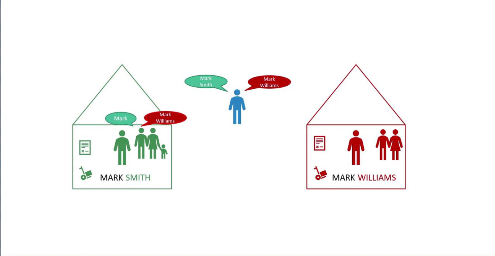
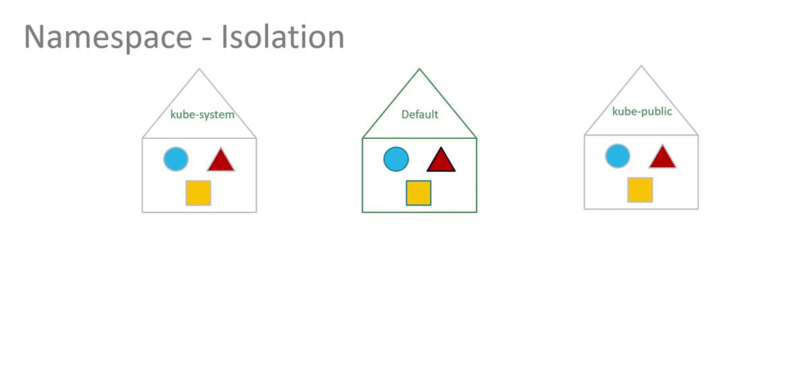
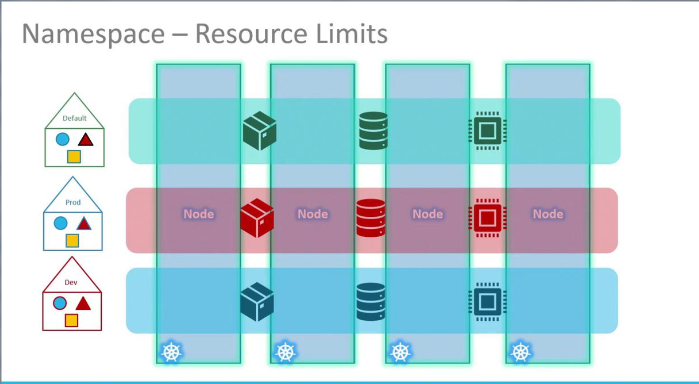
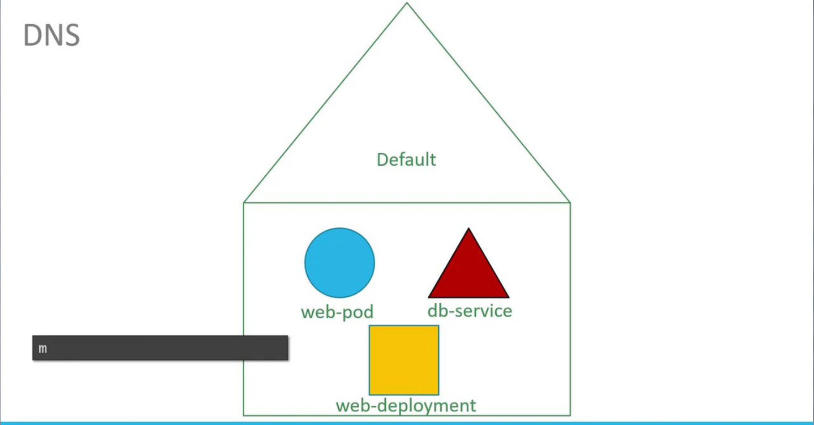
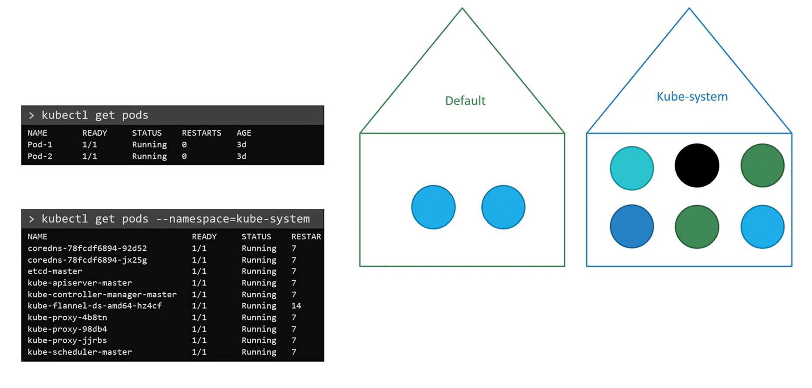
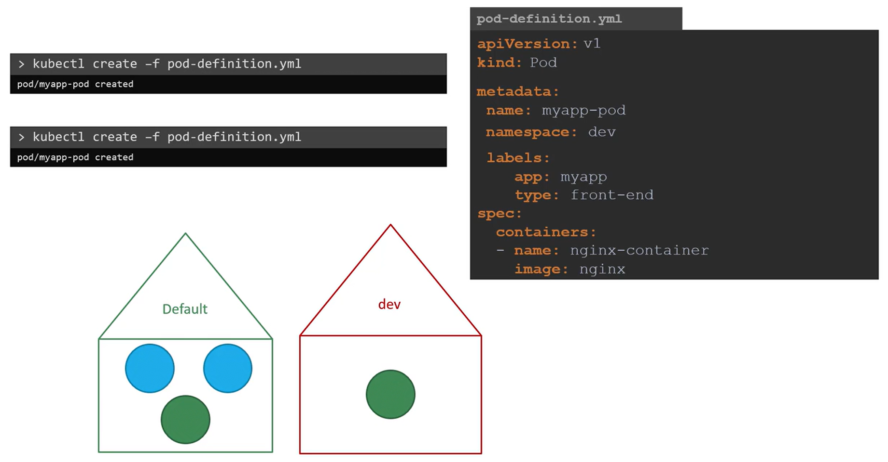
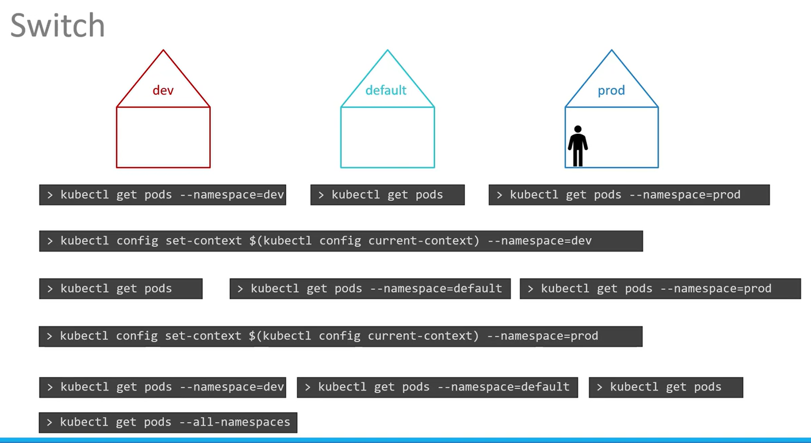
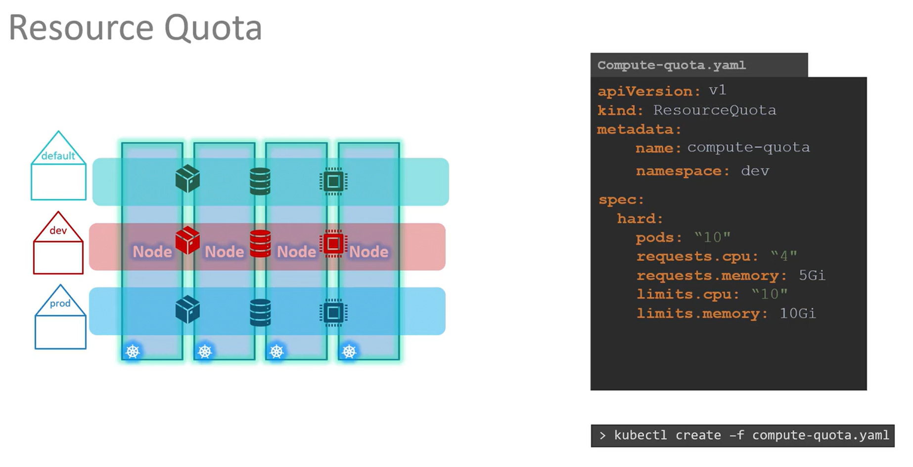

# Namespaces
We explore the concept of namespaces in Kubernetes and **how they help organize and ```isolate resources within your cluster```.**


## Understanding Namespaces Through Analogy
-   Imagine there are two boys named Mark.
    -   To differentiate between them, you refer to them by their last names—Smith and Williams.
    -   They come from different houses where people often use first names for those familiar with them
    -   However, when addressing someone from another house or an outsider, the full name is used.

-   In Kubernetes, these **"houses" represent namespaces**. 
    -    They allow you to **group and manage resources differently based on their context and intended use.**



## Default Namespace and System Namespaces
-   By default, when you create objects such as **pods, deployments, and services in your cluster**, they are placed within a specific namespace (similar to being "inside a house"). 
-   The default namespace is automatically created during the Kubernetes cluster setup. 

-   Additionally, several system namespaces are created at startup:
    -   **kube-system:** Contains core system components like **network services and DNS**, segregated from user operations to prevent accidental changes.
    -   **kube-public:** Intended for resources that need to be publicly accessible across users.

### Note

-   If you're running a small environment or a personal cluster for learning, you might predominantly use the ```default namespace```. 
-   In enterprise or production environments, however, **namespaces provide essential isolation and resource management** by allowing environments like **development and production to coexist on the same cluster.**




## Isolating Resources with Namespaces
-   Namespaces allow you to **set distinct policies and resource limits** for different environments. 
    -   This isolation **prevents one namespace from interfering with another**. 
        -   For instance, you can apply separate resource quotas for CPU, memory, and the total number of pods to ensure fair usage across environments.





-   Within a single namespace, **resources can refer to each other directly via their simple names**. 
    -   For example, a web application pod in the **default namespace** can access a** database service** simply by using its service name
        
-   If the web app pod needs to **communicate with a service located in a different namespace**, you must use its ```fully qualified DNS name```.   
    -   For example, connecting to a database service named ```"db-service"``` in the ```"dev"``` namespace follows this format:
        ```bash
        mysql.connect("db-service.dev.svc.cluster.local")
        ```
        Here, ```"svc"``` indicates the s**ervice subdomain**, followed by the **namespace** ```("dev")``` and the **service name**, ending with the default domain ```"cluster.local"```.

        


## Managing Namespaces with kubectl



### List Namespaces
```bash
kubectl get namespaces

kubectl get ns
```

### Listing Pods in a Namespace
```bash
kubectl get pods --namespace=kube-system
```
### Creating Pods in Specific Namespaces
#### Option-1
```bash
kubectl create -f pod-definition.yml --namespace=dev

kubectl create -f pod-definition.yaml -n dev
```
#### OR Option-2 
[Define the namespace within the pod definition file:]

```bash
apiVersion: v1
kind: Pod
metadata:
    name: myapp-pod
    namespace: dev
    labels:
        app: myapp
        type: front-end
spec:
    containers:
        -   name: nginx-container
            image: nginx
```

```bash
kubectl create -f pod-definition.yaml
```




### Create Namespace
#### Option-1
```bash
kubectl create namespace dev
kubectl create ns dev
```
####  OR 
#### Option-2
You can create a namespace using a YAML file

```bash
apiVersion: v1
kind: Namespace
metadata:
    name: dev
```

```bash
kubectl create -f namespace-dev.yml
```

### Switch Namespace
```bash
kubectl get pods --namespace=dev


kubectl get pods --namespace=prod
```

### Change from default Namespace to Other Namespace

```bash
kubectl config set-context $(kubectl config current-context) --namespace=dev

OR

kubectl config set-context --current --namespace dev
```

### View pods in all Namespace

```bash
kubectl get pods --all-namespaces

OR

kubectl get pods -A
```



### Create pods in particular Namespace
```bash
kubectl run redis --image=redis --namespace finance

kubectl run redis --image=redis -n=finance
```

## Allocate Resource Quota for a Namespace
To ensure that no single namespace overconsumes cluster resources, Kubernetes allows you to define ResourceQuotas.

```bash
apiVersion: v1
kind: ResourceQuota
metadata:
    name: compute-quota
    namespace: dev
spec:
    hard:
        pods:   "10"
        requests.cpu: "4"
        requests.memory: 5Gi
        limits.cpu: "10"
        limits.memory: 10Gi
```

Apply this configuration with:
```bash
kubectl create -f compute-quota.yaml
```


