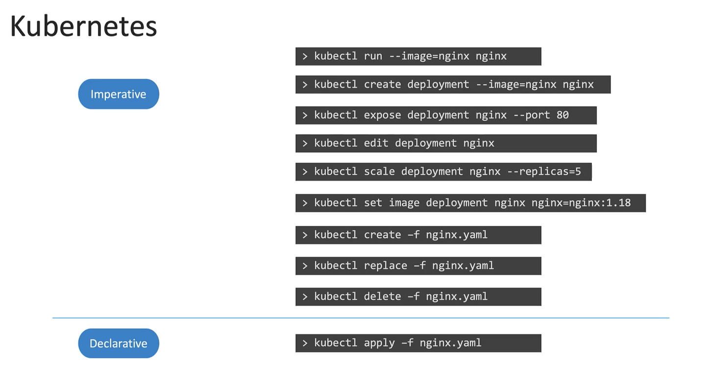
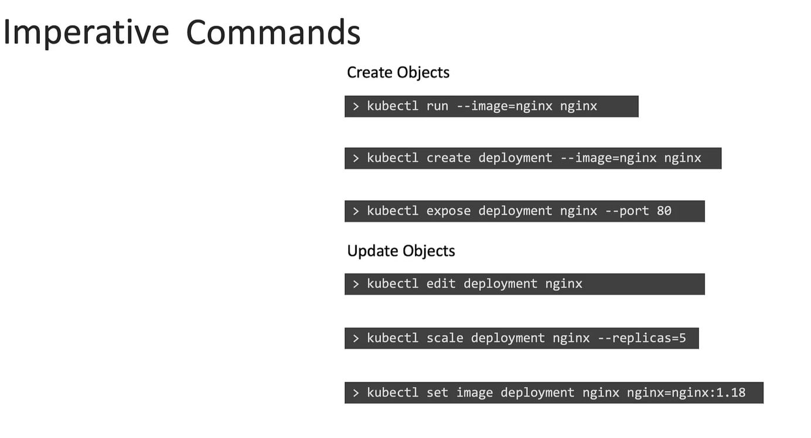
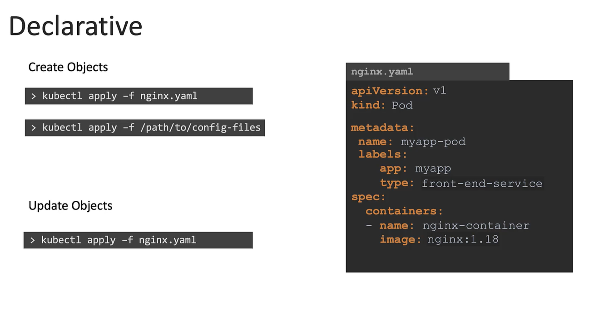

# Imperative vs. Declarative
So far, we have covered creating and managing Kubernetes objects either by **directly issuing commands** or **by using configuration files.** 

-   These approaches fall into two broad categories in the infrastructure-as-code domain: ```imperative``` and ```declarative```.

## An Analogy

-   Imagine visiting a friend’s house.
    -    In the past, you might have taken a taxi and given the driver precise, step-by-step directions—for example, "Take a right onto Street B, then left onto Street C, another left onto Street D, and finally stop at the house." This sequence of detailed instructions illustrates the imperative approach
    -   Today, using an app like Uber, you simply enter your final destination. This is akin to the declarative approach where you specify the desired outcome—"Drive to Tom's house"—and the system figures out the best route.


## Imperative vs Declarative: Kubernetes Perspective

### Imperative Approach
-   The imperative approach in Kubernetes involves executing specific commands to **create, update, or delete objects**.

-   This method instructs Kubernetes on **both what needs to be done and how it should be done.**
```bash
kubectl run --image=nginx nginx
kubectl create deployment --image=nginx nginx
kubectl expose deployment nginx --port 80
kubectl edit deployment nginx
kubectl scale deployment nginx --replicas=5
kubectl set image deployment nginx nginx=nginx:1.18
kubectl create -f nginx.yaml
kubectl replace -f nginx.yaml
kubectl delete -f nginx.yaml
```

While the imperative approach is effective for quick tasks, it comes with some limitations:

-   If a command partially executes, running it again **may require extra checks (e.g., verifying if a resource already exists).**
-   Updating resources—**such as changing the image version**—demands explicit re-execution with live adjustments.
-   Commands executed interactively are often **not persisted**, making it challenging for teammates to trace the system’s original state.




### Declarative Approach
The declarative approach enables you to specify the desired state of your infrastructure through configuration files (typically written in YAML)

```bash
# nginx.yaml
apiVersion: v1
kind: Pod
metadata:
  name: myapp-pod
  labels:
    app: myapp
    type: front-end
spec:
  containers:
    - name: nginx-container
      image: nginx
```

Applying the configuration is as simple as running:
```bash
kubectl apply -f nginx.yaml
```

Kubernetes will **create or update** the object automatically to match the state described in your YAML file.




When you need to update the configuration—say, **to change the image version**—you modify the YAML file and apply it again with:

```bash
kubectl apply -f nginx.yaml
```

This method ensures that your configuration files remain the single source of truth, which is especially valuable in team environments where version-controlled definitions are critical.

## Imperative vs Declarative Update Dilemma
Sometimes, you might modify a live object using the ```kubectl edit``` command. This command opens a YAML representation of the current state, including additional fields like status, **which are absent from your original configuration file.** For instance:

1. Initially, you create the object using your YAML file:
    ```bash
    kubectl create -f nginx.yaml
    ```

2.  Later, you edit the deployment:
    ```bash
    kubectl edit deployment nginx
    ```

3. The live object now contains extra status fields. If you later apply the original ```nginx.yaml``` **(perhaps with updates), your live edits might be overwritten.**


### Best Practice

**Always update your local configuration files** and use commands like ```kubectl replace -f nginx.yaml``` to ensure that your changes are consistently tracked and version-controlled.

A typical workflow in a team environment is as follows:
1.  Create the object:
    ```bash
    kubectl create -f nginx.yaml
    ```
2.  Modify the local file to implement changes (e.g., update the image version).

3.  Update the live object with:
    ```bash
    kubectl replace -f nginx.yaml
    ```

