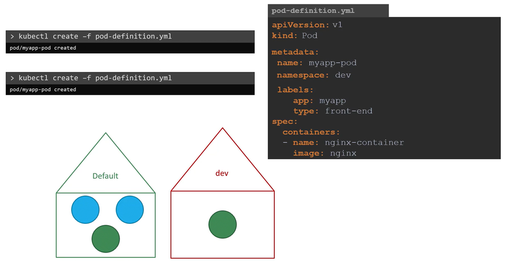
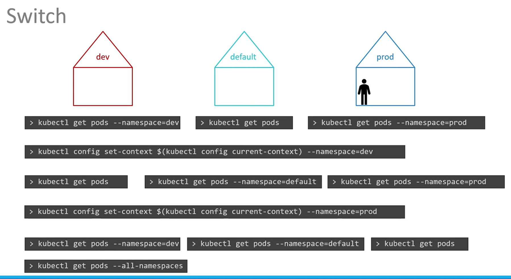

# Namespaces


List Namespaces
```bash
kubectl get namespaces

kubectl get ns
```

```bash
kubectl get pods --namespace=kube-system
```



```bash
apiVersion: v1
kind: Pod
metadata:
    name: myapp-pod
    namespace: dev
    labels:
        app: myapp
        type: front-end
spec:
    containers:
        -   name: nginx-container
            image: nginx
```

## Create Namespace
```bash
kubectl create namespace dev
kubectl create ns dev
```
####  OR
```bash
apiVersion: v1
kind: Namespace
metadata:
    name: dev
```

```bash
kubectl create -f namespace-dev.yml
```

## Switch Namespace
```bash
kubectl get pods --namespace=dev


kubectl get pods --namespace=prod
```

## Change from default Namespace to Other Namespace

```bash
kubectl config set-context $(kubectl config current-context) --namespace=dev
```

## View pods in all Namespace

```bash
kubectl get pods --all-namespaces
kubectl get pods -A
```



## Create pods in particular Namespace
```bash
kubectl run redis --image=redis --namespace finance

kubectl run redis --image=redis -n=finance
```

## Allocate Resource Quota for a Namespace

```bash
apiVersion: v1
kind: ResourceQuota
metadata:
    name: compute-quota
    namespace: dev
spec:
    hard:
        pods:   "10"
        requests.cpu: "4"
        requests.memory: 5Gi
        limits.cpu: "10"
        limits.memory: 10Gi
```

```bash
kubectl create -f compute-quota.yaml
```


