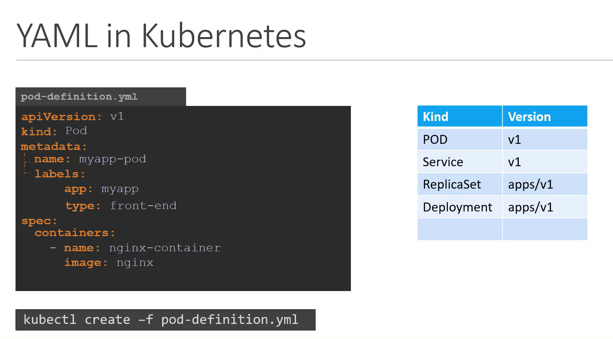

# YAML in K8s



```bash
apiVersion: v1
kind: Pod
metadata:
    name: myapp-pod
    labels:
        app: myapp
        type: front-end
spec:
    containers:
        -   name: nginx-container
            image: nginx
        -   name: busybox-container
            image: busybox

```

Start the Pod
```bash
kubectl create -f pod-definition.yml
```

Apply changes to already running pod
```bash
kubectl apply -f <.....yaml>
```