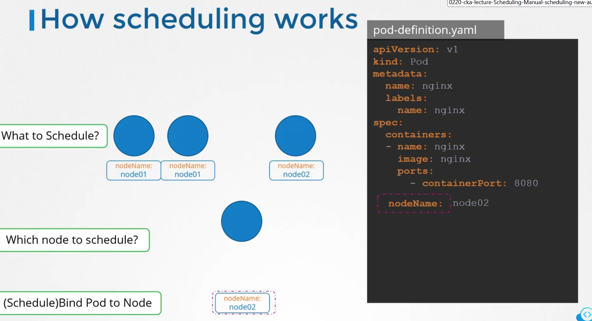

# Manual Scheduling
 -  This guide explains how to assign pods to nodes without relying on Kubernetes’ built-in scheduler.
 -  Manual scheduling can be useful in niche scenarios where you need tighter control over pod placement.


## Understanding the Default Scheduler Behavior
-   Every pod definition includes a field called ```nodeName```, which is left unset by default.
-   The Kubernetes scheduler automatically scans for pods without a ```nodeName``` and selects an appropriate node by updating this field and creating a binding object




## Manually Setting the Node Name
-   To manually assign a pod to a specific node during creation, populate the nodeName field in the manifest.

```bash
---
apiVersion: v1
kind: Pod
metadata:
  name: nginx
spec:
  nodeName: node01      #  Node Name
  containers:
  -  image: nginx
     name: nginx
```


### **Note**

-   The ```nodeName``` must be set during pod creation. 
-   Once the pod is running, Kubernetes does not permit modifications to the ```nodeName``` field.


-   **If the pod already exists in a pending state, you will need to delete it and recreate it.** 

-   **A convenient approach is to use the ```kubectl replace --force``` command, which deletes the existing pod and recreates it in one step:**

```bash
root@controlplane:~# kubectl replace --force -f nginx.yaml
pod "nginx" deleted
pod/nginx replaced
```

## Reassigning a Running Pod Using a Binding Object
-   If a pod is already running and you need to change its node assignment, you cannot modify its nodeName directly

    1.  Create a binding object that specifies the target node ("node02"):
    ```bash
        apiVersion: v1
        kind: Binding
        metadata:
            name: nginx
        target:
            apiVersion: v1
            kind: Node
            name: node02
    ```

    2.  The original pod definition remains unchanged:
    ```bash
        apiVersion: v1
        kind: Pod
        metadata:
        name: nginx
        labels:
            name: nginx
        spec:
        containers:
        - name: nginx
            image: nginx
            ports:
            - containerPort: 8080
    ```

    3. Convert the YAML binding to JSON (e.g., save it as binding.json) and send a POST request to the pod’s binding API using curl:
    ```bash
    curl --header "Content-Type: application/json" --request POST --data @binding.json http://$SERVER/api/v1/namespaces/default/pods/nginx/binding
    ```