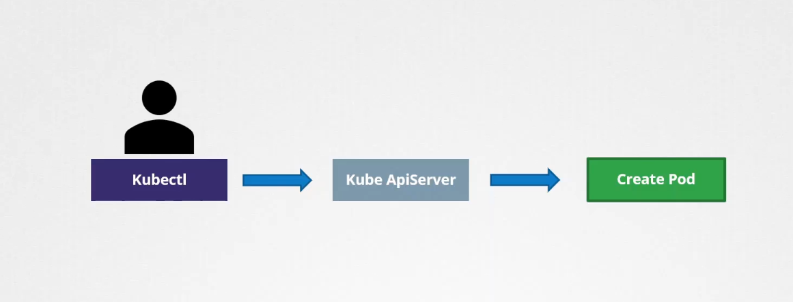
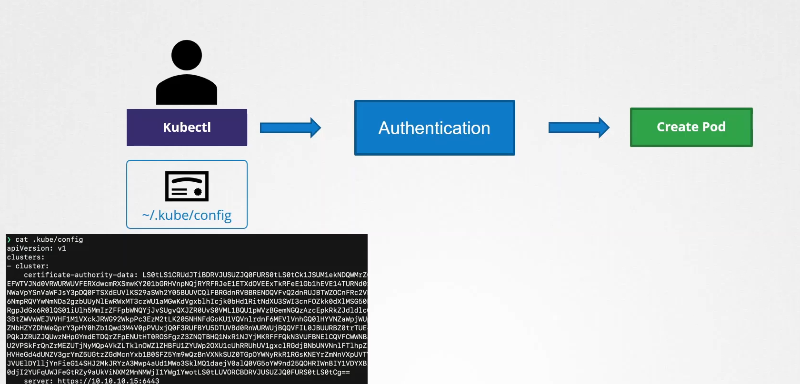
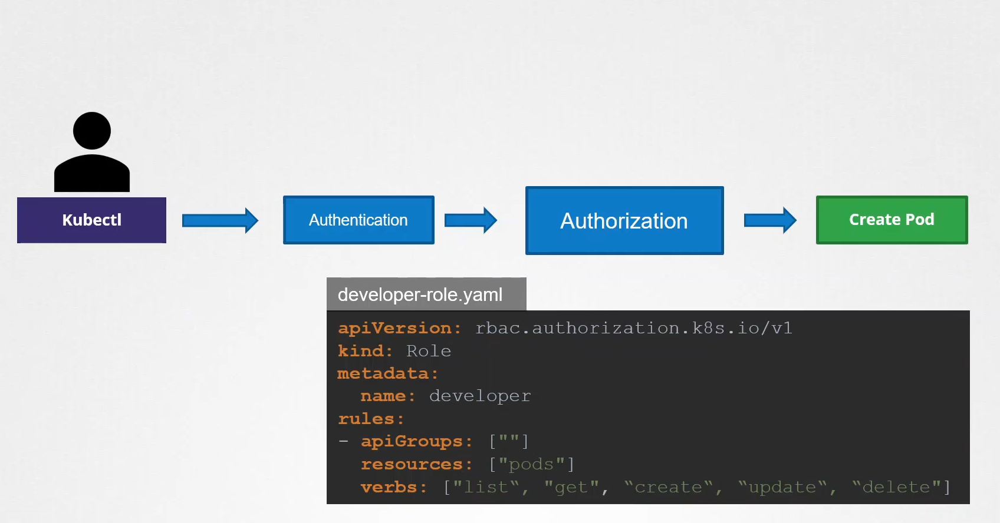
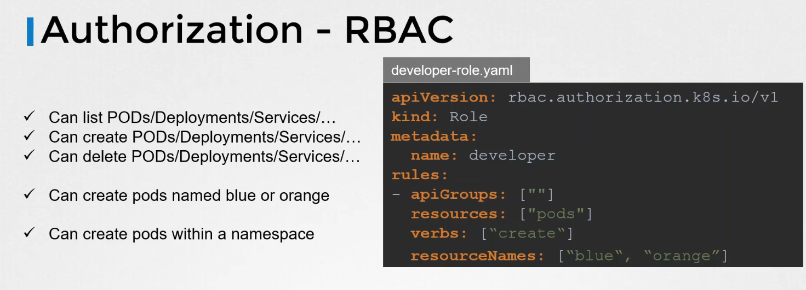
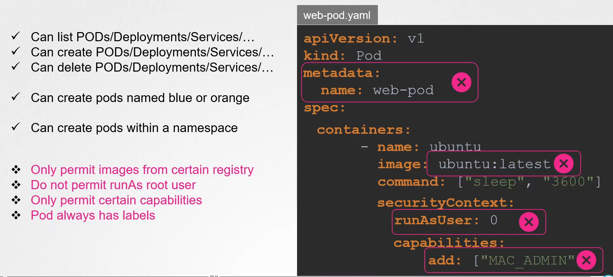
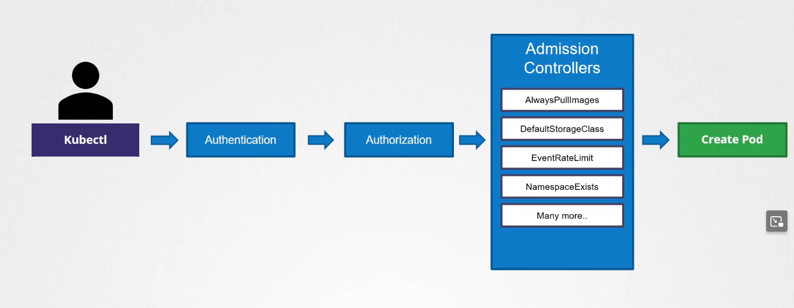

# 2025 Updates Admission Controllers

We explore admission controllers in Kubernetes and understand how **they enhance security and enforce policies before object persistence in etcd**.

-   Every operation performed using the ```kubectl``` command-line utility—such as creating a ```pod```—is first sent as a request to the ```API server```. 
    -   The ```API server``` then **processes the request and stores its information.**

    

## Authentication
-   When a request reaches the ```API server```, it is first handled by an **authentication** process. For instance, when using ```kubectl```, the required certificates for authentication are provided in the KubeConfig file.

    


## Authorization
-   After successful **authentication**, the request undergoes an **authorization** process using **role-based access control (RBAC).** For example, a role may be defined to allow specific operations on pods:
    ```bash
    apiVersion: rbac.authorization.k8s.io/v1
    kind: Role
    metadata:
    name: developer
    rules:
    - apiGroups: [""]
    resources: ["pods"]
    verbs: ["list", "get", "create", "update", "delete"]
    ```

    

    -   This configuration permits a user assigned to the developer role to list, get, create, update, and delete pods. RBAC rules can be further refined to target specific resource names.

        ```bash
        apiVersion: rbac.authorization.k8s.io/v1
        kind: Role
        metadata:
        name: developer
        rules:
        - apiGroups: [""]
        resources: ["pods"]
        verbs: ["create"]
        resourceNames: ["blue", "orange"]
        ```

        

-   However, **object-level permissions may not be sufficient in certain scenarios.** When a pod creation request is received, you might need to inspect the configuration—for example, *verifying that the pod does not use images from public registries*, enforcing the use of a designated registry, or *disallowing the "latest" tag.*

-   You might also enforce security policies, such as ensuring the *container is not running as the root user* or rejecting certain capability configurations.

    ```bash
    apiVersion: v1
    kind: Pod
    metadata:
    name: web-pod
    spec:
    containers:
        - name: ubuntu
        image: ubuntu:latest
        command: ["sleep", "3600"]
        securityContext:
            runAsUser: 0
        capabilities:
            add: ["MAC_ADMIN"]
    ```

    


## Admission Controllers
-   Standard RBAC rules operate only at the API level and cannot inspect or modify an object’s contents.

This limitation is overcome by ```admission controllers```, which **validate or even mutate requests prior to persisting objects.** Admission controllers can enforce specific policies, such as:

-   Changing requests based on internal guidelines.
-   Enforcing container image policies.
-   Ensuring that certain metadata labels are always applied.



Kubernetes includes a variety of *built-in ```admission controllers```.* Some common examples include:

1.  **Always Pull Images:** Forces the pod to pull images from the registry every time.
2.  **Default Storage Class:** Automatically adds a default storage class to PersistentVolumeClaims (PVCs) when none is provided.
3.  **Event Rate Limit:** Restricts the API server’s request-handling rate.
4.  **Namespace Exists:** Ensures that requested namespaces exist before proceeding.


### Namespace Admission Controllers
