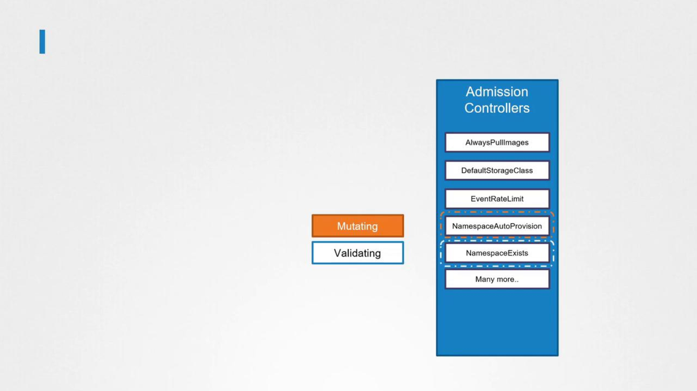

# 2025 Updates Validating and Mutating Admission Controllers

## Types of Admission Controllers
1.  Validating Admission Controllers
2. Mutating Admission Controllers

### 1.  Validating Admission Controllers
-   It verifies that an **object meets specific criteria before it is persisted in the cluster**
    -   For example, the ```namespace existence``` or ```namespace lifecycle``` admission controller **checks if a namespace exists and, if not, rejects the incoming request.**


### 2. Mutating Admission Controllers
-   Modify (mutate) objects before they are persisted.
    -   For example, when you create a ```PersistentVolumeClaim (PVC)``` without specifying a storage class, **the validating controller intercepts the request and modifies it by adding the default storage class.**

    Consider the initial PVC creation request:
    ```bash
    apiVersion: v1
    kind: PersistentVolumeClaim
    metadata:
    name: myclaim
    spec:
    accessModes:
        - ReadWriteOnce
    resources:
        requests:
        storage: 500Mi
    ```

    After the request passes through ```authentication```, ```authorization```, and the ```admission controller```, the modified PVC appears as follows:
    ```bash
    apiVersion: v1
    kind: PersistentVolumeClaim
    metadata:
    name: myclaim
    spec:
    accessModes:
        - ReadWriteOnce
    resources:
        requests:
        storage: 500Mi
    storageClassName: default       #<=====
    ```

## Mutating vs. Validating Admission Controllers
-   Some controllers perform both mutation and validation.

-   Typically, ```mutating``` controllers **run first** so that subsequent ```validating ``` controllers can work with the modified object.

    -   For instance, if a ```namespace auto-provisioning mutating``` admission controller **creates a missing namespace before **the ```namespace existence validating``` controller runs, the request proceeds smoothly. 
    -   However, if the ```validating``` controller **executes first, it would reject the request due to the missing namespace.**

### Important

If any admission controller (mutating or validating) rejects a request, **the entire request is denied and an error is returned to the user.**




All built-in admission controllers are part of the Kubernetes source code. But for custom validations and mutations, **Kubernetes supports external admission controllers using webhook mechanisms:**

1.  Mutating Admission Webhook
2.  Validating Admission Webhook