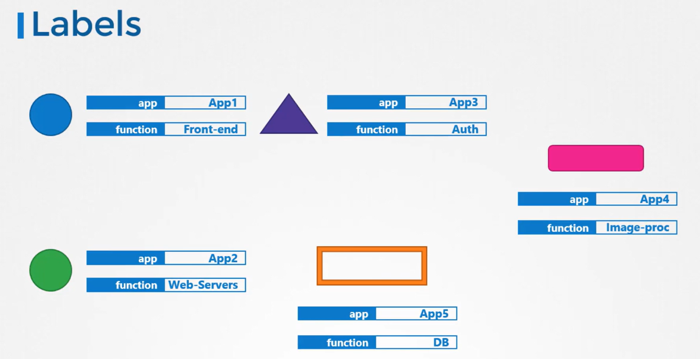

# Labels and Selectors

- Labels and selectors offer a systematic approach to categorizing items. 

## Labels and Selectors in Kubernetes

-   In Kubernetes, labels and selectors are instrumental in **managing an array of objects such as Pods, Services, ReplicaSets, and Deployments.** 
-   As the number of objects in a cluster grows, these tools become essential for **grouping** and **selecting** objects by application, functionality, or type.



## Specifying Labels in Kubernetes
- To apply labels to a Kubernetes object such as a Pod, include a **labels section** under the ```metadata``` field in its definition file. 

  ```bash
  apiVersion: v1
  kind: Pod
  metadata:
    name: simple-webapp
    labels:           # Labels
      app: App1
      function: Front-end
  spec:
    containers:
    - name: simple-webapp
      image: simple-webapp
      ports:
      - containerPort: 8080

  ```
### List Pods with Selector
```bash
kubectl get pods --selector app=App1
kubectl get all --selector env=prod,bu=finance,tier=frontend
```

### Get all objects in prod
```bash
kubectl get all -A --selector env=prod
```

## Using Labels and Selectors with ReplicaSets
- A ReplicaSet definition includes labels in **two key areas**:

    1.  Within the ReplicaSet's metadata (allowing other objects to reference the ReplicaSet).
   
   2.   Within the template of the ReplicaSet's specification (applying the labels to the Pods).

  ```bash
  apiVersion: apps/v1
  kind: ReplicaSet
  metadata:
    name: simple-webapp
    labels:
      app: App1
      function: Front-end
  spec:
    replicas: 3
    selector:
      matchLabels:
        app: App1  # Must be same as template of pod
    template:
      metadata:
        labels:
          app: App1   # same
          function: Front-end
      spec:
        containers:
        - name: simple-webapp
          image: simple-webapp
  ```

## Annotations

-   It differs from labels and selectors in that **they are used to store additional metadata** that is **not intended for selection.**
-   This metadata might include details such as tool versions, build information, or contact information.

    ```bash
    apiVersion: apps/v1
    kind: ReplicaSet
    metadata:
      name: simple-webapp
      labels:
        app: App1
        function: Front-end
      annotations:          # Annotations
        buildversion: "1.34"
    spec:
      replicas: 3
      selector:
        matchLabels:
          app: App1
      template:
        metadata:
          labels:
            app: App1
            function: Front-end
        spec:
          containers:
          - name: simple-webapp
            image: simple-webapp
    ```