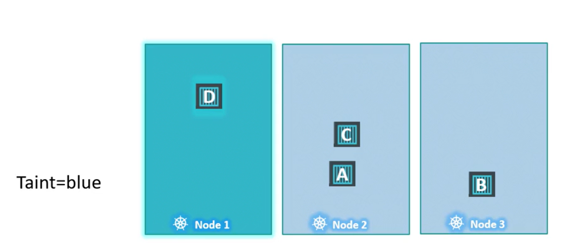

# Taint & Tolerations
-   Think of it like using a **repellent on a person to keep bugs away**
-   In Kubernetes, a **taint is applied to a node** (the repellent) **to repel pods** unless they have a matching toleration (an immunity to the repellent). 
    - This ensures that **only intended pods can run on tainted nodes.**


## How Taints and Tolerations Work

-   Two factors determine whether a pod can run on a node:

    1.  The taint applied on the node.
    2.  The pod's toleration for that taint.

**In Kubernetes, taints and tolerations are used solely for scheduling control, *not security.*** 


Consider a simple cluster with three worker nodes (node one, two, and three) and four pods (A, B, C, and D). 

By default, without any taints or tolerations, the scheduler distributes the pods evenly across all nodes.

Suppose you want to dedicate node one to a specific application

1.  **First, taint node one** (using, for example, the key-value pair "app=blue") so that no pods are scheduled there by default.

2. **Then, add an appropriate toleration to the dedicated pod** (Pod D) so that it alone can run on node one.

When the scheduler assigns pods:

  1.  Pod A, lacking a toleration, will be scheduled on node two.
  2.  Pod B is repelled from node one and lands on node three.
  3.  Pod C, without a matching toleration, is scheduled on node two or three.
  4.  Pod D, having the correct toleration, is scheduled on node one.




### Tainting a Node
To taint a node, use the following command where you **specify the node name along with a taint in the format** of a **key-value pair and taint effect**:

```bash
kubectl taint nodes node-name key=value:taint-effect
```
Example:
```bash
kubectl taint nodes node1 app=blue:NoSchedule

kubectl taint node node01 spray=mortein:NoSchedule
```

### View a Taint in a node
```bash
kubectl describe node node01 | grep Taint
Taints:             spray=mortein:NoSchedule
```


**There are three taint effects:**

  1.  **NoSchedule:** Pods that **do not tolerate the taint will not be scheduled on the node.**
    
  2.  **PreferNoSchedule:** The scheduler tries to avoid placing non-tolerating pods on the node, **but it is not strictly enforced.**
    
  3. **NoExecute:** New pods without a matching toleration **will not be scheduled**, **and existing pods will be evicted from the node.**


### Adding Tolerations to Pods
To allow a specific pod to run on a tainted node, add a toleration to the pod’s manifest.

```bash
apiVersion: v1
kind: Pod
metadata:
  name: myapp-pod
spec:
  containers:
    - name: nginx-container
      image: nginx
  tolerations:      # Tolerations
    - key: "app"
      operator: "Equal"
      value: "blue"
      effect: "NoSchedule"
```

**Note**: *Tolerations should be enclosed in double quotes ```" "```.*


## Understanding the NoExecute Effect

Using the NoExecute taint effect has a more immediate impact. 

Suppose node one is tainted with the key-value pair "app=blue" and the effect NoExecute. In an initially untainted cluster, all pods schedule normally. But once the taint is applied:

  1.  Pods without a matching toleration (e.g., Pod C) will be evicted from node one if already running, or prevented from being scheduled.

  2. Pods with the correct toleration (e.g., Pod D) continue to run on node one.

## Master Node Taints
While the discussion so far has focused on worker nodes, master nodes are also capable of running pods.
-   By default, Kubernetes applies a taint to master nodes to prevent workload pods from being scheduled there. 

  ```bash
  kubectl describe node kubemaster | grep Taint
  ```

  Output:
  ```bash
  Taints:             node-role.kubernetes.io/master:NoSchedule
  ```

## Untaint Nodes
### List list the Taint
```bash
kubectl describe node controlplane | grep Taint
```
Output:
```bash
Taints:             node-role.kubernetes.io/control-plane:NoSchedule
```

### Remove Taint by adding **-** in the end of taint command

```bash
kubectl taint nodes controlplane node-role.kubernetes.io/control-plane:NoSchedule- # hint: copy the taint from the descibe node command 
```
