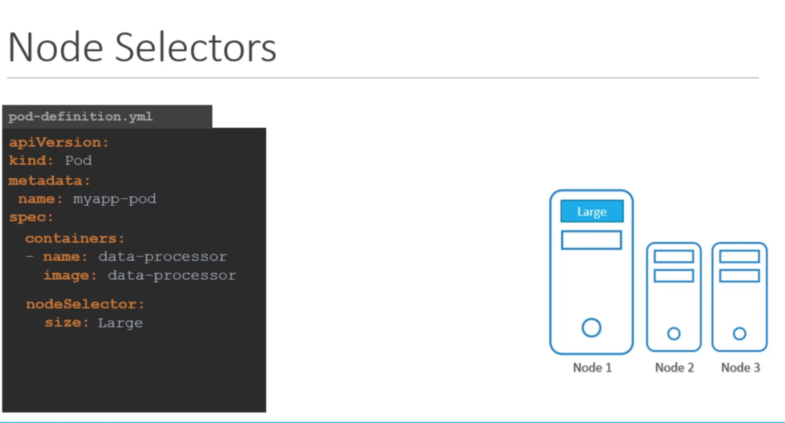

# Node Selector
-   In this guide, you'll learn how to ensure that specific pods run only on designated nodes within your cluster.
-   Node selectors help align your pod deployments with the underlying hardware characteristics of your nodes, enhancing performance and resource management.

-   **Node selectors restrict pod placement by matching key-value pairs defined in the pod’s specification against the labels on the nodes**


Without any scheduling constraints, any **pod might land on any node—even on one with insufficient resources—leading to performance bottlenecks**.

## Configuring Node Selectors
To ensure that a pod is restricted to run on a specific node, you can modify the pod's definition file using node selectors.

```bash
apiVersion: v1
kind: Pod
metadata:
  name: myapp-pod
spec:
  containers:
    - name: data-processor
      image: data-processor
  nodeSelector:         # Node Selector
    size: Large

```


In this configuration, the Kubernetes scheduler identifies the appropriate node **by matching the label with the key-value pair size: Large.** 

**Ensure that you pre-label the target node accordingly.**

## Labeling a  Nodes
-   **```Before deploying your pod```, you must label your node so that it can be recognized by the selector.**

    ```bash
    kubectl label nodes node-1 size=Large
    ```


-   *Once the node is labeled*, **create the pod** by applying your configuration:

    ```bash
    kubectl create -f pod-definition.yaml
    ```


## Limitations and Advanced Scheduling
- While node selectors are ideal for simple scenarios involving a single label, they come with certain limitations.

  -  For instance, if you need to **schedule a pod on a node that is either large or medium,** or on any node that is not **labeled as small, a basic** ```node selector``` may not suffice.

-  In these cases, consider using ```node affinity``` and ```anti-affinity features```, which offer advanced scheduling capabilities to define more complex placement rules.


### Important

Make sure that **your nodes are pre-labeled** with the correct key-value pairs before deploying your pods. 

Failure to do so may prevent the scheduler from **matching pods to the intended nodes.**