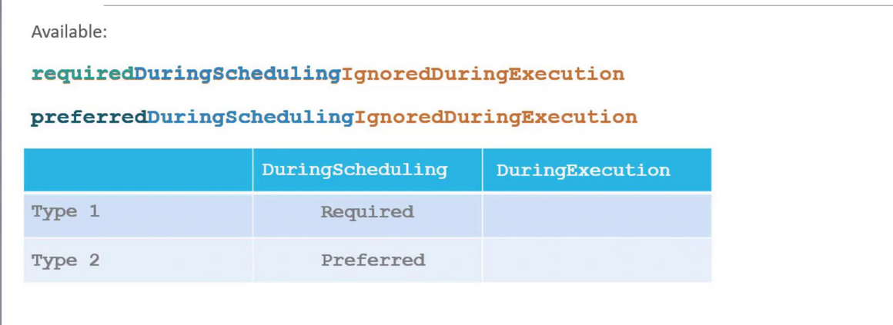
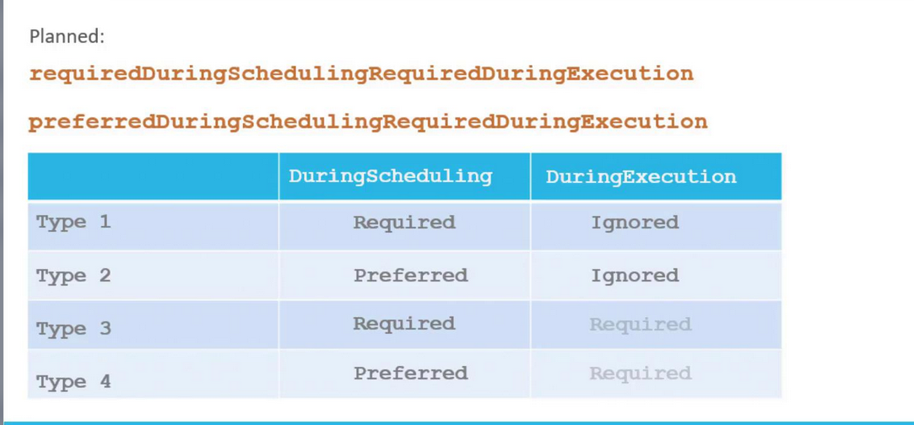
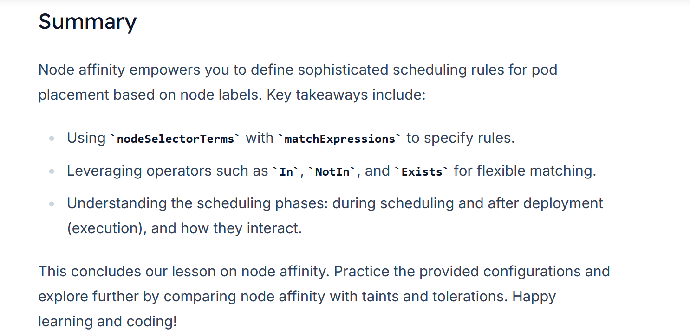

# Node Affinity
-   In this guide, you'll learn how node affinity extends the capabilities of basic node selectors by allowing advanced expressions like ```In```, ```NotIn```, and ```Exists```. 
-   This feature enables you to specify detailed rules for pod placement based on node labels.
-   While [Node Selectors](4.%20Node_Selector.md) are simple and intuitive, **they lack support for advanced matching operators.**

-   **Node affinity overcomes these limitations by allowing more expressive rules.**

### 1 
#### *Here, the ```In``` operator ensures that the pod is scheduled only on nodes where the label size includes ‘Large’.*

```bash
apiVersion: v1
kind: Pod
metadata:
  name: myapp-pod
spec:
  containers:
    - name: data-processor
      image: data-processor
  affinity:             ## Node_Affinity
    nodeAffinity:
      requiredDuringSchedulingIgnoredDuringExecution:
        nodeSelectorTerms:
          - matchExpressions:
              - key: size
                operator: In
                values:
                  - Large
```

###  Understanding the Configuration

- The ```affinity``` key under ```spec``` introduces the ```nodeAffinity``` configuration.
- The field ```requiredDuringSchedulingIgnoredDuringExecution``` indicates that the **scheduler must place the pod on a node meeting the criteria**. 

  Once the *pod is running*, **any changes to node labels are ignored.**
- The ```nodeSelectorTerms``` **array** contains **one or more matchExpressions.** 

  Each expression specifies a label key, an operator, and a list of values. Here, the ```In``` operator ensures that the pod is scheduled only on nodes where the label ```size``` includes ```‘Large’.```


### 2
To allow for more flexible scheduling, such as permitting a pod to run on **either large or medium nodes,** simply add additional values to the list. 

- *Alternatively, you can use the ```NotIn``` operator to explicitly avoid placing a pod on nodes with specific labels*


```bash
apiVersion: v1
kind: Pod
metadata:
  name: myapp-pod
spec:
  containers:
    - name: data-processor
      image: data-processor
  affinity:
    nodeAffinity:
      requiredDuringSchedulingIgnoredDuringExecution:
        nodeSelectorTerms:
          - matchExpressions:
              - key: size
                operator: NotIn
                values:
                  - Small
```


### 3
*In cases where you only need to verify the presence of a label without checking for specific values, the ```Exists``` operator is useful.*

```bash
apiVersion: v1
kind: Pod
metadata:
  name: myapp-pod
spec:
  containers:
  - name: data-processor
    image: data-processor
  affinity:
    nodeAffinity:
      requiredDuringSchedulingIgnoredDuringExecution:
        nodeSelectorTerms:
        - matchExpressions:
          - key: size
            operator: Exists
```

### Scheduling Behavior
-   Once a pod is scheduled using node affinity rules, **these rules are only evaluated during scheduling.** 
- Changes to node labels after scheduling will not affect a running pod due to the ```"ignored during execution"``` behavior.


### There are 2 primary scheduling behaviors for node affinity:

  1.  **Required During Scheduling, Ignored During Execution**
        -   The pod is scheduled only on nodes that fully satisfy the affinity rules.
        -   Once running, changes to node labels do not impact the pod.

  2.  **Preferred During Scheduling, Ignored During Execution**
        -   The scheduler prefers nodes that meet the affinity rules but will place the pod on another node if no matching nodes are available.





Future enhancements may introduce additional affinity types, such as ```Required During Execution.``` 
- In this model, **if a node's labels change after a pod is running** and **no longer meet the affinity criteria, the pod would be evicted.**




