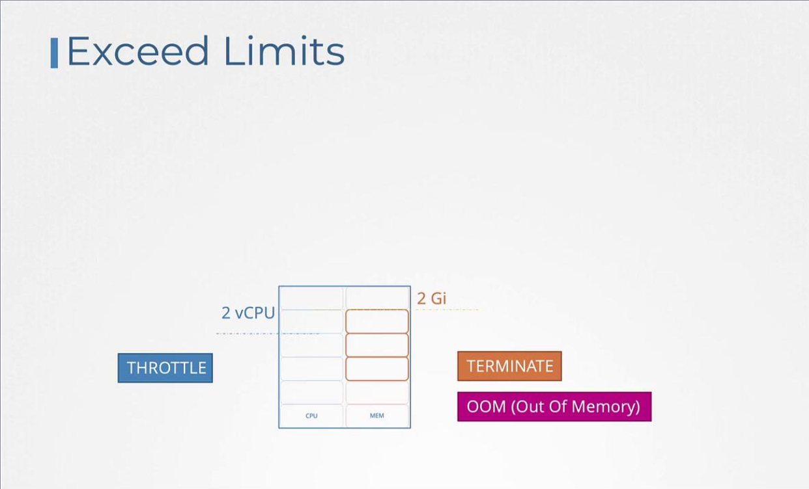

# Resource Limits

- When a pod is scheduled, **it consumes a portion of its node's resources based on the specifications** in its definition—such as needing 2 CPUs and 1 memory unit.
- The Kubernetes scheduler decides which node will host the pod **by evaluating the requested resources** against what each node can offer. 

    -   If, for example, Node 2 has **sufficient capacity**, the scheduler assigns the pod there.

    -   Otherwise, **if no node meets the requirements**, the pod remains in a ```pending state.```

    ```bash
    NAME              READY   STATUS    RESTARTS   AGE
    Nginx             0/1     Pending   0          7m
    Events:
      Reason           Message
      ------           -------
      FailedScheduling  No nodes are available that match all of the following predicates:: Insufficient cpu (3).
    ```

## Resource Requests [Minimum]

-   Resource requests define the **minimum CPU and memory a container is guaranteed** when scheduled.

    -   Specifying a request, for instance, of 1 CPU and 1 GB memory in a pod definition ensures that **the pod will only be scheduled on a node that can provide these minimum resources.**

- The Kubernetes **scheduler searches for a node that meets these requirements**, guaranteeing the pod access to the declared resources.

  ```bash
  apiVersion: v1
  kind: Pod
  metadata:
    name: simple-webapp-color
    labels:
      name: simple-webapp-color
  spec:
    containers:
    - name: simple-webapp-color
      image: simple-webapp-color
      ports:
      - containerPort: 8080
      resources:
        requests:
          memory: "4Gi"
          cpu: 2
  ```

- Remember, **it is possible to use fractional CPU values.** 
  - For example, 0.1 CPU is equivalent to 100m (where "m" denotes milli, meaning 0.001 of a CPU). 
  - One CPU core is typically equivalent to one vCPU in cloud environments like AWS, GCP, or Azure.

## Resource Limits
-   By default, a container in a **pod can consume all the available resources on its node if no limits are set.**

-   However, you can restrict its usage by defining resource limits

    -   Setting a limit, such as 1 vCPU, prevents the container from using more than that allocation

    -   Similarly, memory limits restrict its maximum memory usage.


    ```bash
    apiVersion: v1
    kind: Pod
    metadata:
      name: simple-webapp-color
      labels:
        name: simple-webapp-color
    spec:
      containers:
      - name: simple-webapp-color
        image: simple-webapp-color
        ports:
        - containerPort: 8080
        resources:
          requests:       # minimum
            memory: "1Gi"
            cpu: 1
          limits:         # maximum
            memory: "2Gi"
            cpu: 2
    ```

### Note

- If a **container exceeds its CPU limit**, Kubernetes throttles its **CPU usage.**
- Conversely, **if a container uses more memory than allowed**, the pod will be **terminated** and an ```OOM error``` will be logged.

  

## Default Behavior and Scenarios

-   By default, Kubernetes **does not enforce CPU or memory requests and limits.** 
    - This means a **pod without specified limits can consume all available resources on its node**, potentially affecting other pods and system processes.

#### Below are several scenarios for **```CPU```** configurations:

  1.  **No Requests or Limits:**
    A container **can utilize all available CPU**, potentially starving other pods.

  2.  **Limits Specified Without Requests:**
    Kubernetes **assumes the request value is equal to the limit** 
      - (e.g., setting a limit of 3 vCPUs results in a request of 3 vCPUs).
    
  3.  **Both Requests and Limits Defined:**
    The **container is guaranteed its requested amount** (e.g., 1 vCPU) but **can use additional CPU up to its defined limit** (e.g., 3 vCPUs).

  4. **Requests Defined Without Limits:**
    The container is **guaranteed its requested CPU value**, with access to additional cycles if available, which allows for efficient utilization of idle resources.

#### Similar configurations apply for **```memory```**:

  1.  **Without any resource configurations,** a single pod may monopolize node memory.
    
  2.  When **only limits are specified**, Kubernetes sets the **memory request equal to the limit.**

  3.   **With both requests and limits,** the pod is allocated a guaranteed memory amount and can burst up to the limit.
    
  4.  **Only specifying requests** guarantees the pod a base amount of memory **but might let it consume more, potentially leading to termination if memory usage becomes excessive.**


## Limit Ranges
- By default, Kubernetes **does not enforce resource requests or limits on pods.** 
- To ensure that **every pod in a namespace receives default resource settings**, you can define a ```LimitRange```. 
  - ```LimitRanges``` are **namespace-level objects** that automatically assign **default resource values to containers that do not specify them.**


  For example, you can create a LimitRange to enforce CPU constraints:
  ```bash
  # limit-range-cpu.yaml

  apiVersion: v1
  kind: LimitRange
  metadata:
    name: cpu-resource-constraint
  spec:
    limits:
      - default:
          cpu: 500m
        defaultRequest:
          cpu: 500m
        max:
          cpu: "1"
        min:
          cpu: 100m
        type: Container
  ```

  Likewise, to set memory constraints, use the following configuration:
  ```bash
  # limit-range-memory.yaml

  apiVersion: v1
  kind: LimitRange
  metadata:
    name: memory-resource-constraint
  spec:
    limits:
      - default:
          memory: 1Gi
        defaultRequest:
          memory: 1Gi
        max:
          memory: 1Gi
        min:
          memory: 500Mi
        type: Container
  ```
Keep in mind that changes to a **LimitRange affect only new pods created after the LimitRange is applied or updated.**


## Resource Quotas
- Resource Quotas allow you to restrict the overall resource consumption for all applications within a namespace. 
- By setting a ```Resource Quota```, you can define hard limits on the aggregate consumption—such as restricting total CPU requests to 4 vCPUs and total memory to 4 GB, while also defining maximum limits (for example, 10 vCPUs and 10 GB) across all pods.