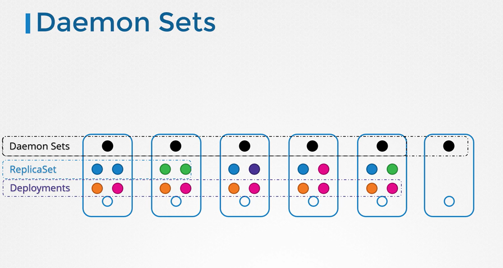

# Daemon Sets
-   DaemonSets ensure that **exactly one copy of a pod runs on every node** in your Kubernetes cluster.
    - E.g - kube-proxy

-   **When you add a new node**, the ```DaemonSet``` **automatically deploys the pod on the new node.**
    -   Likewise, **when a node is removed,** the corresponding pod is also removed.

-   **This guarantees that a single instance of the pod is consistently available on each node.**




## Use Cases for DaemonSets


-   They are particularly *useful* in scenarios where you need to **run background services or agents on every node.**

Some common use cases include:

  -   **Monitoring agents and log collectors:** Deploy monitoring tools or log collectors across every node to ensure comprehensive cluster-wide visibility without manual intervention.

  -   **Essential Kubernetes components:** Deploy critical components, such as ```kube-proxy```, which Kubernetes requires on all worker nodes.
    
  -   **Networking solutions:** Ensure consistent deployment of networking agents like those used in ```VNet``` or ```weave-net``` across all nodes.


### Creating a DaemonSet
Same as ```ReplicaSet```, only ```kind``` is different which is set to ```DaemonSet```

```bash
apiVersion: apps/v1
kind: DaemonSet
metadata:
  name: monitoring-daemon
spec:
  selector:
    matchLabels:
      app: monitoring-agent
  template:
    metadata:
      labels:
        app: monitoring-agent
    spec:
      containers:
        - name: monitoring-agent
          image: monitoring-agent
```

### Note 
- Ensure that the labels in the selector match those in the pod template. 
- Consistent labeling is crucial for the proper functioning of your DaemonSet. :::


#### Create DaemonSets
```bash
kubectl create -f daemon-set-definition.yaml
```
#### Get DaemonSets
```bash
kubectl get daemonsets
kubectl get daemonsets -A   # All Namespaces
```

#### For more detailed information on your DaemonSet
```bash
kubectl describe daemonset monitoring-daemon
```

#### NOTE [IMPORTANT]
An easy way to create a DaemonSet is to **first generate a YAML file for a Deployment** with the command 

```bash
kubectl create deployment elasticsearch --image=registry.k8s.io/fluentd-elasticsearch:1.20 -n kube-system --dry-run=client -o yaml > fluentd.yaml.
``` 

Next, remove the ```replicas```, ```strategy``` and ```status``` fields from the YAML file using a text editor. Also, change the kind from ```Deployment``` to ```DaemonSet```.

Finally, create the Daemonset by running ```kubectl create -f fluentd.yaml```

### How DaemonSets Schedule Pods
- *Prior to Kubernetes version 1.12*, scheduling a pod on a specific node was often achieved by **manually** setting the ```nodeName``` property within the pod specification. 
- *However, since version 1.12,* ```DaemonSets``` leverage the **default scheduler in conjunction with node affinity rules**.   
  - This improvement ensures that a pod is automatically scheduled on every node without manual intervention.