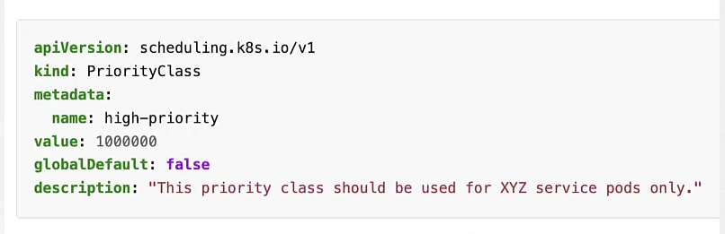
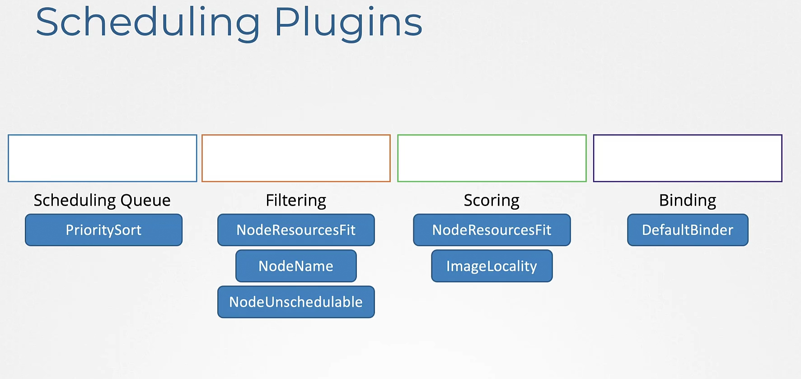
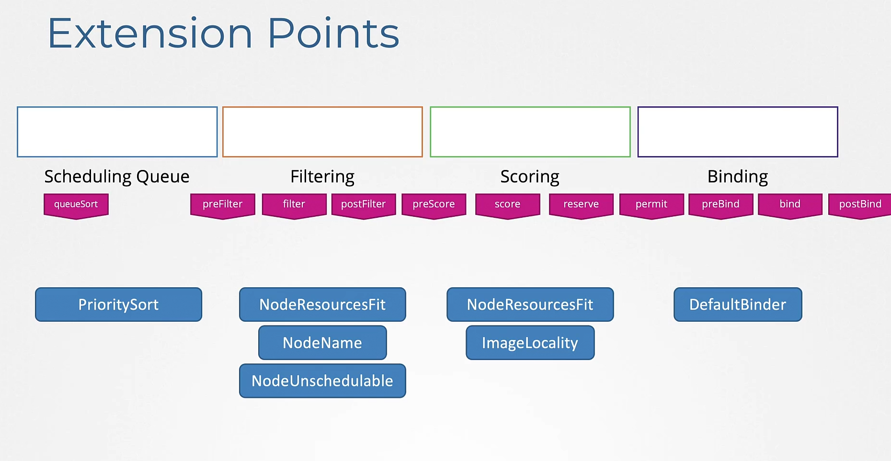
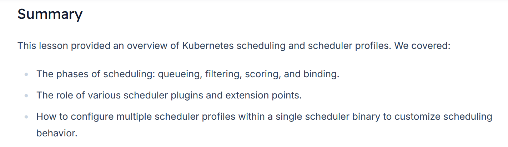

# Configuring Scheduler Profiles
We will start with a refresher on how the Kubernetes scheduler functions, illustrated by a simple example where a pod is scheduled to one of several available nodes.

## How Scheduling Works
-   When a ```pod``` is defined, it **enters a scheduling queue along with other pending pods**

-   Consider a ```pod``` that requires 10 CPU; it will only be scheduled on ```nodes``` with **at least 10 available CPUs**.
    -   Additionally, ```pods``` with **higher priorities are placed at the beginning of the queue.**

-   For instance, the following pod definition uses a high-priority class:
    ```bash
    apiVersion: v1
    kind: Pod
    metadata:
    name: simple-webapp-color
    spec:
    priorityClassName: high-priority
    containers:
        - name: simple-webapp-color
        image: simple-webapp-color
        resources:
            requests:
            memory: "1Gi"
            cpu: 10
    ```

-   Before using this priority, y**ou must create a priority class with a specific name and a priority value.** 
    -   Assigning a value like 1,000,000, for example, grants a very high priority. 
    -   This ensures that pods with higher priorities are scheduled ahead of those with lower ones.



## Scheduling Phases

After being queued, pods progress through several phases:

1.  **Filter Phase:** *```Nodes``` that cannot meet the ```pod```'s resource requirements* (e.g., nodes lacking 10 CPUs) are filtered out.

2.  **Scoring Phase:** Remaining ```nodes``` are **scored based on resource availability** after reserving the required CPU. For example, a node with 6 CPUs left scores higher than one with only 2.

3.  **Binding Phase:** The ```pod``` is **assigned to the ```node``` with the highest score**.

## Key Scheduler Plugins

Several scheduler plugins play critical roles during these phases:

1.  **Priority Sort Plugin:** *Sorts* ```pods``` in the *scheduling queue according to their priority.*

2.  **Node Resources Fit Plugin:** Filters out nodes that do not have the needed resources.

3.  **Node Name Plugin:** Checks for a *specific node name in the pod specification and filters nodes accordingly.*

4.  **Node Unschedulable Plugin:** *Excludes ```nodes``` marked as unschedulable*. For instance, running commands like ```drain``` or ```cordon``` will set the unschedulable flag. An example node description is:
    ```bash
    controlplane ~ → kubectl describe node controlplane
    Name:               controlplane
    Roles:              control-plane
    CreationTimestamp:  Thu, 06 Oct 2022 06:19:57 -0400
    Taints:             node.kubernetes.io/unschedulable:NoSchedule
    Unschedulable:      true
    Lease:
    ```



5.  **Scoring Plugins:** During the scoring phase, plugins (such as the Node Resources Fit and Image Locality plugins) assess each node's suitability. *They assign scores rather than outright rejecting nodes.*

6.  **Default Binder Plugin:** Finalizes the scheduling process by binding the ```pod``` to the ```selected node```.


## Extension Points
Kubernetes emphasizes extensibility, allowing you to modify the scheduling process via extension points at stages such as queueing, filtering, scoring, and binding.




## Customizing Scheduler Behavior with Profiles
-   **Rather than running separate scheduler binaries** (like default scheduler, MyScheduler, and MyScheduler2) with distinct configuration files, ```Kubernetes 1.18``` introduced **support for multiple scheduling profiles within a single scheduler binary.** 
    -   This approach minimizes operational overhead and prevents potential race conditions that can arise when multiple processes schedule workloads on the same node.

### Profile Configuration
-   **Each scheduler profile** is defined within the scheduler configuration file and **behaves like an independent scheduler.**

    ```bash
    # my-scheduler-2-config.yaml

    apiVersion: kubescheduler.config.k8s.io/v1
    kind: KubeSchedulerConfiguration
    profiles:
    - schedulerName: my-scheduler-2
    - schedulerName: my-scheduler-3
    ```

    ```bash
    # my-scheduler-config.yaml

    apiVersion: kubescheduler.config.k8s.io/v1
    kind: KubeSchedulerConfiguration
    profiles:
    - schedulerName: my-scheduler
    ```

    ```bash
    # scheduler-config.yaml

    apiVersion: kubescheduler.config.k8s.io/v1
    kind: KubeSchedulerConfiguration
    profiles:
    - schedulerName: default-scheduler
    ```

-   Each profile allows you to customize plugin configurations. For instance, **you could disable specific plugins or enable custom ones.** 


-   Below is an example where the ```"my-scheduler-2"``` profile disables the ```TaintToleration plugin``` and enables two custom plugins (MyCustomPluginA and MyCustomPluginB).
    -   Additionally, the ```"my-scheduler-3"``` profile disables all ```preScore``` and ```score``` plugins:

    ```bash
    apiVersion: kubescheduler.config.k8s.io/v1
    kind: KubeSchedulerConfiguration
    profiles:
    - schedulerName: my-scheduler-2
        plugins:
        score:
            disabled:
            - name: TaintToleration
            enabled:
            - name: MyCustomPluginA
            - name: MyCustomPluginB
    - schedulerName: my-scheduler-3
        plugins:
        preScore:
            disabled:
            - name: '*'
        score:
            disabled:
            - name: '*'
    - schedulerName: my-scheduler-4
    ```

