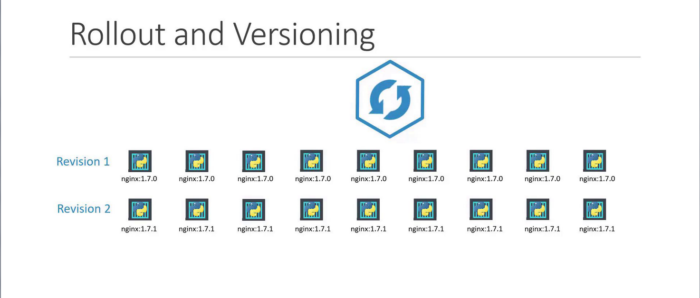
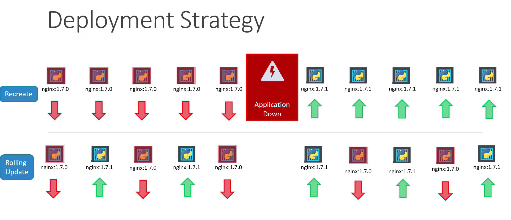
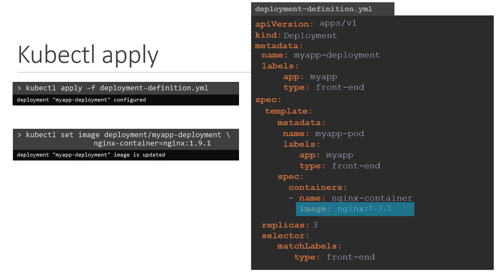
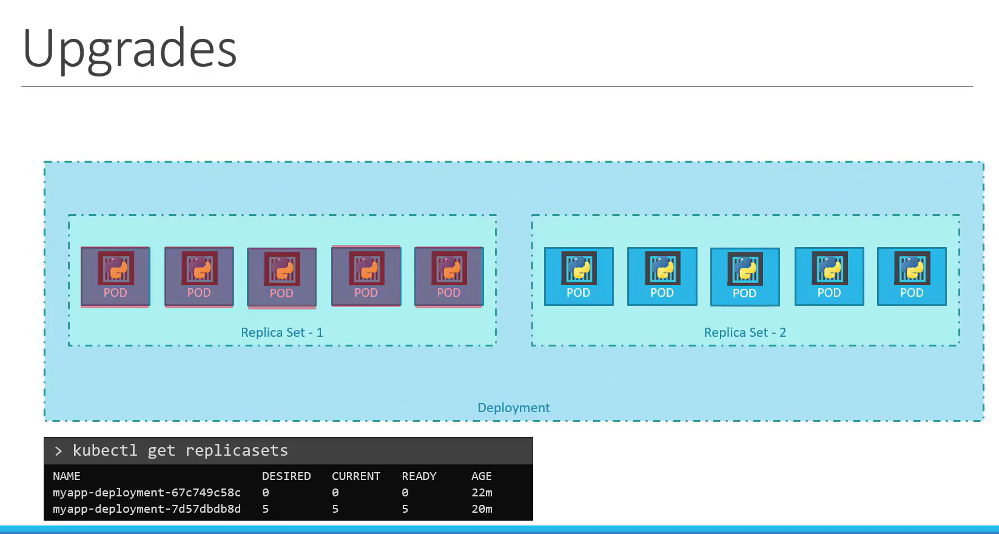
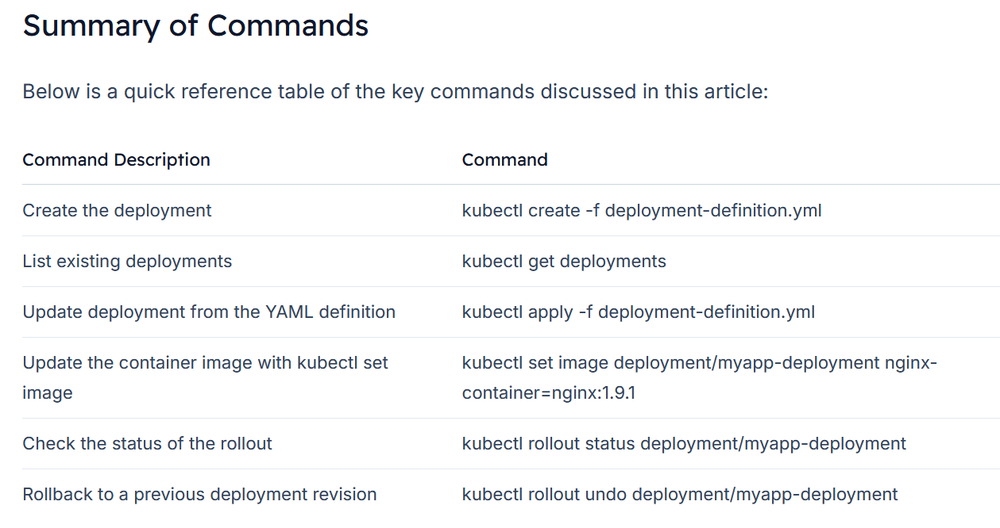

# Application Lifecycle Management Section Introduction

-   In this article, we cover essential aspects such as **rolling updates** and **rollbacks**, various application configuration methods, **scaling strategie**s, and the fundamentals of **self-healing application design**.

## Rolling Updates and Rollbacks
-   Welcome to this guide on managing ```updates``` and ```rollbacks``` in Kubernetes deployments.
-   In this article, we explore key concepts such as ```rollouts```, ```versioning```, and ```various deployment strategies```.
    -   We also provide practical commands to **update your deployments with minimal downtime and to revert changes when necessary.**

## Understanding Rollouts and Versioning
-   When you create a ```deployment```, Kubernetes initiates a **rollout** that establishes the **first deployment revision (revision one)**. 
    -   Later, when you update your application—say by changing the container image version—**Kubernetes triggers another rollout**, **creating a new revision (revision two)**

These revisions help you track changes and enable rollbacks to previous versions if issues arise.



To monitor and review these rollouts, you can use the following commands:

### Check the rollout status:
```bash
kubectl rollout status deployment/myapp-deployment
```

### View the history of rollouts:
```bash
kubectl rollout history deployment/myapp-deployment
```

## Deployment Strategies
-   There are different strategies to update your applications. 
    -   For example, consider a scenario where your web application is running five replicas.

-   One approach is the ```"recreate"``` strategy, which involves shutting down all existing instances before deploying new ones.
    -   However, this method results in temporary downtime as the application becomes inaccessible during the update.

-   A more seamless approach is the ```"rolling update"``` strategy. 
    -   Here, instances are updated one at a time, ensuring continuous application availability throughout the process.


### Note
If no strategy is specified when creating a deployment, **Kubernetes uses the rolling update strategy by default.**

1. Recreate:- Destroy & Recreate
2. Rolling Update :- One at a time




### Updating a Deployment
-   There are several methods to update your deployment, such as adjusting the container image version, modifying labels, or changing the replica count.

    1. A common practice is to update your deployment definition file and then apply the changes.
        ```bash
        apiVersion: apps/v1
        kind: Deployment
        metadata:
        name: myapp-deployment
        labels:
            app: myapp
            type: front-end
        spec:
        replicas: 3
        selector:
            matchLabels:
            type: front-end
        template:
            metadata:
            name: myapp-pod
            labels:
                app: myapp
                type: front-end
            spec:
            containers:
            - name: nginx-container
                image: nginx:1.7.1
        ```

    2. After updating the file, apply the changes:
        ```bash
        kubectl apply -f deployment-definition.yml
        ```
        -   This action triggers a new rollout and creates a new deployment revision.


    3. **Alternatively**, you can update the container image directly using the following command: (NOTE : this doesn't change the yml file)
        ```bash
        kubectl set image deployment/myapp-deployment nginx-container=nginx:1.9.1
        ```




## Viewing Deployment Details
To retrieve detailed information about your deployment—including rollout strategy, scaling events, and more—use:

```bash
kubectl describe deployment myapp-deployment
```

This output shows different details depending on the strategy used:

-   **Recreate Strategy:** Events indicate that the old ReplicaSet is scaled down to zero before scaling up the new ReplicaSet.
-   **Rolling Update Strategy:** The old ReplicaSet is gradually scaled down while the new ReplicaSet scales up.


## How K8 does deployment upgrades
During an upgrade, Kubernetes:
1. Creates a ```new ReplicaSet``` *for the updated containers* while the ```original ReplicaSet``` *continues to run the old version.*
2. Starts deploying ```new Pods``` while *stopping old pods* in ```old ReplicaSet```




## Rollback upgrades
If an issue is detected after an upgrade, you can revert to the previous version using the rollback feature. 

First, check the status:
```bash
kubectl rollout status deployment/myapp-deployment
```
To perform a rollback, run:
```bash
kubectl rollout undo deployment/myapp-deployment
```

This command scales down the new ReplicaSet, restoring pods from the older ReplicaSet. Verify the state of ReplicaSets before and after a rollback with:

```bash
kubectl get replicasets
```

