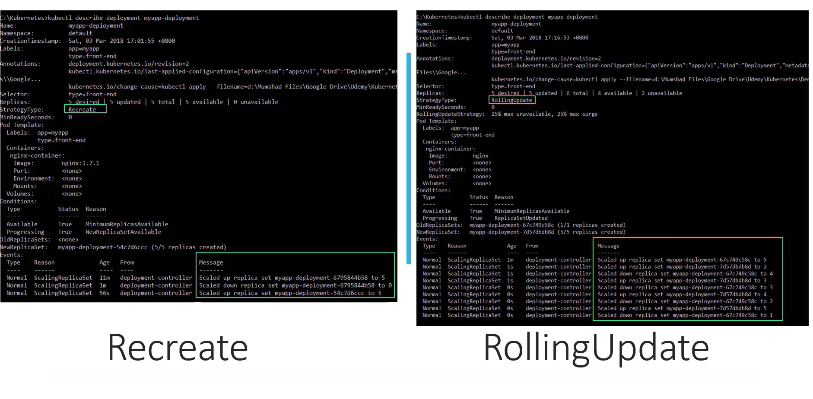
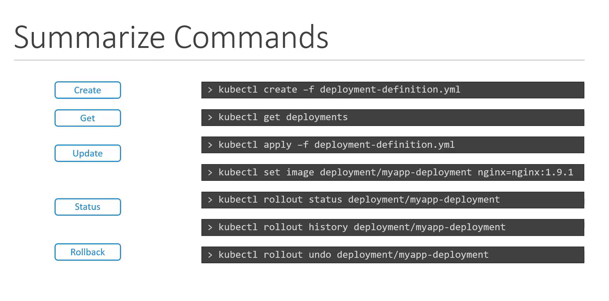

## Deployment Strategy
1. Destroy & Recreate
2. Rolling Update 


### Make Upgrades 

1. By changing the YML file
```bash
kubectl apply -f deployment-definition.yml
```

2. By command (NOTE : this doesn't change the yml file)
```bash
kubectl set image deployment/myapp-deployment nginx-container=nginx:1.9.1
```




## Deployment Rollout and Versioning


## How K8 does deployment upgrades

1. Create a new replica set 
2. Start deploying new pods while stopping old pods in old replica set


## Details
```bash
kubectl rollout status deployment/myapp-deployment
```

```bash
kubectl rollout history deployment/myapp-deployment
```


## Rollback upgrades
```bash
kubectl rollout status deployment/myapp-deployment
```

```bash
kubectl rollout undo deployment/myapp-deployment
```

## Summary
