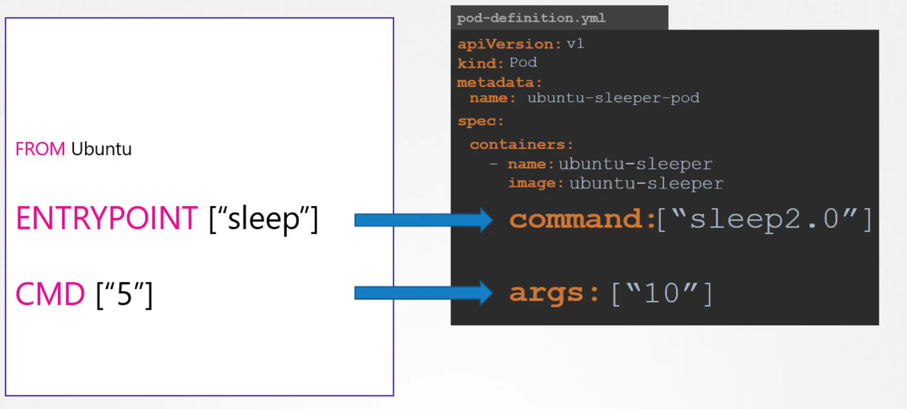

# Commands and Arguments in Kubernetes
We'll learn how to adjust container behaviors by **overriding default settings defined in the Dockerfile via the pod definition.**


  - Previously, we built a simple Docker image—named "ubuntu-sleeper"—that executes a ```sleep``` command for a specified number of seconds.
  - By default, running a container with this image makes it sleep for five seconds. 
    - However, you can easily change this behavior by passing a command-line argument.

## Overriding Default Behavior with Arguments
Suppose we want to create a pod using the "ubuntu-sleeper" image.
  - We begin with a basic pod definition where the pod's name and image are specified. 
  - When the pod is created, it starts a container that runs the default sleep command (sleeping for five seconds) and then exits.
  - To modify the sleep duration to 10 seconds, simply append an additional argument in the pod specification.
  - Any argument provided in the ```docker run``` command correlates with the ```args``` property in the pod definition file (formatted as an array).

    - Consider the following examples:
      ```bash
      docker run --name ubuntu-sleeper ubuntu-sleeper
      docker run --name ubuntu-sleeper ubuntu-sleeper 10
      ```

    - Pod definition YAML:
      ```bash
      apiVersion: v1
      kind: Pod
      metadata:
        name: ubuntu-sleeper-pod
      spec:
        containers:
        - name: ubuntu-sleeper
          image: ubuntu-sleeper
          args: ["10"]
      ```


## Dockerfile Instructions and Their Mappings
The Dockerfile for the "ubuntu-sleeper" image is defined with both an ```ENTRYPOINT``` and a ```CMD```:
  ```bash
  FROM Ubuntu
  ENTRYPOINT ["sleep"]
  CMD ["5"]
  ```
- By specifying the ```args``` field in the pod definition file, the **```CMD``` instruction is overridden**, which effectively changes the sleep duration from 5 to 10 seconds.


## Overriding the ENTRYPOINT
Docker command example with overridden ```ENTRYPOINT```:
  ```bash
  docker run --name ubuntu-sleeper \
    --entrypoint sleep2.0 \
    ubuntu-sleeper 10
  ```

Pod definition YAML with overridden ```ENTRYPOINT```:
  ```bash
  apiVersion: v1
  kind: Pod
  metadata:
    name: ubuntu-sleeper-pod
  spec:
    containers:
      - name: ubuntu-sleeper
        image: ubuntu-sleeper
        command: ["sleep2.0"]
        args: ["10"]
  ```

#### Remember that specifying the ```command``` in a pod definition replaces the Dockerfile's ```ENTRYPOINT``` entirely, while the ```args``` field only **overrides** the default parameters defined by CMD.




## Imperative Commands
### Kubectl command for **commands** and **arguments**
Default Command:
```bash
kubectl run nginx --image=nginx --command -- <cmd> <arg1> ... <argN>
```

```bash
kubectl run ubuntu-sleeper --image=ubuntu-sleeper --command -- sleep2.0 10
```
  - where ```sleep2.0``` is command
  -  ```10``` is arguments

### kubectl command for **arguments** only

Default Command:
```bash
kubectl run nginx --image=nginx -- <arg1> <arg2> ... <argN>
```
  


Example:
```bash
kubectl run ubuntu-sleeper --image=ubuntu-sleeper -- 10
```
