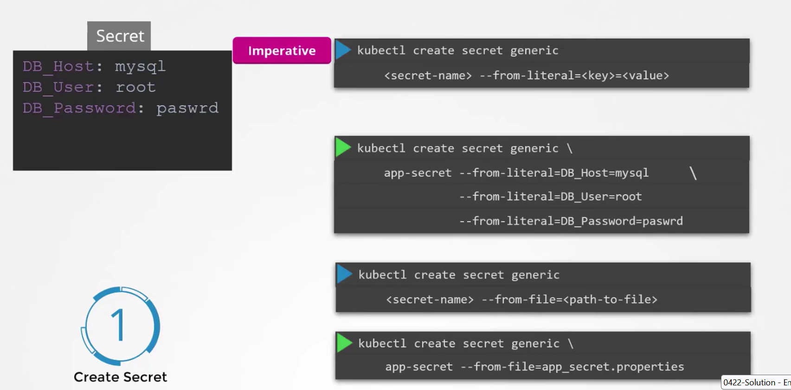
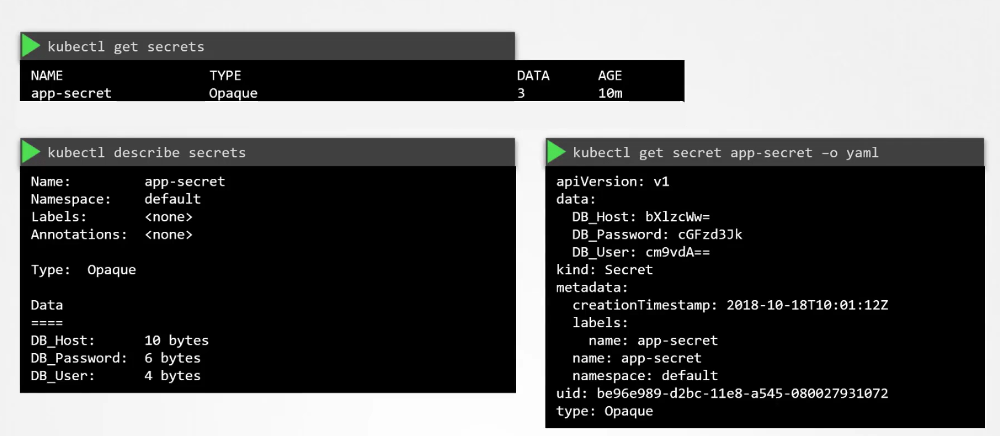
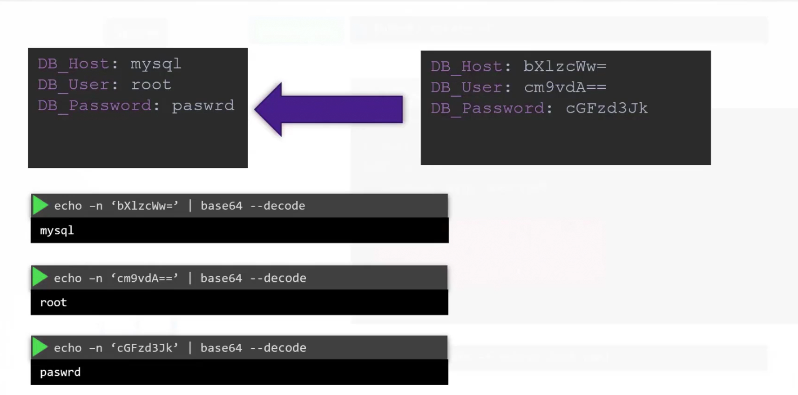
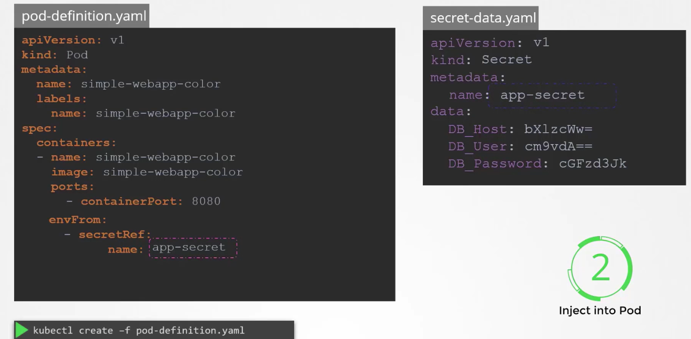
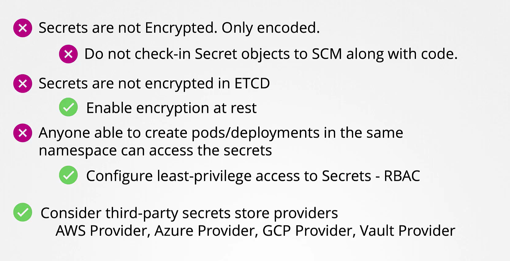

# Configure Secrets
-   In this article, we explain how to securely handle sensitive data (such as passwords and keys) in your Kubernetes deployments while avoiding common pitfalls like hardcoding credentials in your application.

-   Secrets encode data using **Base64**. Although it provides obfuscation, it is not a substitute for encryption.


## Understanding Kubernetes Secrets

-   Working with Secrets in Kubernetes involves two main steps:

    1.  Create the Secret.
    2.  Inject it into a Pod.


## Two primary approaches to creating a Secret:

    1. Imperative Creation: Using the command line to create Secrets on the fly.
    
    2. Declarative Creation: Defining Secrets in YAML files.

### 1. Imperative Approach
-   With the imperative method, you can supply key-value pairs directly via the command line.

```bash
kubectl create secret generic app-secret --from-literal=DB_Host=mysql
```

**To include multiple key-value pairs, use the --from-literal option repeatedly:**
```bash
kubectl create secret generic app-secret \
  --from-literal=DB_Host=mysql \
  --from-literal=DB_User=root \
  --from-literal=DB_Password=paswd
```
**Alternatively, create a Secret from a file with the --from-file option:**
```bash
kubectl create secret generic app-secret --from-file=app_secret.properties
```




### 2. Declarative Approach
-   For a more manageable approach, define a Secret in a **YAML** file. 

```bash
apiVersion: v1
kind: Secret
metadata:
  name: app-secret
data:
  DB_Host: bXlzcWw=
  DB_User: cm9vdA==
  DB_Password: cGFzd3Jk
```
```bash
kubectl create -f secret-data.yaml
```


## Converting Plaintext to Base64
-   On Linux hosts, you can convert plaintext values to Base64-encoded strings using the **echo -n** command piped to base64

### Encoding Secrets

```bash
echo -n 'mysql' | base64
echo -n 'root' | base64
echo -n 'paswrd' | base64
```


## Viewing and Decoding Secrets
1.  List Secrets
```bash
kubectl get secrets
```

2.  Describe a Secret **(without showing sensitive data):**
```bash
kubectl describe secret app-secret
```
3. View the encoded data in YAML format:
```bash
kubectl get secret app-secret -o yaml
```



### Decode Secrets
```bash
echo -n 'bXlzcWw=' | base64 --decode
echo -n 'cm9vdA==' | base64 --decode
echo -n 'cGFzd3Jk' | base64 --decode
```




### Injecting Secrets in Pod
Once the Secret is created, you can inject it into a Pod using environment variables or by mounting them as files in a volume.

#### Injecting as Environment Variables
```bash
# pod-definition.yaml
apiVersion: v1
kind: Pod
metadata:
  name: simple-webapp-color
  labels:
    name: simple-webapp-color
spec:
  containers:
  - name: simple-webapp-color
    image: simple-webapp-color
    ports:
    - containerPort: 8080
    envFrom:
    - secretRef:
        name: app-secret
```



## Notes
