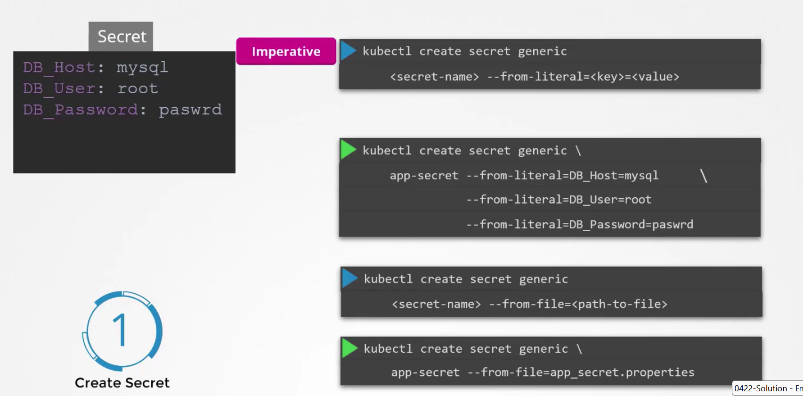
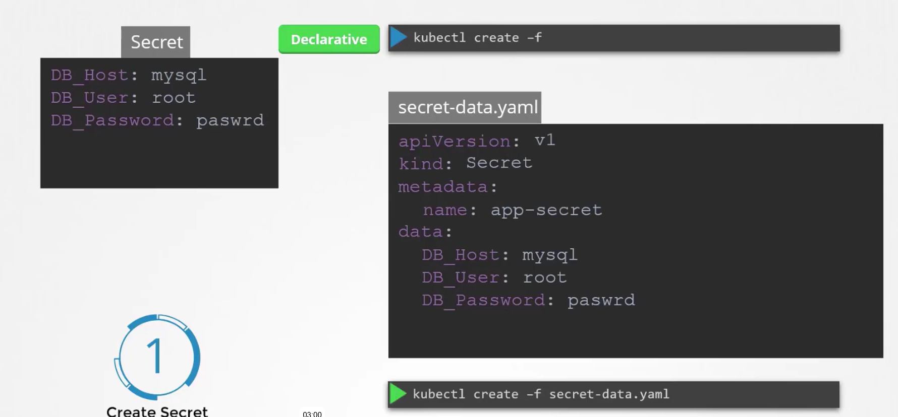
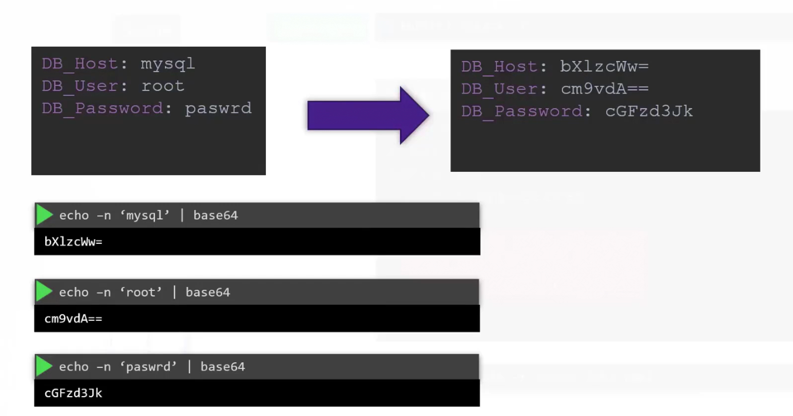
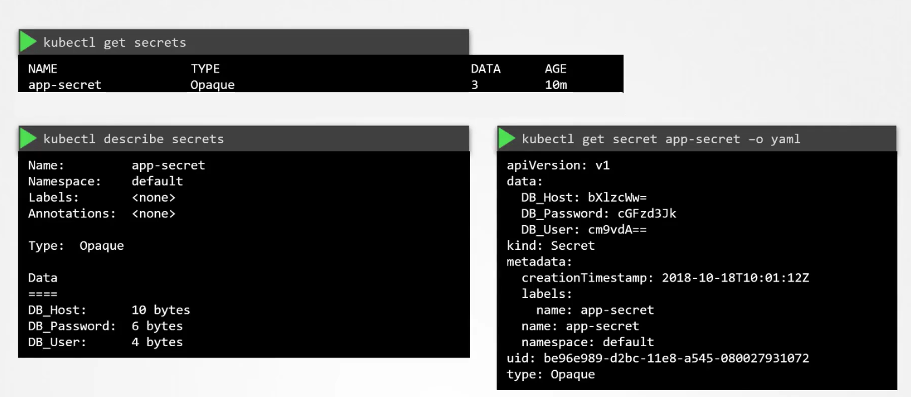
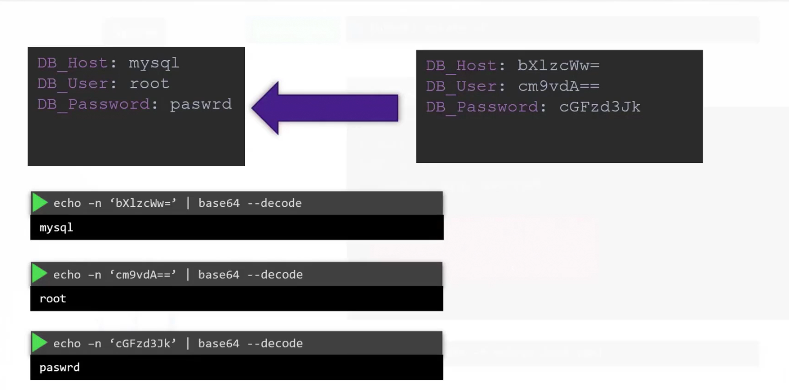
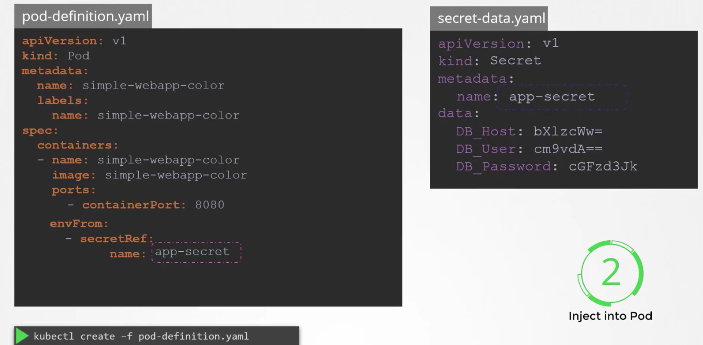
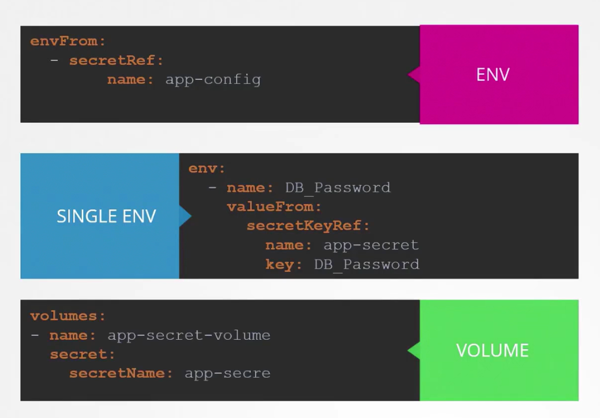
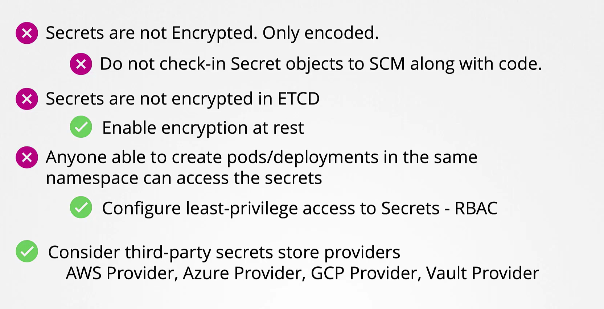

# Configure Secrets
-   In this article, we explain how to securely **handle sensitive data** (such as passwords and keys) in your Kubernetes deployments while avoiding common pitfalls like hardcoding credentials in your application.

-   Secrets encode data using **Base64**. Although it provides obfuscation, it is not a substitute for encryption.


## Understanding Kubernetes Secrets

-   Working with Secrets in Kubernetes involves two main steps:

    1.  Create the Secret.
    2.  Inject it into a Pod.


### Two primary approaches to creating a Secret:

  1. *Imperative Creation:* Using the command line to create Secrets on the fly.
    
  2. *Declarative Creation:* Defining Secrets in YAML files.

####  **1. Imperative Approach**
-   With the imperative method, you can supply key-value pairs directly via the command line.

    ```bash
    kubectl create secret generic app-secret --from-literal=DB_Host=mysql
    ```

- **To include multiple key-value pairs, use the --from-literal option repeatedly:**
  ```bash
  kubectl create secret generic app-secret \
    --from-literal=DB_Host=mysql \
    --from-literal=DB_User=root \
    --from-literal=DB_Password=paswd
  ```


- **Alternatively, create a Secret from a file with the --from-file option:**
  ```bash
  kubectl create secret generic app-secret --from-file=app_secret.properties
  ```

  


#### **2. Declarative Approach**
-   For a more manageable approach, define a Secret in a **YAML** file. 

    ```bash
    apiVersion: v1
    kind: Secret
    metadata:
      name: app-secret
    data:
      DB_Host: bXlzcWw=
      DB_User: cm9vdA==
      DB_Password: cGFzd3Jk
    ```

    - Apply the definition with the following command:
    ```bash
    kubectl create -f secret-data.yaml
    ```

    


## Converting Plaintext to Base64
-   On Linux hosts, you can convert plaintext values to Base64-encoded strings using the **echo -n** command piped to base64

### Encoding Secrets

```bash
echo -n 'mysql' | base64
echo -n 'root' | base64
echo -n 'paswrd' | base64
```



## Viewing and Decoding Secrets
### 1.  List Secrets
```bash
kubectl get secrets
```

### 2.  Describe a Secret **(without showing sensitive data):**
```bash
kubectl describe secret app-secret
```

### 3. View the encoded data in YAML format:
```bash
kubectl get secret app-secret -o yaml
```



## Decode Secrets
```bash
echo -n 'bXlzcWw=' | base64 --decode
echo -n 'cm9vdA==' | base64 --decode
echo -n 'cGFzd3Jk' | base64 --decode
```




### Injecting Secrets in Pod
Once the ```Secret``` is created, you can inject it into a Pod using environment variables or by mounting them as files in a volume.

#### Injecting as Environment Variables
  ```bash
  # pod-definition.yaml
  apiVersion: v1
  kind: Pod
  metadata:
    name: simple-webapp-color
    labels:
      name: simple-webapp-color
  spec:
    containers:
    - name: simple-webapp-color
      image: simple-webapp-color
      ports:
      - containerPort: 8080
      envFrom:
      - secretRef:
          name: app-secret
  ```





#### Mounting Secrets as Files
- Alternatively, mount the Secret as files within a volume. Each key in the Secret becomes a separate file:
  ```bash
  volumes:
  - name: app-secret-volume
    secret:
      secretName: app-secret
  ```

- After mounting, listing the directory contents should display each **key as a file**:
  ```bash
  ls /opt/app-secret-volumes
  # Output: DB_Host  DB_Password  DB_User
  ```

- To view the content of a specific file, such as the DB password:
  ```bash
  cat /opt/app-secret-volumes/DB_Password
  # Output: paswrd
  ```

## Notes
