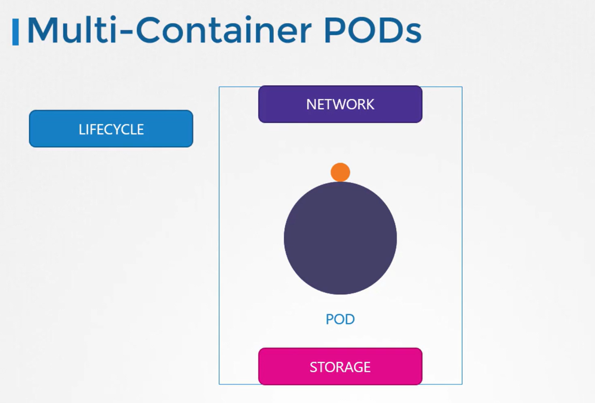

# Multi Container Pods

-   By breaking down a **monolithic application** into **smaller, independent microservices**, you can deploy, manage, and scale each service individually.

-   However, certain scenarios require two closely linked services to run together.

-   For example, a web server might need to be paired with a dedicated logging agent. 

    -   In this configuration, each web server instance is automatically associated with its own logging service, allowing both services to scale concurrently while keeping their codebases distinct.

-   Multi-container pods are designed to group containers that share the same lifecycle. 

    -   This means they are created and terminated together, share a common network namespace (allowing seamless communication via localhost), and have access to shared storage volumes




```bash
apiVersion: v1
kind: Pod
metadata:
  name: simple-webapp
  labels:
    name: simple-webapp
spec:
  containers:
    - name: simple-webapp
      image: simple-webapp
      ports:
        - containerPort: 8080
    - name: log-agent
      image: log-agent
```