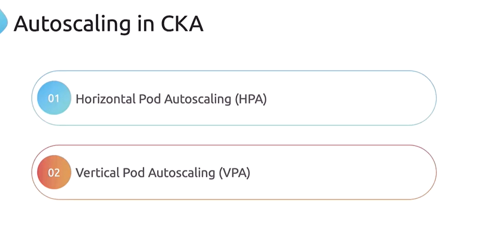
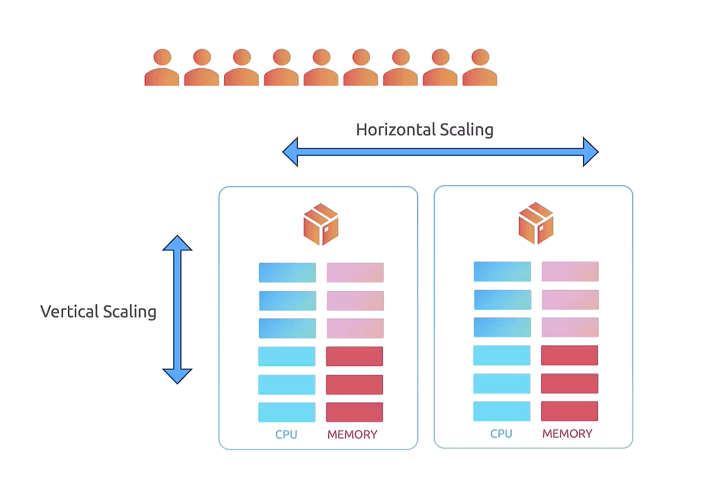
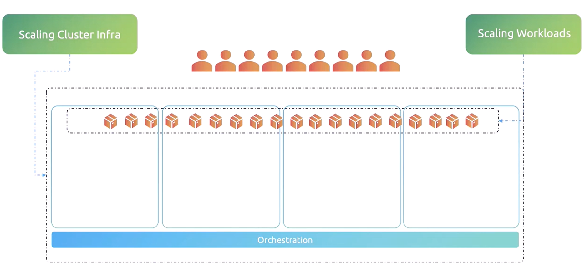
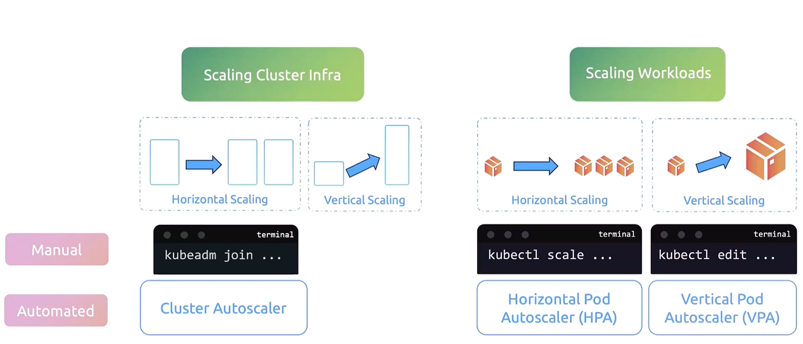

# 2025 Updates Introduction to Autoscaling

## Traditional Scaling Concepts

-   Historically, applications were deployed on physical servers with **fixed CPU and memory capacities**. 

-   When demand increased and resources were exhausted, the only option was to perform vertical scaling. This involved:

    1.  Shutting down the application.
    2.  Upgrading the CPU or memory.
    3.  Restarting the server.

-   This process is referred to as **vertical scaling** since it focuses on enhancing the capacity of an existing server.

-  Conversely, if an application supported multiple instances, additional servers could be added to handle increased loads without any downtime. This method, known as **horizontal scaling**, distributes the workload by creating more instances of the application.

## Key Points:

1. **Vertical Scaling:** Increases resources (CPU, memory) of an existing server.

2. **Horizontal Scaling:** Increases server count by adding more instances.

## Scaling in Kubernetes

-   Kubernetes is specifically designed for hosting containerized applications and incorporates scaling based on current demands. **It supports two main scaling types:**
    1. **Workload Scaling:** Adjusting the number of containers or Pods running in the cluster.
    2. **Cluster (Infrastructure) Scaling**: Adding or removing nodes (servers) from the cluster.

When scaling in a Kubernetes cluster, consider the following:

-   1. Cluster Infrastructure Scaling:

        -   Horizontal Scaling: Add more nodes.

        -   Vertical Scaling: Enhance the resources (CPU, memory) of existing nodes.

-  2. Workload Scaling:
        -   Horizontal Scaling: Create additional Pods.
        
        -   Vertical Scaling: Modify the resource limits and requests for existing Pod

