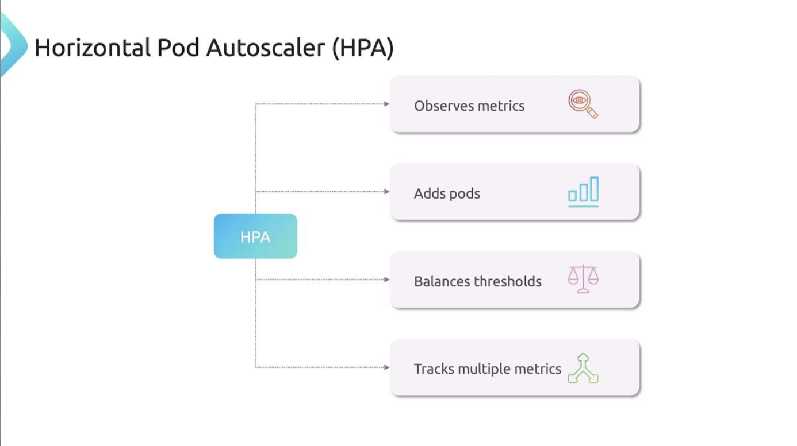
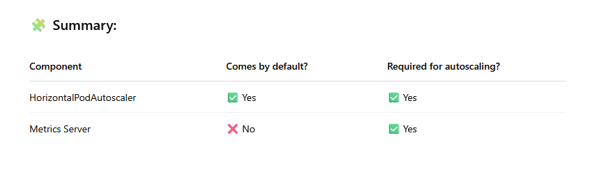

# Horizontal Pod Autoscaler (HPA)
-   HPA is a key feature that **automates scaling of workloads** based on resource usage, reducing the manual monitoring overhead for administrators.

## Manual Horizontal Scaling
Imagine you are managing a Kubernetes cluster and need to ensure your application can handle traffic spikes. 

Consider an application where each pod requests 250 millicores (mCPU) and has a limit of 500 mCPU. Even under heavy load, a single pod will never exceed 500 mCPU.

- To monitor the pod’s resource consumption manually, you might run:

  ```bash
  $ kubectl top pod my-app-pod
  NAME         CPU(cores)   MEMORY(bytes)
  my-app-pod   450m         350Mi
  ```

- When resource usage reaches a predefined threshold (e.g., 450 mCPU), you must manually scale the deployment:
  ```bash
  kubectl scale deployment my-app --replicas=3
  ```


**Manually scaling pods requires continuous monitoring, which can be resource-intensive and error-prone during traffic surges.**

## Automated Scaling with Horizontal Pod Autoscaler
Kubernetes simplifies scaling with the Horizontal Pod Autoscaler.

-   HPA monitors resource metrics—including **CPU, memory, and custom metrics**—using the **metrics server**. 

    -   *When usage exceeds a defined threshold*, it **automatically adjusts the number of pod replicas in deployments**, stateful sets, or replica sets.

-   When CPU or memory usage is **high**, 
    - HPA **scales up the number of pods**; 
    - when usage **drops**, **it scales them down to conserve system resources**. 
    - HPA can even track multiple metrics concurrently.



### 1. Imperative Approach
For an existing Nginx deployment, you can configure an HPA with the following command.

- This command sets the ```autoscaler``` to maintain CPU utilization at 50% with a ```replica``` count that can vary between 1 and 10:
  ```bash
  kubectl autoscale deployment my-app --cpu-percent=50 --min=1 --max=10
  ```
Once executed, Kubernetes creates an ```HPA``` that continuously polls the metrics server based on the pod’s CPU limit (500 mCPU in this case).
If CPU usage exceeds 50% of this limit, HPA automatically scales the deployment up or down.

- To check the status of your HPA, run:

  ```bash
  kubectl get hpa
  ```

-  If you need to remove the autoscaler later, simply run
    ```bash
    kubectl delete hpa my-app
    ```


### 2. Declarative Approach
Alternatively, you can define the ```HPA``` using a declarative configuration file. The example below uses the ```autoscaling/v2``` API:

```bash
apiVersion: autoscaling/v2
kind: HorizontalPodAutoscaler
metadata:
  name: my-app-hpa
spec:
  scaleTargetRef:
    apiVersion: apps/v1
    kind: Deployment
    name: my-app
  minReplicas: 1
  maxReplicas: 10
  metrics:
  - type: Resource
    resource:
      name: cpu
      target:
        type: Utilization
        averageUtilization: 50
```

In this configuration:

- The ```scaleTargetRef``` links the HPA to the ```"my-app"``` deployment.
- ```minReplicas``` and ```maxReplicas``` specify the allowed replica count range.
- The metrics section ensures that the average CPU utilization is maintained at 50%.


### Note

HPA has been integrated into Kubernetes since version 1.23 and uses the metrics-server to deliver real-time resource data.


## Metrics Server and Custom/External Metrics

- The ```HPA``` relies on the **internal metrics server** for real-time CPU and memory usage data. 
-  Kubernetes also **supports custom metrics adapters**, which allow ```HPA``` to fetch metrics from internal cluster workloads. 
    -  Additionally, **external metrics adapters** can integrate with tools like ```Datadog``` or ```Dynatrace``` to supply metrics from outside the cluster.


### Note: 
1.  **Metrics Server** is *not* installed by default in Kubernetes clusters, even in the latest versions (as of 2025).

2.  **Horizontal Pod Autoscaler (HPA)** is part of Kubernetes by default – but it **requires** metrics to make decisions, and **by default it depends on the Metrics Server**.

#### So, what's the catch
- **HPA is just a controller.** 
  - It's present and ready to use.

- But to function (e.g., scale a deployment based on CPU usage), 
  - **it needs resource metrics**.

- These metrics are provided by ```Metrics Server```, which **you must install yourself**.



- Even if metrics server is not deplyed, you will still be able to create ```HPA```.
  -   However, it doesn't track the metrics.

      