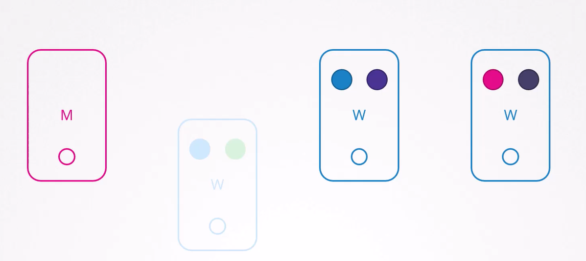

# OS Upgrades

-   We will explore various scenarios that require taking a **node offline**, such as :

    1.  Routine maintenance, 
    2. Base software upgrades, 
    3. The application of security patches.

-   We also review options to minimize service interruptions during these events.

-   Imagine a cluster with several nodes where each node runs pods serving your applications. **What happens if a node goes down?**

    -   The pods on that node become inaccessible, and depending on your deployment strategy, this could impact your users.

        -   For instance, if you have **multiple replicas** of a **"blue" pod**, your users will still be served by the remaining replicas. 
        -   However, if a **"green" pod** is the **only instance running**, its *unavailability results in downtime*.




Kubernetes offers mechanisms to handle such situations:

-   If a **node comes back online quickly**, the **pods are simply restarted**.
    
-   If a **node remains down for more than five minutes**, Kubernetes marks the pods on that **node as dead**. 
    -   For pods managed by a ReplicaSet, new pods are automatically created on other nodes. 
    -   In contrast, pods that are not part of a ReplicaSet will not be restarted, potentially leading to downtime.


## Draining a Node

-   For situations **where the recovery time is uncertain**, the **safer method is to drain the node.**

    -   **Draining** involves g**racefully terminating the pods** running on that node so they are **recreated on other nodes.**

    -    At the same time, **draining** marks the node as **unschedulable (cordoned)**, *preventing new pods from being scheduled on it until explicitly allowed.*

-   After the node's workloads have been ***safely relocated,** **you can reboot the node.**

    -   When it comes back online, **it remains unschedulable** until you **uncordon it**, allowing new pods to be scheduled

To perform these operations, run the following commands:

```bash
kubectl drain node-1
kubectl uncordon node-1
```

## Cordon vs. Drain

-   Unlike drain, **cordon only marks a node as unschedulable without terminating or relocating the currently running pods**.

    - This ensures that **no new pods will be scheduled on the node.**  

### Warning

Be cautious when using cordon on a node with critical workloads. 
-   Since existing pods remain and new pods cannot be scheduled, your application might become overloaded or experience unexpected behavior.