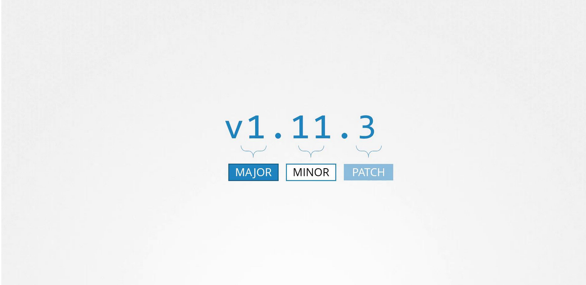

# Kubernetes Software Versions

### Viewing Your Cluster Version
-   When you install a Kubernetes cluster, you install a specific version of Kubernetes.

-    To check which version is running on your cluster
        ```bash
        kubectl get nodes
        ```

-   Output:
    ```bash
    kubectl get nodes
    NAME     STATUS   ROLES    AGE    VERSION
    master   Ready    master   1d     v1.11.3           <=====
    node-1   Ready    <none>   1d     v1.11.3           <=====
    node-2   Ready    <none>   1d     v1.11.3           <=====
    ```

## Understanding Semantic Versioning

-   Kubernetes release versions follow a three-part semantic versioning scheme: **major, minor, and patch.**

    1. **Major versions** indicate significant changes.
    2. **Minor versions** are released every few months and introduce new features and functionalities.
    3. **Patch versions** are released more frequently to address critical bug fixes.



### Tip

Semantic versioning helps ensure **backward compatibility** while introducing new features incrementally.
